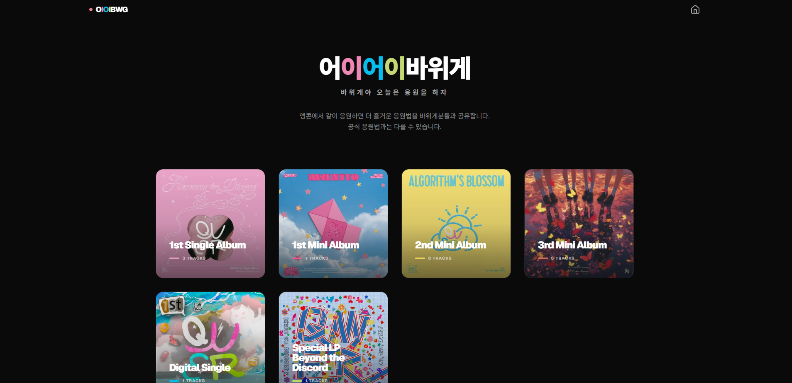
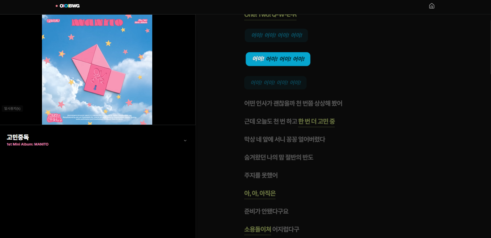
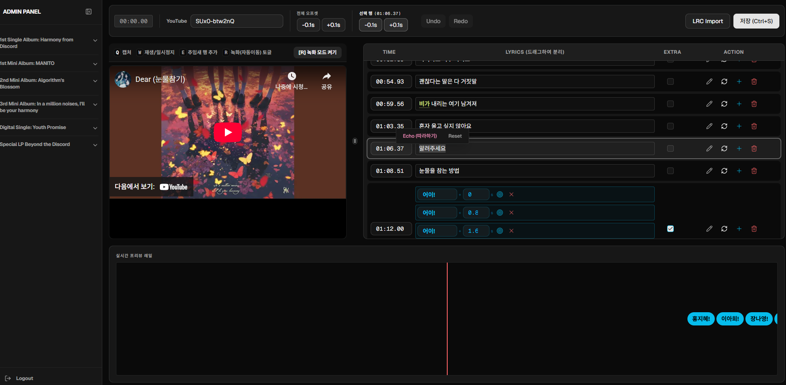

# 어이어이바위게 (OiOiBawige)

> **"바위게야 응원법을 알아보자"**

- **LIVE**: [oioibawige.com](https://oioibawige.com)



어이어이바위게(OiOiBawige) 는 QWER 팬덤 '바위게'를 위한 비공식 응원법 가이드 서비스입니다.

유튜브 영상과 실시간으로 동기화되는 가사 및 응원법 자막을 통해 누구나 쉽게 응원 리듬을 익힐 수 있습니다.
정답을 정의하기보다 모두가 각자의 방식으로 QWER을 더 즐겁게 응원할 수 있기를 바랍니다.

## 핵심 기능 (Key Features)

### 1. 사용자 응원법 뷰어 (User Sync Viewer)



- **실시간 유튜브 연동**: YouTube IFrame API를 활용하여 영상 재생 시간과 가사를 1/60초 단위로 정밀하게 동기화합니다.
- **스마트 스냅 (Smart Snap)**: 현재 재생 중인 가사 행이 화면 중앙에 오도록 GSAP 기반의 부드러운 자동 스크롤을 지원합니다.
- **응원 하이라이트**: 에코(Echo) 파트와 추임새(Extra) 파트를 시각적으로 구분하여 직관적인 응원 가이드를 제공합니다.
- **광고 감지 로직**: 영상 재생 중 광고 발생 시 가사 싱크를 일시 정지하는 휴리스틱 감지 기능을 포함합니다.

### 2. 어드민 가사 편집기 (Admin Editor)



- **라인 스플리터**: 드래그 앤 드롭과 플로팅 메뉴를 통해 단어 단위로 `Echo(함께 부르기)` 속성을 부여할 수 있습니다.
- **실시간 타임스탬프 캡처**: 단축키(Space)를 사용하여 영상 재생 중 즉시 `startTime`을 기록합니다.
- **엑스트라 행 관리**: 가사에 없는 네임콜이나 기합을 위한 전용 행을 빠르게 삽입하고 그룹화 할 수 있습니다.

---

## 기술 스택 (Tech Stack)

### Framework & Library

- **Framework**: Next.js 16 (App Router, standalone output), React 19
- **Styling**: Tailwind CSS 4, Shadcn UI
- **Animation**: GSAP
- **State & Form**: React Hook Form, Zod, nuqs

### Database & Backend

- **Database**: PostgreSQL 17 (OCI production / isolated local Docker)
- **ORM**: Drizzle ORM
- **Auth**: Supabase Auth
- **Runtime**: Node.js standalone server

### Infrastructure

- **Build**: Next.js standalone output
- **Monitoring**: Sentry (Error & Performance tracking)
- **Analytics**: Google Analytics & Google Tag Manager

### Test

- **stress / spike / load**: K6

---

## 프로젝트 구조 (Project Structure)

```text
cheer-rock-crab/
├── .github/workflows/  # cicd pipe (.yml)
├── data/lyrics/        # 원본 가사 파일 (.lrc)
├── docs/               # 문서 (.md)
├── drizzle/            # SQL 마이그레이션 이력
├── src/
│   ├── app/            # App Router와 route-local private segment
│   ├── widgets/        # 화면 구획 단위 조합
│   ├── features/       # 사용자 행동과 유스케이스
│   ├── entities/       # 도메인 모델과 표현
│   ├── shared/         # 도메인 비종속 공용 코드
│   └── server/         # 서버 전용 조합과 인프라 경계
├── tests/              # stress, load, spike 테스트 스크립트
├── proxy.ts            # Next.js proxy
├── next.config.ts      # Next.js 설정
└── package.json        # 의존성 및 스크립트

```

---

## 서비스 운영 철학 (Philosophy)

본 서비스는 "응원법의 정답을 정의하는 곳"이 아니라, "함께 즐기기 위한 응원 법을 공유하는 서비스"입니다.

- **공식 응원법**: `OfficialBadge`를 통해 출처를 명확히 밝힙니다.
- **제안 응원법**: 개인적인 경험을 바탕으로 한 제안이며, 사용자의 자유로운 응원을 존중합니다.
- **비영리 프로젝트**: 본 서비스는 팬이 만든 비영리 프로젝트입니다.

---

## 시작하기 (Getting Started)

### 설치

```bash
pnpm install --frozen-lockfile
```

### 로컬 Docker 개발환경

```bash
cp .env.example .env.local
docker compose -f compose.dev.yml up -d postgres
docker compose --profile tools -f compose.dev.yml run --rm migrate
docker compose -f compose.dev.yml up -d next
docker compose -f compose.dev.yml exec next pnpm db:seed
```

브라우저에서 `http://localhost:3000`을 엽니다. 자세한 migration, reset, 운영 DB 안전 원칙은 [로컬 개발환경 문서](docs/migration/implementation/LOCAL-DEVELOPMENT-ENVIRONMENT.md)를 따릅니다.

팀에서 전달받은 `.local/` PostgreSQL dump가 있으면 전체 개발 데이터를 복원할 수 있습니다.

```bash
pnpm db:restore-local
```

### 컨테이너 종료

```bash
docker compose -f compose.dev.yml down
```

### 테스트

```bash
# 정적 검사와 단위 테스트
pnpm verify

# k6 부하 테스트
pnpm test:load
pnpm test:stress
pnpm test:spike
```

### 프로덕션 빌드와 로컬 실행

```bash
pnpm build
pnpm start
```

---

_Last Updated: 2026-08-29_
_Copyright © 2026 CheerRockCrab Team._
