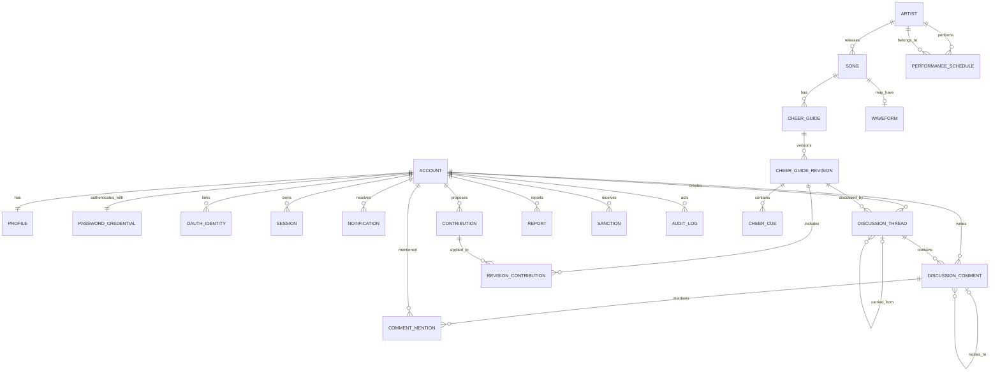
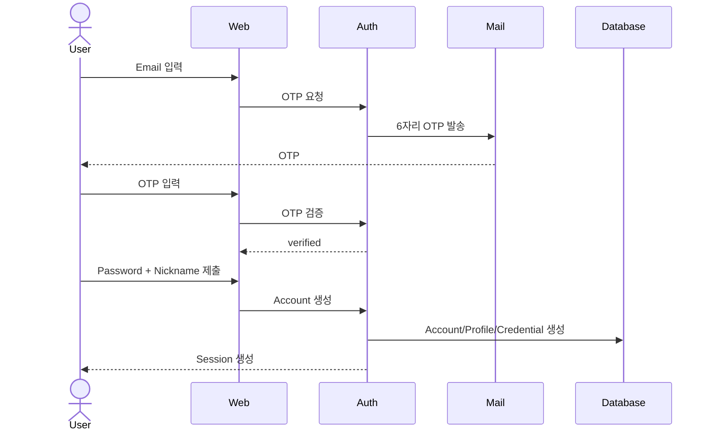
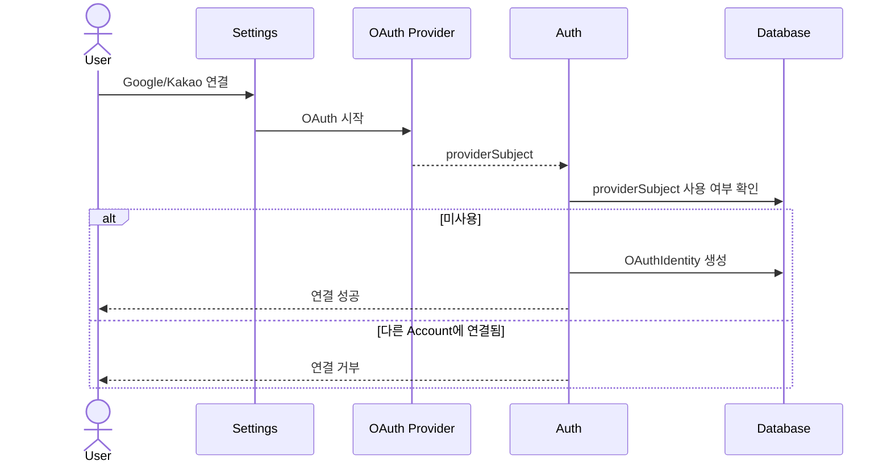
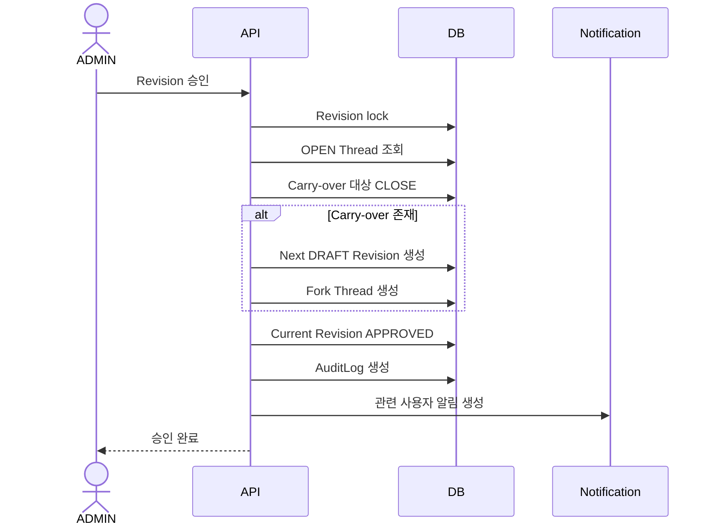

# DOMAIN_SPECIFICATION.md

> 프로젝트: **어이어이 바위게**
>
> 문서 성격: Product Domain Specification / Development Contract / Test Oracle / Operations Policy  
> 상태: **Baseline v1.0**  
> 목적: 본 문서는 서비스의 도메인 용어, 정책, 권한, 상태 전이, 데이터 생명주기, 핵심 워크플로, ERD, 테스트 기준, 운영 규칙을 하나의 기준으로 고정한다.  
> 우선순위: 구현 편의보다 **도메인 일관성, 이력 보존, 운영 가능성, 개인정보 최소화, 어뷰징 내성**을 우선한다.

---

## 1. 문서 목적

어이어이 바위게는 단순한 곡별 응원법 모음이 아니다.

서비스의 핵심은 다음 네 가지다.

1. **곡별 응원법을 FAN / FESTIVAL 모드로 분리해 제공한다.**
2. **응원법 변경은 직접 편집이 아니라 제안 → 토론 → 검토 → Revision 승인 흐름으로 관리한다.**
3. **특정 사용자가 콘텐츠를 소유하지 않고, 서비스가 공동 콘텐츠를 관리하며 사용자는 Contributor로 기여한다.**
4. **공연 일정과 응원법 모드를 연동해 지금 필요한 응원법을 사용자에게 우선 제시한다.**

본 문서는 다음 질문의 최종 기준으로 사용한다.

- 이 사용자는 이 액션을 할 수 있는가?
- 이 데이터는 삭제 가능한가?
- Revision 승인 후 어떤 데이터가 동결되는가?
- 미해결 토론은 다음 Revision으로 어떻게 이관되는가?
- 탈퇴 시 개인정보와 기여 이력은 어떻게 처리되는가?
- 신고·제재·감사 로그는 어떤 생명주기를 가지는가?
- Google/Kakao 연결은 계정 생성인가, 로그인 수단 추가인가?
- FAN과 FESTIVAL 응원법은 언제 어떤 규칙으로 변경 가능한가?
- 공연 일정이 있을 때 어떤 응원법을 기본 노출하는가?
- Waveform 데이터가 없을 때 서비스는 어떻게 동작하는가?

---

# 2. Domain Principles

## DP-001. Account와 Authentication Method를 분리한다

`Account`는 어이어이 바위게 내부의 사용자 주체다.

Email/Password, Google, Kakao는 이 Account를 인증하기 위한 수단이다.

```text
Account
├─ PasswordCredential   // 필수
├─ OAuthIdentity(GOOGLE) // 선택
└─ OAuthIdentity(KAKAO)  // 선택
```

외부 Provider의 email, provider subject 또는 PasswordCredential 자체가 Account의 identity가 되어서는 안 된다.

모든 도메인 FK는 `accountId`를 기준으로 한다.

---

## DP-002. 콘텐츠에는 소유자가 없다

CheerGuide는 특정 사용자의 소유물이 아니다.

사용자는 콘텐츠를 소유하는 것이 아니라 **변경을 제안하고 토론하고 기여한다.**

```text
잘못된 모델
CheerGuide.ownerAccountId

권장 모델
Contribution.proposedByAccountId
Revision.createdByAccountId
DiscussionThread.createdByAccountId
DiscussionComment.authorAccountId
```

사용자 프로필에는 GitHub Contributor처럼 기여 이력을 노출할 수 있다.

---

## DP-003. 승인된 Revision은 immutable이다

승인된 Revision은 수정하지 않는다.

오류가 발견되면 기존 Revision을 다시 열지 않고 다음 Revision을 생성한다.

```text
v3 APPROVED
↓ 오류 발견
v4 DRAFT 생성
↓
v4 REVIEW
↓
v4 APPROVED
```

---

## DP-004. 토론은 Revision에 귀속된다

DiscussionThread는 특정 Revision에 대한 논의다.

Revision이 승인되면 해당 Revision의 Discussion은 동결된다.

미해결 Thread는 다음 Revision으로 **이동하지 않고 Fork**한다.

---

## DP-005. 데이터 생명주기와 Account 생명주기를 분리한다

탈퇴는 도메인 데이터의 연쇄 삭제를 의미하지 않는다.

```text
Account 탈퇴
→ 인증수단 제거
→ 개인정보 제거/비식별화
→ Account tombstone 유지
→ Contribution/Revision/Thread/Comment 유지
```

---

## DP-006. FAN과 FESTIVAL은 독립된 CheerGuide다

하나의 Song은 최대 두 개의 Guide Mode를 가진다.

```text
Song
├─ CheerGuide(FAN)
└─ CheerGuide(FESTIVAL)
```

두 Guide는 각각 별도의 Revision history와 Discussion history를 가진다.

---

## DP-007. Waveform은 보조 데이터다

응원법 Cue가 SSOT다.

Waveform은 Cue를 시각적으로 생성·편집하기 위한 편의 데이터이며 없어도 응원법 기능은 정상 동작해야 한다.

---

# 3. Domain Glossary

| 용어 | 정의 |
|---|---|
| Account | 서비스 내부의 사용자 identity. 공개 프로필/인증수단/역할의 기준 주체 |
| Profile | nickname, avatar 등 공개 사용자 정보 |
| PasswordCredential | Email/Password 로그인을 위한 자격 정보 |
| OAuthIdentity | 기존 Account에 연결된 Google/Kakao 외부 인증 identity |
| Role | USER / REVIEWER / ADMIN |
| Artist | 응원법 대상 아티스트 |
| Song | 곡 |
| CheerGuide | 특정 Song의 특정 Mode에 대한 응원법 aggregate |
| GuideMode | FAN 또는 FESTIVAL |
| Revision | CheerGuide의 변경 후보 또는 승인된 immutable snapshot |
| Contribution | 사용자가 제안한 응원법 변경 단위 |
| DiscussionThread | 특정 Revision의 하나의 독립 논점 |
| DiscussionComment | Thread 내부의 시간순 댓글 |
| CommentMention | 댓글에서 특정 Account를 구조적으로 언급한 정보 |
| PerformanceSchedule | 아티스트의 공연/방송/행사 일정 |
| Notification | 사용자에게 전달되는 인앱 알림 |
| Report | 특정 콘텐츠/행위에 대한 사용자 신고 |
| Sanction | 특정 Account에 부여되는 기능 제한 또는 계정 정지 |
| AuditLog | 운영자/검수자의 중요 행위 기록 |
| SecurityEvent | 로그인/비밀번호/OAuth 등 보안 관련 이벤트 |
| Waveform | 음원 분석으로 생성된 파형 데이터 |
| CheerCue | 응원법의 시간축 상 구간/행위 단위 |
| Tombstone Account | 탈퇴 후 개인정보는 제거됐지만 참조 무결성을 위해 남겨둔 Account record |

---

# 4. Actors & Roles

## 4.1 Guest

로그인하지 않은 사용자.

원칙:

> **Read Public / Write Authenticated / Moderation Authorized**

허용:
- Artist 조회
- Song 조회
- CheerGuide 조회
- Revision 조회
- Discussion 조회
- PerformanceSchedule 조회
- 검색

금지:
- Contribution 제안
- Thread 작성
- Comment 작성
- 신고
- 알림
- 프로필 편집

---

## 4.2 USER

일반 회원.

권한:
- Contribution 생성
- DiscussionThread 생성
- DiscussionComment 생성
- 본인 Comment 제한적 수정/삭제
- Report 생성
- OAuthIdentity 연결/해제
- Profile 관리
- Contributor history 조회

---

## 4.3 REVIEWER

콘텐츠 검수 담당.

USER 권한에 추가:
- Thread `RESOLVED`
- Thread `REJECTED`
- Thread carry-over 여부 결정
- Thread 검토 의견 작성
- Revision 검토 참여

금지:
- Revision 최종 APPROVE / REJECT
- Sanction 생성
- Account suspension
- Role 변경
- 일반 사용자 개인정보 접근

---

## 4.4 ADMIN

최종 발행권자이자 운영자.

REVIEWER 권한에 추가:
- Revision APPROVE
- Revision REJECT
- 공식 FAN Guide 잠금/해제 정책 적용
- Report 처리
- Sanction 생성/해제
- Account suspension
- Role 변경
- Audit 조회
- Waveform source 등록 및 분석 job 실행
- PerformanceSchedule 관리 및 GuideMode override

작은 운영 조직을 고려하여 ADMIN은 본인이 생성한 Revision도 승인할 수 있다.  
단, 모든 승인/거절 행위는 AuditLog에 남겨야 한다.

---

# 5. Permission Matrix

| Action | Guest | USER | REVIEWER | ADMIN |
|---|:---:|:---:|:---:|:---:|
| Artist/Song 조회 | O | O | O | O |
| CheerGuide 조회 | O | O | O | O |
| Revision history 조회 | O | O | O | O |
| Discussion 조회 | O | O | O | O |
| Contribution 생성 | X | O | O | O |
| Thread 생성 | X | O | O | O |
| Comment 생성 | X | O | O | O |
| 본인 Comment 수정 | X | O | O | O |
| 본인 Comment soft delete | X | O | O | O |
| Thread Resolve/Reject | X | X | O | O |
| Revision Approve/Reject | X | X | X | O |
| Report 생성 | X | O | O | O |
| Report 처리 | X | X | X | O |
| Sanction 생성/해제 | X | X | X | O |
| Role 변경 | X | X | X | O |
| Waveform source 등록 | X | X | X | O |
| PerformanceSchedule 관리 | X | X | X | O |

> Frozen Revision에 속한 Thread/Comment는 Role과 무관하게 일반 편집이 금지된다.  
> ADMIN의 예외 조치는 일반 update가 아니라 별도 moderation action + audit로 남긴다.

---

# 6. Account & Authentication Policy

## AUTH-001. 회원가입 방식

Account 생성은 **Email + Password 회원가입만 허용**한다.

Google/Kakao OAuth는 Account 생성 수단이 아니라 기존 Account에 연결되는 추가 로그인 수단이다.

---

## AUTH-002. 회원가입 프로세스

```text
Email 입력
↓
6자리 OTP 발송
↓
OTP 검증
↓
Password / Nickname 입력
↓
Account 생성
↓
ACTIVE
```

권장 구현:

- OTP: 숫자 6자리
- TTL: 5분
- 재전송 cooldown: 60초
- 한 OTP의 최대 실패 횟수: 5회
- 재발급 시 이전 OTP 즉시 무효화
- 성공 시 OTP 즉시 소모
- Email 기준 시간당 발송 제한
- IP 기준 시간당 발송 제한

초기 rate limit 값:
- Email: 1시간 5회
- IP: 1시간 20회

운영 지표를 보고 조정 가능해야 한다.

---

## AUTH-003. Password Policy

Password는 다음 조건을 만족해야 한다.

- 영문 포함
- 숫자 포함
- 특수문자 포함
- 최소 10자
- 최대 32자

특수문자는 구현에서 명시적인 allowlist를 사용한다.  
SQL 문법과 충돌 우려가 있는 일부 문자를 제품 입력 정책상 제외할 수 있으나, 이는 SQL Injection 방어수단으로 간주하지 않는다.

보안 구현 원칙:
- 모든 SQL은 parameterized query 사용
- 평문 Password 저장 금지
- PasswordHash만 저장
- Password hashing: Argon2id 우선
- 로그에 Password/PasswordHash 기록 금지

---

## AUTH-004. Password Reset

```text
비밀번호 찾기
↓
Email 입력
↓
Reset URL 전송
↓
15분 내 1회 사용
↓
새 Password 설정
↓
모든 기존 Session revoke
↓
재로그인
```

정책:
- reset token TTL: 15분
- 1회용
- 새 token 발급 시 이전 token 무효화
- 계정 존재 여부를 응답에서 노출하지 않는 방향 권장

---

## AUTH-005. Email 변경

```text
로그인 상태
↓
현재 Password 재인증
↓
새 Email 입력
↓
새 Email OTP 인증
↓
Email 교체
↓
모든 기존 Session revoke
```

Email은 서비스 내부 identity가 아니며 변경 가능하다.

---

## AUTH-006. Session

- 다중 기기 로그인 허용
- Password 변경 시 전체 Session revoke
- Email 변경 시 전체 Session revoke
- Account suspension 시 전체 Session revoke
- Account deletion 시 전체 Session revoke
- 사용자가 `모든 기기에서 로그아웃` 실행 가능하도록 확장 가능

---

## AUTH-007. Google/Kakao Account Linking

기존 Email/Password Account에만 연결 가능하다.

```text
로그인된 Account
↓
설정 > Google 연결
↓
Google OAuth 성공
↓
(provider, providerSubject) 미사용 확인
↓
OAuthIdentity 생성
```

동일하게 Kakao도 지원한다.

### Linking invariant

1. OAuthIdentity는 하나의 Account에만 속한다.
2. `(provider, providerSubject)`는 globally unique다.
3. 다른 Account가 이미 보유한 OAuthIdentity는 link할 수 없다.
4. Account merge는 MVP에서 지원하지 않는다.
5. Provider email이 Account email과 같을 필요는 없다.
6. Provider email은 account matching key가 아니다.

---

## AUTH-008. OAuth Unlink

Email/Password Credential이 항상 존재하므로 Google/Kakao는 개별적으로 해제 가능하다.

민감 작업이므로 unlink 전 최근 재인증을 요구하는 방향을 권장한다.

```text
Account
├─ Email/Password // 필수 anchor
├─ Google         // optional
└─ Kakao          // optional
```

---

# 7. Account Lifecycle & Privacy

## 7.1 Account Status

```text
PENDING_VERIFICATION
        ↓
      ACTIVE
        ↓
 ┌──────┴───────┐
SUSPENDED      DELETED
```

---

## 7.2 탈퇴

탈퇴는 물리 Account row 삭제가 아니다.

```text
Account deletion
↓
Credential 제거
OAuthIdentity 제거
Profile 개인정보 제거
Session revoke
Account.status = DELETED
deletedAt 기록
↓
도메인 콘텐츠 유지
```

화면 표시:

```text
탈퇴한 사용자
```

과거 nickname을 일반 화면에서 계속 표시하지 않는다.

---

## 7.3 PII Inventory

| 데이터 | 목적 | 공개 | 탈퇴 시 | 비고 |
|---|---|---:|---|---|
| Email | 로그인/복구 | X | 제거 | 인증정보 |
| PasswordHash | 로그인 | X | 제거 | 절대 로그 금지 |
| Nickname | 공개 기여자 표시 | O | 비식별화 | 탈퇴 후 `탈퇴한 사용자` |
| Avatar | 프로필 | O | 제거 | |
| OAuth provider subject | 추가 로그인 | X | 제거 | unlink 시에도 제거 |
| Security IP | 보안/어뷰징 | X | 보존기간 후 삭제 | 필요 event만 |
| Contribution history | 기여 이력 | O | 유지 | 개인정보와 생명주기 분리 |

---

# 8. Artist / Song / CheerGuide

## 8.1 Song

Song은 응원법과 Waveform, 공연 컨텍스트의 기준 엔티티다.

주요 속성:
- id
- artistId
- title
- releaseAt
- youtubeUrl nullable
- metadata

---

## 8.2 CheerGuide Mode

```text
FAN
FESTIVAL
```

한 Song + Mode 조합은 최대 하나의 CheerGuide를 가진다.

```text
UNIQUE(songId, mode)
```

---

## 8.3 FAN Mode

대상:
- 콘서트
- 음악방송
- 시상식
- 팬덤 중심 공연

목적:
- 공식/팬덤 정식 응원법 제공

공식 응원법이 확인되면:

```text
FAN Guide
→ OFFICIAL_LOCKED
```

의미:
- 일반 USER의 변경 제안 금지 또는 운영정책상 제한
- 공식 출처가 변경되면 ADMIN만 다음 Revision 생성 가능
- 과거 승인 Revision은 immutable

공식 Guide 자체가 영구 고정되는 것은 아니다.

---

## 8.4 FESTIVAL Mode

대상:
- 페스티벌
- 대학축제
- 일반 관객 비중이 높은 공연

목적:
- 일반 관객도 따라하기 쉬운 간결한 응원법

정책:
- USER Contribution 허용
- Discussion 허용
- Revision workflow 적용
- 지속 개선 가능

---

# 9. Contribution

## CONTRIB-001. Contribution과 Revision은 분리한다

Contribution은 **사용자 변경 제안**, Revision은 **여러 제안을 통합할 수 있는 작업본/승인본**이다.

```text
Contribution A ─┐
Contribution B ─┼─> Revision #7
Contribution C ─┘
```

따라서 Revision은 한 사용자의 소유물이 아니다.

---

## CONTRIB-002. Contributor Profile

사용자 프로필에는 다음 정보를 노출할 수 있다.

예:
- 승인된 Contribution 수
- 참여한 Revision 수
- 생성한 Thread 수
- 해결에 기여한 Thread 수
- 최근 기여 내역

등급/레벨/신뢰 점수는 두지 않는다.

```text
금지
Lv. 12 Contributor
Gold Reviewer
신뢰도 843점
```

Role 이외의 사용자 계층화는 만들지 않는다.

---

# 10. Revision

## 10.1 Revision State

```text
DRAFT
  ↓
UNDER_REVIEW
  ↓
 ┌─────────────┐
APPROVED      REJECTED
```

`APPROVED`는 immutable terminal state다.

`REJECTED`도 이력 보존 대상이다.

---

## 10.2 Active Revision Constraint

동일한 `CheerGuide`에는 동시에 활성 작업 Revision이 최대 1개만 존재한다.

활성 작업 Revision:
- DRAFT
- UNDER_REVIEW

```text
CheerGuide
├─ v1 APPROVED
├─ v2 APPROVED
└─ v3 UNDER_REVIEW  // active는 이것 하나
```

이 규칙은 여러 Draft branch의 merge 문제를 방지한다.

---

## 10.3 Revision Approval

Revision 최종 APPROVE / REJECT는 ADMIN만 가능하다.

승인 시:

1. Revision 상태 잠금
2. 현재 상태 검증
3. OPEN Thread 조회
4. Carry-over 대상 확정
5. 현재 Revision의 Discussion freeze
6. Carry-over Thread 종료
7. 필요 시 Next Revision DRAFT 생성
8. Forked Thread 생성
9. 현재 Revision APPROVED
10. current Revision pointer 갱신
11. Notification 생성
12. AuditLog 기록
13. Commit

이 작업은 transaction boundary로 취급해야 한다.

---

## 10.4 Approval Concurrency Invariant

승인 직전/동시에 새 Thread가 생성되어 승인된 Revision에 OPEN Thread가 남아서는 안 된다.

Thread 생성 조건:

```text
revision.status in (DRAFT, UNDER_REVIEW)
AND revision is not locked for approval
```

---

# 11. Discussion

## 11.1 Structure

```text
CheerGuideRevision
└─ DiscussionThread 1:N
   └─ DiscussionComment 1:N
```

Thread는 하나의 독립적인 논점이다.

예:
- "2절 38초 응원 타이밍이 맞는가?"
- "마지막 후렴 멤버 이름 순서 수정 필요"
- "FESTIVAL 버전에서 박수 4회를 2회로 줄일지"

---

## 11.2 Thread 삭제

Thread는 사용자 또는 작성자가 삭제할 수 없다.

이유:
- Revision review record의 일부
- 판단 근거 보존
- Revision 승인 history와 연결

운영상 숨김이 필요하면 moderation action으로 처리하고 AuditLog를 남긴다.

---

## 11.3 Thread State

```text
OPEN
CLOSED
```

종료 의미는 별도 resolution으로 표현한다.

```text
RESOLVED
REJECTED
CARRIED_OVER
CLOSED_WITHOUT_CARRYOVER
```

`CLOSED_BY_REVISION_APPROVAL` 같은 상태 폭증을 피한다.

---

## 11.4 Thread 수정

- 작성 후 10분 이내 제목/본문 수정 가능
- 수정 시 `editedAt` 표시
- 10분 이후 수정 불가
- Revision freeze 후 수정 불가

---

# 12. Flat Comment Policy

## 12.1 Rendering

댓글은 항상 시간순 flat list로 렌더링한다.

Reddit식 nested tree를 렌더링하지 않는다.

```text
AAA  01:00
이 구간 12초 아닌가요?

BBB  01:03
@AAA 공식 영상은 13초 같습니다.

CCC  01:05
@BBB 12.8초네요.
```

---

## 12.2 Reply Reference

DB에는 optional `replyToCommentId`를 둘 수 있다.

목적:
- 어떤 댓글에 대한 답인지 보존
- 원댓글 이동
- 답글 알림
- 닉네임 변경과 무관한 reply 관계 유지

제약:
- replyToCommentId는 동일 Thread의 Comment만 참조 가능
- UI는 여전히 flat rendering

---

## 12.3 Structured Mention

`@nickname` 문자열만을 identity로 사용하지 않는다.

```text
CommentMention
- commentId
- mentionedAccountId
```

멘션 표시 문자열과 실제 Account reference를 분리한다.

---

## 12.4 Comment 수정/삭제

수정:
- 작성 후 5분 이내
- `editedAt` 표시
- 이후 수정 불가

삭제:
- Revision이 review 중이면 작성자가 soft delete 가능
- 삭제된 댓글은 placeholder로 유지
- Revision freeze 후에는 작성자도 삭제 불가

```text
[삭제된 댓글입니다.]
```

---

# 13. Carry-over Workflow

## CARRY-001. Move 금지, Fork 사용

잘못된 방식:

```text
Thread #11
revisionId = v3
↓
revisionId = v4
```

금지.

권장:

```text
v3 Thread #11
status = CLOSED
resolution = CARRIED_OVER

v4 Thread #21
carriedFromThreadId = #11
status = OPEN
```

---

## CARRY-002. 댓글은 복사하지 않는다

새 Thread에는 과거 댓글을 복제하지 않는다.

UI에서 이전 Thread로 링크한다.

```text
이전 Revision에서 이어진 논의입니다.
[이전 토론 보기]
```

---

## CARRY-003. Next Revision 자동 생성

Revision 승인 시 carry-over 대상 Thread가 1개 이상이면 다음 DRAFT Revision을 자동 생성한다.

```text
v3 APPROVED
OPEN carry-over 2개
↓
v4 DRAFT 자동 생성
├─ Thread #21
└─ Thread #22
```

carry-over가 0개면 다음 Revision을 자동 생성하지 않는다.

---

# 14. Performance Schedule

## 14.1 PerformanceType

초기 enum:

```text
CONCERT
MUSIC_SHOW
AWARD_SHOW
FESTIVAL
UNIVERSITY_FESTIVAL
ETC
```

---

## 14.2 Recommended GuideMode

기본 매핑:

| PerformanceType | Default GuideMode |
|---|---|
| CONCERT | FAN |
| MUSIC_SHOW | FAN |
| AWARD_SHOW | FAN |
| FESTIVAL | FESTIVAL |
| UNIVERSITY_FESTIVAL | FESTIVAL |
| ETC | ADMIN 선택 |

ADMIN은 schedule별로 recommendedGuideMode를 override할 수 있다.

---

## 14.3 Today Schedule Banner

오늘 일정이 있으면 사이트 상단 배너를 제공한다.

예:

```text
오늘 QWER 대학축제 일정이 있습니다.
[FESTIVAL 응원법 보기]
```

시간 저장:
- DB: UTC
- 사용자 표시: 사용자 timezone
- 한국 중심 기본 표시: Asia/Seoul

---

# 15. Notification

## 15.1 MVP Channel

MVP는 **인앱 알림**을 기준으로 한다.

이메일/push는 추후 delivery channel로 확장할 수 있다.

---

## 15.2 Notification Types

초기 후보:

```text
REVISION_REVIEW_REQUESTED
REVISION_APPROVED
REVISION_REJECTED

THREAD_COMMENTED
COMMENT_MENTIONED
THREAD_RESOLVED
THREAD_REJECTED
THREAD_CARRIED_OVER

REPORT_RESOLVED
SANCTION_APPLIED
```

---

## 15.3 Recipient Policy

예:

### Contribution / Revision review 요청
수신:
- REVIEWER
- ADMIN

### Revision 승인
수신:
- 관련 Contribution 제안자
- 해당 Revision의 Thread 작성자

### Thread Comment
기본:
- Thread 작성자

### Mention
수신:
- mentionedAccountId

동일 event가 동일 사용자에게 여러 조건으로 알림을 만들 경우 중복 생성하지 않는다.

---

# 16. Report

## 16.1 Report Target

초기 대상:

```text
PROFILE
CHEER_GUIDE
REVISION
DISCUSSION_THREAD
DISCUSSION_COMMENT
```

Account 자체 신고보다 구체적인 콘텐츠/행위 신고를 우선한다.

---

## 16.2 Report Reason

```text
SPAM
ABUSE
FALSE_INFORMATION
IMPERSONATION
INAPPROPRIATE_CONTENT
COPYRIGHT
PRIVACY
OTHER
```

`OTHER`는 상세 설명 필수.

---

## 16.3 Duplicate Report

동일 Account가 동일 target에 중복 신고할 수 없다.

개념적 unique:

```text
UNIQUE(reporterAccountId, targetType, targetId)
```

---

## 16.4 Automatic Sanction 금지

신고 수만으로 자동 숨김/자동 제재하지 않는다.

```text
Report
↓
ADMIN review
├─ DISMISSED
└─ ACTIONED
   ↓
Sanction optional
```

---

## 16.5 Moderation Evidence

신고된 콘텐츠가 사용자의 soft delete로 사라져 운영자가 원문을 검토하지 못하는 상황을 방지해야 한다.

Report 생성 시 최소한의 moderation snapshot/evidence를 보존한다.

예:
- target content snapshot
- target author accountId
- target revision/thread reference
- createdAt

이 snapshot은 일반 사용자 화면이 아니라 moderation 목적에만 사용한다.

---

# 17. Sanction

## 17.1 Types

```text
CONTRIBUTION_SUSPENSION
DISCUSSION_SUSPENSION
ACCOUNT_SUSPENSION
```

---

## 17.2 Semantics

### CONTRIBUTION_SUSPENSION
- 조회 O
- Thread/Comment 정책상 허용
- Contribution 생성 X

### DISCUSSION_SUSPENSION
- 조회 O
- Contribution 정책상 허용
- Thread/Comment 생성 X

### ACCOUNT_SUSPENSION
- 로그인 X
- 기존 Session 즉시 revoke

---

## 17.3 Duration

DB에는 preset enum이 아니라 timestamp를 저장한다.

```text
startsAt
endsAt nullable
```

UI preset 예:
- 1일
- 3일
- 7일
- 30일
- 영구
- 직접 지정

`endsAt = null`은 indefinite suspension.

---

# 18. Audit

## 18.1 Audit 대상

필수:
- Revision APPROVE
- Revision REJECT
- Thread 운영 조치
- Carry-over 결정
- Report DISMISS/ACTION
- Sanction CREATE/REVOKE
- Role 변경
- Account 관리자 정지
- FAN official lock 관련 조치
- Waveform source 관리 주요 행위

---

## 18.2 Audit Immutability

AuditLog는 application-level immutable이다.

일반 운영 API로 update/delete를 제공하지 않는다.

주요 필드:

```text
actorAccountId
action
targetType
targetId
reason
metadata
createdAt
```

PII를 metadata에 불필요하게 복제하지 않는다.

보존기간은 운영/법적 요구를 반영해 별도 확정하되 장기 보존을 기본 가정으로 한다.

---

# 19. Security Event

예:

```text
LOGIN_SUCCESS
LOGIN_FAILURE
PASSWORD_CHANGED
PASSWORD_RESET
EMAIL_CHANGED
OAUTH_LINKED
OAUTH_UNLINKED
ACCOUNT_SUSPENDED
```

IP는 보안상 필요한 event에만 저장한다.

정책:
- Rate limit counter: PostgreSQL 원자 counter
- Rate limit counter는 Email/IP scope와 window를 포함하며 만료된 window는 정리 대상이다.
- Security event IP: 30~90일 범위 초기 가정
- Account row의 `lastLoginIp` 같은 영구 PII 컬럼은 지양

---

# 20. Waveform & Cue Editor

## 20.1 목적

응원법의 시간축 위치를 시각적으로 찾고 Cue를 생성/수정하기 위한 도구다.

ADMIN 전용 도구가 아니라 일반 USER의 Contribution 편집 UX에도 활용한다.

---

## 20.2 Source Policy

Production 기준:

### 다운로드 가능한 정식 음원 파일이 있는 경우
- 정식 확보 파일을 transient analysis source로 사용
- 분석 후 원본 파일 영구 저장 금지
- Waveform JSON만 저장

### 디지털 싱글 등 다운로드 가능한 음원 source가 없는 경우
- Waveform 없이 응원법 기능 제공
- Cue timestamp 기반 편집은 유지

YouTube는:
- iframe 재생/참조용
- production waveform source로 사용하지 않는 현재 정책

> 정식 구매 파일의 서버 분석 가능 범위는 출시 전 이용조건/권리 범위를 최종 검토해야 한다.

---

## 20.3 Worker

초기 운영 가정:

```text
Python Worker
├─ ffmpeg
├─ waveform peak/RMS extraction
└─ concurrency = 1
```

2 OCPU 서버 보호를 위해 동시 분석 1개를 기본값으로 한다.

---

## 20.4 Waveform Data

예시:

```text
Waveform
- id
- songId
- durationMs
- bucketSizeMs
- peaksJson
- generatedAt
- generationStatus
```

원본 audio file path를 영구 데이터로 저장하지 않는다.

---

## 20.5 Cue

CheerCue가 SSOT다.

```text
CheerCue
- id
- revisionId
- startMs
- endMs nullable
- type
- text
- sortOrder
```

Waveform을 재생성하더라도 기존 Cue의 `startMs/endMs`는 변경하지 않는다.

---

# 21. Business Invariants

아래 조건은 DB constraint, application validation, transaction 또는 테스트로 반드시 보호한다.

## INV-001
Account deletion이 Contribution/Revision/Discussion의 cascade delete를 유발해서는 안 된다.

## INV-002
`(OAuth provider, providerSubject)`는 하나의 Account에만 연결된다.

## INV-003
Google/Kakao OAuth 성공만으로 Account를 자동 생성하지 않는다.

## INV-004
승인된 Revision은 수정할 수 없다.

## INV-005
동일 CheerGuide에 DRAFT/UNDER_REVIEW 활성 Revision은 최대 1개다.

## INV-006
APPROVED Revision에는 새 Thread를 생성할 수 없다.

## INV-007
Revision approval 후 해당 Revision에 OPEN Thread가 남아서는 안 된다.

## INV-008
Carry-over는 기존 Thread의 revisionId 변경으로 구현하지 않는다.

## INV-009
replyToCommentId는 동일 Thread 내부 Comment만 참조한다.

## INV-010
동일 Account는 동일 Report target을 중복 신고할 수 없다.

## INV-011
신고 횟수만으로 자동 Sanction하지 않는다.

## INV-012
FAN OFFICIAL_LOCKED 상태의 Guide는 일반 USER Contribution으로 변경할 수 없다.

## INV-013
Waveform이 없어도 CheerGuide 조회/편집 workflow는 정상 동작해야 한다.

## INV-014
CheerGuide에 특정 사용자 owner FK를 두지 않는다.

---

# 22. Conceptual ERD



---

# 23. Logical Table Specification

## 23.1 account

주요 필드:
- id PK
- role
- status
- created_at
- deleted_at nullable

금지:
- password_hash 직접 저장
- OAuth provider id 직접 저장
- nickname 직접 저장
- lastLoginIp 영구 저장

Deletion:
- physical delete 지양
- tombstone 유지

---

## 23.2 profile

- account_id PK/FK
- nickname UNIQUE
- avatar_url nullable
- updated_at

Account 탈퇴 시:
- nickname 비식별 처리
- avatar_url null

---

## 23.3 password_credential

- account_id PK/FK
- email UNIQUE
- password_hash
- email_verified_at
- password_changed_at
- updated_at

---

## 23.4 oauth_identity

- id PK
- account_id FK
- provider
- provider_subject
- provider_email nullable
- created_at

Constraint:
- UNIQUE(provider, provider_subject)

---

## 23.5 artist

- id PK
- name
- metadata
- created_at

---

## 23.6 song

- id PK
- artist_id FK
- title
- release_at nullable
- youtube_url nullable
- created_at

---

## 23.7 cheer_guide

- id PK
- song_id FK
- mode FAN | FESTIVAL
- state
- current_revision_id nullable
- created_at

Constraint:
- UNIQUE(song_id, mode)

state 예:
- ACTIVE
- OFFICIAL_LOCKED

---

## 23.8 cheer_guide_revision

- id PK
- cheer_guide_id FK
- version
- status
- source_type
- source_url nullable
- created_by_account_id nullable
- created_at
- approved_by_account_id nullable
- approved_at nullable

Constraint:
- UNIQUE(cheer_guide_id, version)
- active revision partial unique constraint 고려

---

## 23.9 contribution

- id PK
- cheer_guide_id FK
- proposed_by_account_id FK
- title
- description
- status
- created_at

Contribution deletion:
- 승인 이력과 연결된 경우 물리 삭제 금지

---

## 23.10 revision_contribution

- revision_id FK
- contribution_id FK

Composite PK 권장:
- (revision_id, contribution_id)

---

## 23.11 cheer_cue

- id PK
- revision_id FK
- start_ms
- end_ms nullable
- cue_type
- text
- sort_order

Index:
- (revision_id, start_ms)

---

## 23.12 discussion_thread

- id PK
- revision_id FK
- created_by_account_id FK
- title
- body
- status
- resolution nullable
- carried_from_thread_id nullable FK self
- created_at
- edited_at nullable
- closed_at nullable

Deletion:
- physical delete 금지

---

## 23.13 discussion_comment

- id PK
- thread_id FK
- author_account_id FK
- reply_to_comment_id nullable FK self
- content
- created_at
- edited_at nullable
- deleted_at nullable

Invariant:
- reply target must belong to same thread

---

## 23.14 comment_mention

- comment_id FK
- mentioned_account_id FK
- display_text_snapshot nullable

Composite unique:
- (comment_id, mentioned_account_id)

---

## 23.15 performance_schedule

- id PK
- artist_id FK
- title
- performance_type
- starts_at
- ends_at nullable
- venue nullable
- recommended_guide_mode
- guide_mode_overridden boolean
- created_at

Index:
- (artist_id, starts_at)
- starts_at

---

## 23.16 notification

- id PK
- recipient_account_id FK
- type
- resource_type
- resource_id
- read_at nullable
- created_at

Index:
- (recipient_account_id, read_at, created_at)

---

## 23.17 report

- id PK
- reporter_account_id FK
- target_type
- target_id
- reason
- description nullable
- status
- evidence_snapshot
- created_at
- resolved_at nullable
- resolved_by_account_id nullable

Logical unique:
- reporter + target_type + target_id

---

## 23.18 sanction

- id PK
- account_id FK
- type
- reason
- starts_at
- ends_at nullable
- created_by_account_id FK
- revoked_at nullable
- revoked_by_account_id nullable
- created_at

---

## 23.19 audit_log

- id PK
- actor_account_id nullable FK
- action
- target_type
- target_id
- reason nullable
- metadata
- created_at

Application-level immutable.

---

## 23.20 waveform

- id PK
- song_id FK UNIQUE
- duration_ms
- bucket_size_ms
- peaks_json 또는 object storage reference
- generation_status
- generated_at
- updated_at

Waveform은 nullable relation.

---

# 24. Critical Workflows

## 24.1 Signup



---

## 24.2 OAuth Linking



---

## 24.3 Revision Approval + Carry-over



---

## 24.4 Account Deletion

```text
사용자 탈퇴 요청
↓
재인증
↓
전체 Session revoke
↓
PasswordCredential 제거
↓
OAuthIdentity 제거
↓
Profile PII 비식별화
↓
Account.status = DELETED
↓
Contribution/Revision/Thread/Comment 유지
```

---

# 25. Error / Exceptional Cases

## AUTH
- OTP expired
- OTP attempt exceeded
- Email already registered
- OAuth identity already linked to another Account
- Password reset token expired
- Suspended Account login

## REVISION
- Active Revision already exists
- Approve already approved Revision
- Concurrent Thread creation during approval
- Carry-over fork duplicate creation
- Official FAN Guide에 USER Contribution 시도

## DISCUSSION
- Reply target belongs to different Thread
- Frozen Revision comment attempt
- Edit grace period exceeded
- Deleted Account mention target

## REPORT
- Duplicate report
- Target already deleted
- Target unavailable but evidence snapshot exists

## WAVEFORM
- Source unavailable
- Analysis failed
- Worker timeout
- Waveform missing
- Duration mismatch detected

---

# 26. Test Scenario Catalog

## Authentication

### AUTH-T001
회원가입 OTP 성공 후 Account 생성  
**Expected:** ACTIVE Account + verified Credential 생성

### AUTH-T002
만료 OTP 검증  
**Expected:** 실패, Account 생성 없음

### AUTH-T003
Password 변경  
**Expected:** 기존 모든 Session 무효화

### AUTH-T004
연결되지 않은 Google OAuth identity로 로그인  
**Expected:** Account 자동 생성 금지

### AUTH-T005
다른 Account 소유 Google identity link 시도  
**Expected:** link 실패

### AUTH-T006
Google unlink  
**Expected:** Email/Password 로그인 유지

---

## Revision

### REV-T001
USER가 FESTIVAL Contribution 생성  
**Expected:** 성공

### REV-T002
OFFICIAL_LOCKED FAN Guide에 USER 변경 제안  
**Expected:** 정책상 거부

### REV-T003
동일 Guide에 active Revision이 이미 존재할 때 새 active Revision 생성  
**Expected:** 실패

### REV-T004
OPEN Thread 3개가 있는 Revision 승인  
**Expected:** 현재 Revision APPROVED, OPEN Thread 종료, carry-over 대상 fork

### REV-T005
carry-over가 없을 때 Revision 승인  
**Expected:** Next Revision 자동 생성 안 함

### REV-T006
APPROVED Revision 수정 시도  
**Expected:** 실패

### REV-T007
승인과 Thread 생성 concurrency  
**Expected:** 승인 후 OPEN Thread 0개

---

## Discussion

### DISC-T001
Thread 작성 후 10분 이내 수정  
**Expected:** 성공 + editedAt

### DISC-T002
Thread 작성 후 10분 이후 수정  
**Expected:** 실패

### DISC-T003
Comment 작성 후 5분 이내 수정  
**Expected:** 성공

### DISC-T004
Review 중 Comment soft delete  
**Expected:** placeholder 유지

### DISC-T005
Frozen Revision Comment delete  
**Expected:** 실패

### DISC-T006
다른 Thread Comment를 replyTo로 지정  
**Expected:** 실패

### DISC-T007
Mention 댓글 생성  
**Expected:** CommentMention + Notification 생성

---

## Moderation

### MOD-T001
동일 사용자 동일 댓글 중복 신고  
**Expected:** 두 번째 신고 실패

### MOD-T002
신고 후 작성자가 Comment soft delete  
**Expected:** ADMIN은 evidence snapshot 검토 가능

### MOD-T003
신고 100건 누적  
**Expected:** 자동 Sanction 없음

### MOD-T004
ACCOUNT_SUSPENSION  
**Expected:** 모든 Session revoke + 로그인 거부

---

## Waveform

### WAVE-T001
Waveform 없는 Song 조회  
**Expected:** 응원법 정상 제공

### WAVE-T002
Waveform 재생성  
**Expected:** 기존 Cue startMs/endMs 변경 없음

### WAVE-T003
Worker concurrency  
**Expected:** 동시에 1개 분석 job만 실행

---

# 27. Seed / Fixture Specification

개발/QA 환경에는 최소 다음 fixture를 제공한다.

## Accounts

```text
user_active
user_suspended
user_deleted
reviewer
admin
```

## Authentication

```text
password_only_user
password_google_linked_user
password_kakao_linked_user
password_google_kakao_linked_user
```

## CheerGuide

```text
song_a
├─ FAN
│  ├─ v1 APPROVED
│  └─ OFFICIAL_LOCKED
└─ FESTIVAL
   ├─ v1 APPROVED
   └─ v2 UNDER_REVIEW
      ├─ thread_resolved
      └─ thread_open
```

```text
song_b
└─ FESTIVAL
   ├─ v1 APPROVED
   ├─ v2 APPROVED
   └─ v3 DRAFT
      └─ carried_over_thread
```

## Waveform

```text
song_with_waveform
song_without_waveform
waveform_failed_job
```

## Moderation

```text
reported_comment_active
reported_comment_soft_deleted
active_contribution_sanction
active_discussion_sanction
active_account_suspension
```

---

# 28. Operational Runbook

## 28.1 잘못 승인한 Revision

금지:
- APPROVED Revision 직접 수정
- status 되돌리고 내용 변경

처리:
1. 다음 Revision 생성
2. 수정 내용 반영
3. 필요한 Discussion 진행
4. ADMIN 승인
5. Audit 기록

---

## 28.2 Reviewer 계정 탈취 의심

1. Account suspension 또는 Role 회수
2. 전체 Session revoke
3. 최근 Review/Audit 확인
4. 의심 조치 영향 Revision/Thread 검토
5. 필요 시 후속 Revision으로 정정

---

## 28.3 악성 Thread 대량 생성

1. DISCUSSION_SUSPENSION 고려
2. 자동 삭제 금지
3. moderation action으로 숨김 가능
4. Audit 남김
5. rate limit 정책 추가 검토

---

## 28.4 사용자 탈퇴

1. 재인증
2. Session revoke
3. Authentication data 제거
4. PII 비식별화
5. domain history 유지
6. UI 작성자 표시를 `탈퇴한 사용자`로 변경

---

## 28.5 Waveform 생성 실패

1. generation status 확인
2. 원본 transient source 재확인
3. ADMIN 수동 재시도
4. 반복 실패 시 waveform 없이 공개
5. CheerGuide/Cue 기능은 차단하지 않음

---

# 29. Recommended API/Domain Boundary

아래는 구현 언어/프레임워크와 무관한 도메인 경계다.

```text
Identity & Access
├─ Account
├─ Credential
├─ OAuthIdentity
├─ Session
└─ Role

Catalog
├─ Artist
├─ Song
└─ PerformanceSchedule

Cheer Guide
├─ CheerGuide
├─ Revision
├─ Contribution
└─ CheerCue

Discussion
├─ Thread
├─ Comment
└─ Mention

Moderation
├─ Report
├─ Sanction
└─ AuditLog

Notification
└─ Notification

Media Analysis
└─ Waveform
```

초기 구현에서 이를 무조건 물리 모듈/마이크로서비스로 분리할 필요는 없다.  
이 문서의 목적은 **개념 경계와 책임 경계**를 고정하는 것이다.

---

# 30. Non-goals

MVP에서 명시적으로 하지 않는 것:

- 소셜 로그인만으로 회원가입
- Account merge
- 사용자 등급/레벨/신뢰 점수
- 콘텐츠 개인 소유권
- Reddit식 nested comment UI
- 신고 수 기반 자동 제재
- 승인된 Revision 재오픈/직접 수정
- 원본 음원 파일 영구 저장
- Waveform 필수 의존
- 멀티 active Revision branching
- 사용자 임의 Thread 삭제

---

# 31. Open Risks / Launch Checklist

아래는 도메인 정책이 미확정이라기보다 **출시 전 검증이 필요한 운영/법적 리스크**다.

1. 정식 구매 음원의 서버 transient analysis 허용 범위 확인
2. 개인정보처리방침에 실제 수집/보존 항목 반영
3. SecurityEvent/IP 보존기간 최종 결정
4. AuditLog 보존기간 최종 결정
5. 이메일 발송 Provider 및 abuse 대응 정책 확정
6. Rate limit 수치 운영 튜닝
7. 공식 응원법 출처 판단 기준과 운영 절차 정의
8. Copyright/Privacy 신고 처리 절차 세부화

---

# 32. Change Management

이 문서는 코드보다 상위의 도메인 기준이다.

다음 변경은 반드시 문서 변경을 선행하거나 동반한다.

- Role 권한 변경
- Revision state 변경
- FAN/FESTIVAL governance 변경
- Account deletion 정책 변경
- OAuth linking 정책 변경
- Report/Sanction 자동화 도입
- 데이터 retention 정책 변경
- Waveform source acquisition 정책 변경

권장 변경 절차:

```text
문제/요구사항
↓
Policy 제안
↓
도메인 영향 분석
↓
DOMAIN_SPECIFICATION.md 수정
↓
필요 시 ADR 작성
↓
ERD/Schema/API/Test 수정
↓
배포
```

---

# 33. Summary

어이어이 바위게의 핵심 모델은 다음 한 문장으로 요약할 수 있다.

> **서비스가 공동으로 관리하는 FAN/FESTIVAL 응원법을 사용자가 Contributor로 개선하고, Revision별 토론과 검토를 거쳐 ADMIN이 승인하며, 공연 컨텍스트에 따라 지금 필요한 응원법을 제공하는 시스템.**

핵심 데이터 흐름:

```text
Artist
  ↓
Song
  ↓
CheerGuide(FAN/FESTIVAL)
  ↓
Contribution
  ↓
Revision
  ↓
Discussion
  ↓
Review
  ↓
ADMIN Approval
  ↓
Current Approved Revision
  ↓
PerformanceSchedule context
  ↓
사용자에게 적합한 응원법 노출
```

핵심 Governance:

```text
콘텐츠 소유자 없음
사용자는 Contributor
Revision은 immutable
토론은 Revision에 귀속
미해결 논점은 다음 Revision으로 Fork
개인정보 수명과 콘텐츠 수명 분리
신고는 사람이 검토
운영 행위는 Audit
```

이 원칙을 유지하는 것이 어이어이 바위게의 가장 중요한 소프트웨어 자산이다.
