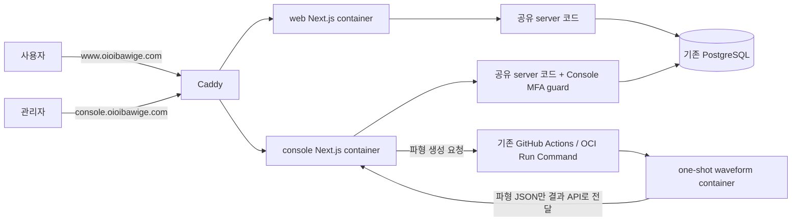

# Console·다중 응원법·파형 편집기 최소 설계

**구현 전 검토용 초안이다.** 코드 근거는 [CURRENT-STATE](CURRENT-STATE.md), 파형 기술 근거는
[AUDIO-FEASIBILITY](AUDIO-FEASIBILITY.md), 구현 순서는 [ROADMAP](ROADMAP.md)이 소유한다.
이 개정은 최초 설계 커밋 `9c15838f9c4cb23a0f8f16c37313ef4fe95b2a48`의 제안을 대체한다.
애플리케이션·DB·배포 코드는 이번 문서 변경에 포함하지 않는다.

## 1. 목표

운영 화면을 별도 Console로 옮기고, 같은 곡의 OFFICIAL/FESTIVAL/CONCERT 응원법을 선택하고 편집한다.
기존 FAN은 FESTIVAL과 CONCERT로 나누며 기존 데이터는 운영자가 수동 분류한다.
Console에서 YouTube 링크를 입력하면 일회성 컨테이너가 파형 JSON을 생성하고, 편집기는 YouTube 재생과 JSON을 사용한다.
**서버의 음원 임시 처리는 허용하며 음원 영구 저장·공개·전달은 금지한다. 브라우저에서는 분석하지 않는다.**

기존 Service/Repository/CASL/Query/Ky/Zod, Auth.js/Argon2id, 가사 JSON, LRC·시간 캡처·Undo/Redo를 재사용한다.
세션 레지스트리·인증 grant·복구 UI·범용 Audit DB·미래 Event/variant 모델과 자동 정렬 연구는 이번 범위에서 뺀다.
필요한 도구의 기능을 직접 다시 구현하지 않는다.

## 2. 핵심 Architecture



공유 server는 두 Next 프로세스에서 실행하는 소스 패키지다. 별도 API 서버는 만들지 않는다.
RSC → Service와 Client → Query → Ky → Route → Service 흐름 및 기존 FSD 규칙을 유지한다.
각 앱은 자기 origin의 API를 호출하며 Console 세션을 web과 공유하지 않는다.
현재 배포의 digest·health·smoke·rollback 절차를 두 앱에 적용한다. release manifest framework는 추가하지 않는다.
DB runtime role 분리는 후속 hardening으로 남기고 기존 service 인가를 유지한다.

## 3. Monorepo 구조와 검증

```text
apps/
  web/                     기존 Next 앱을 먼저 그대로 이동, /admin 유지
  console/                 이후 관리 UI·API·인증 진입점 이관
packages/
  contracts/               함께 쓰는 Zod DTO·request/response·enum
  server/                  함께 쓰는 schema/DB·repository·service·인가·error
tooling/
  typescript-config/       base.json, next.json, node.json
  eslint-config/           base.mjs, next.mjs, node.mjs
  harness/                 기존 FSD·파일/import boundary 검사와 테스트
workers/
  waveform/                CLI entrypoint + Containerfile, 상주 서비스 없음
drizzle/                   기존 migration 이력의 단일 소유자
pnpm-workspace.yaml        workspace/dependency 관리
turbo.json                 task graph·병렬 실행·로컬 cache
.husky/                    repository root 한 곳
```

`packages/ui`, `domain`, `api-client`는 초기 생성하지 않는다. server 추출도 기존 코드를 가능한 그대로 옮긴다.
앱 간 직접 import와 client → server package import를 검사한다. 필요한 `server-only` 경계는 유지한다.
Next/TS/ESLint 자동 탐색 진입점은 각 프로젝트 root의 얇은 wrapper로 두고 공유 설정을 extends/import한다.
web/console은 Next 설정, server는 Node 설정, contracts는 base 설정을 사용한다. 앱별 alias·include만 각 진입점에 둔다.

JS/TS workspace의 실제 작업에 `lint`, `type-check`, `test`, `build` 이름을 사용한다.
Next 앱만 `next build`를 실행하고, TS 소스 패키지는 앱의 `transpilePackages`로 소비해 불필요한 library build를 만들지 않는다.
Node 설정의 module resolution과 package exports가 앱 소비 방식에 맞는지는 두 앱 build로 검증한다.
worker는 JS workspace로 억지 포장하지 않고 CLI/container 검증을 별도로 연결한다.

```text
pnpm verify
├─ tooling/harness: 기존 test:harness + lint:fsd
├─ turbo run lint type-check test build --cache=local:rw
├─ 기존 운영 스크립트 테스트
└─ format:check
```

[Turbo](https://github.com/vercel/turborepo/blob/main/apps/docs/content/docs/crafting-your-repository/configuring-tasks.mdx)의
task graph를 쓰고 직접 변경 감지·cache 도구를 만들지 않는다. TS를 직접 소비하는 패키지도
상위 앱의 검사 hash에 dependency 변경이 반영되도록 transit task를 연결한다.
Next build outputs는 `.next/**`에서 `.next/cache/**`를 제외하고, 공유 tooling·테스트 설정·build 환경값을 hash 입력에 포함한다.
비결정적 작업과 DB/worker 실행 결과는 cache하지 않는다. Remote Cache는 초기 도입하지 않는다.

pre-commit은 root lint-staged의 ESLint/Prettier만 실행한다. 전체 type-check/build는 넣지 않는다.
pre-push는 필요하면 `turbo run lint type-check test --affected`를 사용한다.
[`--affected`](https://github.com/vercel/turborepo/blob/main/apps/docs/content/docs/reference/run.mdx)의 기준은
`migration_develop` merge-base로 설정하고 필요한 Git 이력을 확보한다.
중앙 harness와 root 설정 변경은 항상 검사하며, 초기 CI는 전체 `pnpm verify`로 두 앱을 검증한다.

## 4. Console / Auth

[Auth.js Credentials](https://authjs.dev/getting-started/authentication/credentials)를 유지한다.
UI는 ID/PW → TOTP 두 단계여도 최종 `authorize`에서 **비밀번호·ACTIVE·ADMIN·TOTP를 모두 검증한 뒤에만** identity를 반환한다.
첫 단계는 세션을 발급하지 않는다. 비밀번호는 현재 폼 메모리에서만 최종 요청까지 보유하고 URL/storage에 저장하지 않는다.
TOTP는 [otplib](https://github.com/yeojz/otplib), QR은 [qrcode](https://github.com/soldair/node-qrcode)를 사용하고 OTP 알고리즘이나 외부 QR 서비스를 만들지 않는다.

```text
admin_mfa
  accountId PK/FK
  encryptedSecret          Node crypto의 인증된 암호화, key는 Console 환경에만 보관
  enabledAt nullable       미등록/등록 진행 상태 구분
  lastUsedStep nullable    성공한 TOTP step의 원자 갱신으로 재사용 차단
  version                 reset/회수 시 증가, row를 지워 1로 재시작하지 않음

Console JWT application claims: { sub, mfaVerified: true, mfaVersion }
```

Auth.js의 표준 만료 claims는 유지하고 명시적 session maxAge를 둔다. 현재 sub만 남기는 callback은 위 MFA claims도 보존한다.
관리 RSC/Route/Server Action은 공통 Console guard에서 JWT 증명과 DB의 enabledAt/version을 확인한 뒤
기존 DB role/status·CASL·service `requireAdmin` 검사를 사용한다. MFA reset 및 관리자 인증 정보 변경에 필요한
Console 전체 회수는 version 증가로 처리한다. 세션별 관리·idle tracking·step-up은 도입하지 않는다.

최초 등록은 Console 외부 공개 전에 접근이 제한된 환경에서 끝낸다.
setup endpoint는 비밀번호로 확인한 ACTIVE ADMIN이면서 MFA 미등록일 때만 허용하고 관리 작업 권한은 주지 않는다.
pending secret도 같은 admin_mfa 행에 암호화 저장하며 TOTP 확인 후 활성화한다.
분실은 운영 CLI reset으로 처리한다. 다시 접근을 제한한 뒤 version 증가 → 기존 세션 거절 → 재등록 → 공개 순서를 따른다.
pre-auth DB, login/enrollment/recovery grant, recovery code UI, Gmail OTP fallback은 만들지 않는다.

Console 전용 AUTH_SECRET과 host-only Secure/HttpOnly/SameSite cookie를 사용한다.
관리 mutation은 허용된 Console Origin과 해당 요청 방식의 CSRF 방어를 검사한다.
현재 비밀번호 로그인에는 rate limit 호출이 없으므로, 단일 Console 프로세스에
[rate-limiter-flexible](https://github.com/animir/node-rate-limiter-flexible)의 메모리 limiter를 붙여 계정·신뢰한 IP별 실패를 제한한다.
분산 counter 테이블은 만들지 않는다. secret·OTP·비밀번호는 기록하지 않고 실패 이벤트는 기존 structured logging을 쓴다.

## 5. CheerGuide

```text
Song                       현재 곡·youtubeId·visibility 유지
CheerGuide
  id, songId, type          OFFICIAL | FESTIVAL | CONCERT
  label nullable, lyrics   기존 LyricsData JSON 구조
  version                  저장 요청과 비교하고 같은 UPDATE에서 증가
  UNIQUE(songId, type)
```

Song 하나에 타입별 최대 한 개만 둔다. Cue/Variant/Event 테이블을 미리 만들지 않는다.
가사 행·segments·isCheer/isEcho/isExtra·startTimeOffset을 보존하고 기존 초 단위 JSON을 그대로 소비한다.
편집기의 ms 계산만 저장 경계에서 초로 변환한다. 행의 안정 ID는 우선 편집 draft에만 두어 데이터 변환을 줄인다.
version은 동시 저장 방지용이며 과거 내용을 저장하는 revision 이력은 아니다.
BPM/beatOffset 같은 편집 설정은 해당 기능을 추가할 때 작은 guide JSON 필드로 저장한다.

**Revision History는 기존 Domain 요구로 유지한다.** 이번 단계는 관리자만 편집하는 현재 콘텐츠 모델을 제안하며
이를 APPROVED revision이라고 부르지 않는다. 구현 PR에서 Domain에 이 초기 단계의 적용 범위를 명시하고
후속 이력·승인 단계와 구분해야 한다. 개정 없이 기존 승인본 불변성을 생략하는 구현은 진행하지 않는다.
Contribution/Discussion/범용 Audit과 승인 플랫폼을 타입 추가에 함께 구현하지 않는다.

운영자의 수동 매핑이 있는 곡만 guide로 이전한다. false/null flag를 FESTIVAL/CONCERT로 자동 변환하지 않는다.
Song.lyrics는 전환 기간 보존하고 미분류 곡만 legacy reader를 사용한다. 이전한 곡은 guide가 유일한 writer가 된다.
LRC create/update·lyrics 저장·삭제 경로를 함께 점검하고 shadow 비교로 내용 보존을 확인한다.
공개 조회는 기존 Song/Album visibility 조건을 유지한다. rollback은 새 guide 데이터를 읽는 호환 앱으로 한다.

사용자 기본 선택은 OFFICIAL → FESTIVAL → CONCERT다. 하나면 selector를 숨기고 2~3개면 segmented control을 쓴다.
`nuqs`의 `?guide=<id>`로 공유 가능한 선택을 보존하고 잘못된/다른 곡 ID는 기본 항목으로 정규화한다.
모두 같은 Song.youtubeId를 사용하므로 전환 시 player를 유지하고 가사만 바꾼다.
공개 DTO는 Query cache, Console 저장 성공은 관련 key invalidate를 사용한다. 다른 origin의 갱신은 refetch로 확인한다.
동일 타입의 다수 항목·bottom sheet·행사 연결은 실제 요구가 생길 때 확장한다.

## 6. Waveform Worker

```text
Console: YouTube URL 검증 → videoId 정규화 → 생성 요청
  → 기존 GitHub Actions workflow_dispatch → OCI Run Command의 고정 host script
  → docker run --rm: yt-dlp → ffmpeg pipe → audiowaveform → JSON
  → host script가 JSON만 Console 결과 API로 전달 → DB jsonb 저장 → 종료
```

다운로드는 worker 안에서만 수행한다. 기본은 pipe이고 필요 파일·cache는 컨테이너 tmpfs에만 둔다.
read-only root, audio volume/bind mount 없음, swap/core dump 제한, 성공·실패·timeout 모두 제거를 적용한다.
worker에 HTTP 서버·DB credential은 없고 Console에 Docker socket/host 관리 credential을 주지 않는다.
기존 배포 workflow와 별개의 고정 작업을 요청하는 얇은 연결만 추가한다. 인증된 JSON 결과 경로와 resource 제한을 검증한다.
Run Command stdout은 크기 제한이 있으므로 JSON 전달 통로로 쓰지 않고 짧은 상태만 남긴다.
결과 API의 전용 service token은 host의 보호된 환경에서 읽고 command 내용·로그에 넣지 않는다.

Waveform은 songId, 현재 jobId/status, data JSON만 갖는 작은 저장 단위다. JSON의 source가 현재 youtubeId와 맞아야 한다.
동시 작업은 host의 파일 잠금으로 하나로 제한하고 진행 중 요청은 거절한다. 새 Queue나 자동 재시도 시스템은 만들지 않는다.
실패 시 원인을 보여주고 관리자 재시도를 제공한다. timeout 후 상태를 실패로 정리하고 오래된 job의 결과는 거절한다.
재생성 실패는 직전 정상 JSON을 지우지 않는다. 오디오는 DB/R2/host volume/log/다른 서비스에 남기지 않는다.
JSON 형식·도구 선택·삭제 검증은 [파형 기술 검토](AUDIO-FEASIBILITY.md)를 따른다.

## 7. Audio Editor

```text
기존 YouTube / 가사 표 / LRC / 시간 캡처 / Undo·Redo
+ Peaks.js overview·zoom waveform·timeline·playhead·Cue point drag
+ BPM / 첫 박(beatOffset) / grid / Snap ON·OFF
+ Nudge / Fine Nudge / Cue 주변 Loop / A-B Loop
```

파형·zoom·point drag는 Peaks.js를 사용하고 현재 YouTubePlayer를 작은 custom player adapter로 연결한다.
별도 waveform Canvas 엔진이나 DAW를 만들지 않는다. 기존 가사 행은 point marker이며 UI 폭을 실제 종료 시각으로 저장하지 않는다.
Grid는 기존 point marker/시간축에 붙이는 기능이며 자동 BPM/onset은 필수가 아니다.
예를 들어 120 BPM에서 1/16 grid는 125ms다. 관리자가 첫 박을 지정하고 Snap을 켜야 이동에 적용된다.
Grid 변경은 기존 Cue를 움직이지 않는다. fine nudge는 Snap을 우회하며 Loop는 YouTube seek 지연을 허용한다.

server DTO는 Query, 편집 draft는 RHF, 선택/zoom/loop/drag preview는 local state/ref로 둔다.
기존 50개 Undo/Redo를 재사용하고 drag 종료 한 번을 변경 한 번으로 처리한다. Esc/취소는 원래 위치로 복원한다.
저장은 명시적으로 수행하며 충돌·만료·네트워크 실패에도 draft를 보존한다.
입력란·IME·dialog에서 전역 단축키를 막고 기존 Q/W/E/R·텍스트/강조 편집을 보존한다.
파형 실패 중에도 기존 가사 표와 시간 캡처를 사용할 수 있다. editor 라이브러리는 Console에서만 로드한다.

## 8. 주요 Trade-off

| 선택                                | 남는 한계 / 확인 사항                                                                                    |
| ----------------------------------- | -------------------------------------------------------------------------------------------------------- |
| 같은 OCI host에서 일회성 worker     | 새 인프라는 줄지만 분석이 web 자원을 경쟁하므로 CPU/RAM/timeout을 측정·제한한다.                         |
| YouTube → 파형 JSON                 | iframe은 PCM을 제공하지 않는다. yt-dlp 성공·동일 영상의 시간축·이용 허용을 실제 입력으로 확인한다.       |
| 단일 프로세스 limiter와 MFA version | 재시작 시 limiter 상태는 사라지고 세션별 회수는 없다. 복제 운영 시에만 분산 저장을 재검토한다.           |
| 타입별 한 guide + 현재 JSON         | 공연별 다수 항목과 revision 이력은 초기 범위 밖이며 Domain의 단계 적용을 명시해야 한다.                  |
| 공유 DB·별도 앱                     | 같은 host/DB까지 격리되지는 않는다. pool 합계와 한쪽 rollback을 검증하고 DB role 세분화는 후속으로 둔다. |

상위 기준은 [헌법](../../oioi-bwg-architecture-clean-v1/01-architecture-constitution.md),
[Auth](../../oioi-bwg-architecture-clean-v1/04-auth-authz-architecture.md), [Deployment](../../oioi-bwg-architecture-clean-v1/12-deployment-migration-runbook.md),
[Domain](../../DOMAIN_SPECIFICATION.md)이다. 앱 분리·MFA claims/회수·FAN 분류/Revision 단계·YouTube 임시 분석·실제 CD 경로의
변경은 해당 구현 PR에서 관련 active 문서와 같은 단위로 반영한다. 이 draft가 상위 문서를 자동 대체하지 않는다.
