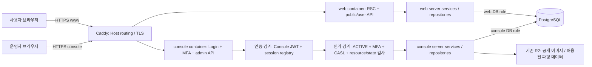
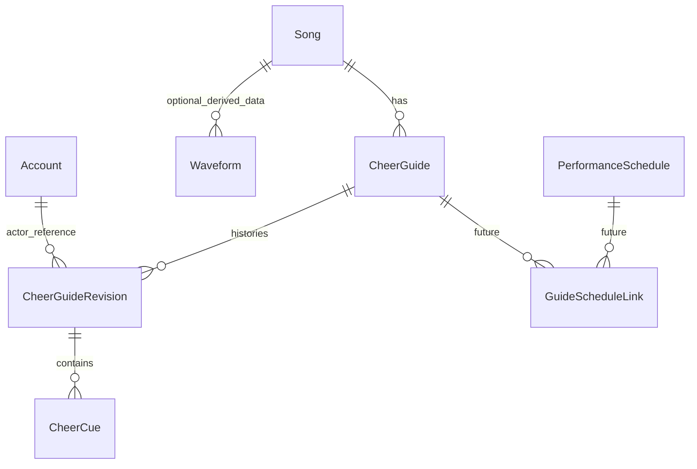
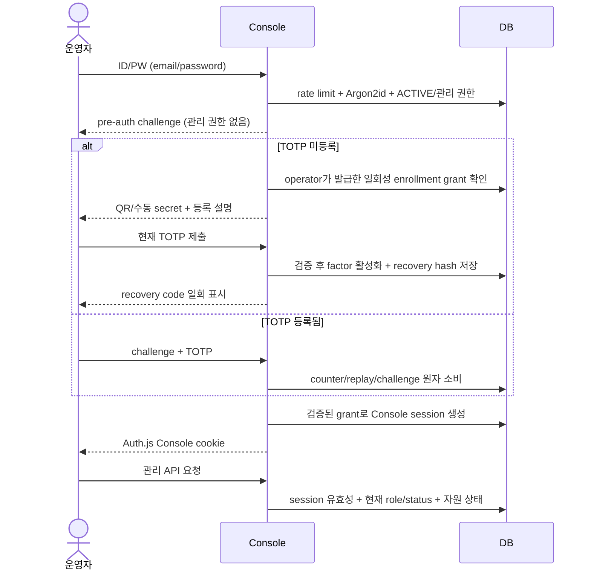

# Console·CheerGuide·Audio Editor 설계 제안

**설계 검토용 초안이다. 구현 착수 승인이나 active architecture를 대신하지 않는다.**
현재 코드의 사실은 [CURRENT-STATE](CURRENT-STATE.md), 외부 기술의 근거는
[AUDIO-FEASIBILITY](AUDIO-FEASIBILITY.md), 실행 단위는 [ROADMAP](ROADMAP.md)이 소유한다.
본 문서는 사용자 요청의 14개 항목 순서로 권고안과 미결정을 연결한다.
application 코드·schema·migration·의존성·배포 설정은 이번 변경에 포함하지 않는다.

상위 기준은 [문서 인덱스](../../oioi-bwg-architecture-clean-v1/00-document-index.md),
[헌법](../../oioi-bwg-architecture-clean-v1/01-architecture-constitution.md),
[Domain Specification](../../DOMAIN_SPECIFICATION.md)와 영역별 active 문서다.
문서 검색 결과 이 세 요구를 함께 다루는 기존 설계 소유자가 없어 이 디렉터리를 새 제안의 canonical home으로 선택했다.

## 1. Executive Summary

권고안은 **같은 repository의 작은 pnpm workspace에 web/console 두 Next.js 앱**, **기존 Auth.js에
Console 전용 TOTP와 세션 회수 추가**, **Song 아래 독립적인 guide/revision**, **수동 Grid부터 개선하는 편집기**다.
별도 API 서버, 운영 Python 서버, Queue, GPU는 MVP에 추가하지 않는다.

기존에 사용할 수 있는 기반이 충분하다. Service/Repository/CASL/Query/Ky/Zod와 LRC·시간 캡처·Undo/Redo를
유지한다. 응원법을 별도 테이블로 분리하는 것보다 더 중요한 것은 기존 가사 강조 정보를 보존하고,
승인된 revision과 편집 draft를 구분하며, 새로운 Console 밖의 관리 쓰기 경로를 닫는 것이다.

최소 비용으로 먼저 효과를 볼 가능성이 큰 기능은 **BPM + 첫 박 지정 + Snap/Nudge + Cue 주변 Loop**다.
이 경로는 파형 없이도 유용하다. Waveform은 분석 가능한 로컬 음원 확보 후 추가하며, 자동 분석은
관리자가 후보를 검수하는 실험으로 제한한다. Forced Alignment로 음원에 없는 응원 문구를 배치하는 안은 제외한다.

사용자가 추가로 확정한 조건은 **FAN을 FESTIVAL/CONCERT로 나누고 최종 종류는
OFFICIAL/FESTIVAL/CONCERT로 재정의**, **기존 데이터 수동 분류**, **음원의 웹서버 전송 금지**다.
기존 데이터별 종류, 공식 출처 확인, 로컬 분석 경로의 채택, 운영 hostname·자원, 관리자 복구 정책은 남아 있다.

## 2. 현재 코드 구조 분석

[현재 구조 표 E01~E18](CURRENT-STATE.md#1-현재-상태--문제--변경-필요-여부)에 각 영역의
현재 상태·문제·변경 필요 여부와 실제 파일/symbol을 기록했다.

- 사용자와 Admin은 한 Next 앱이고, 운영용으로 별도 분리된 image나 Console session은 없다.
- DB에는 CheerGuide 테이블이 없고 `Song.lyrics` JSON과 `hasOfficialCheer`만 있다. `entities/cheer-guide`는 가사 타입·LRC/parser·badge다.
- backend service에서 현재도 ADMIN 인가를 검사한다. 이번에 추가해야 하는 조건은 Console 전용 MFA 완료 증명이다.
- 편집기에는 읽기용 타임라인·키보드 캡처·오프셋·Undo/Redo가 있다. 파형과 이동 가능한 Cue track은 없다.
- 실제 CI/CD 코드는 GitHub Actions → OCIR → OCI Run Command다. 상위 문서의 OCI DevOps 규정과 차이가 있다.
- production DB/host를 조회하지 않았으므로 row 수·실제 DNS·현재 운영 Caddy 설정·성능을 확인했다고 주장하지 않는다.

## 3. 핵심 설계 결정

### 3.1 권고와 미결정 구분

| ID  | 상태                              | 권고안 / 미결정                                                                                                                                 | 구현 전 반영할 소유 문서                                        |
| --- | --------------------------------- | ----------------------------------------------------------------------------------------------------------------------------------------------- | --------------------------------------------------------------- |
| D01 | 사용자 방향 확정·명세 반영 필요   | FAN을 FESTIVAL/CONCERT로 분리. 최종 OFFICIAL/FESTIVAL/CONCERT. 기존 항목 수동 분류, 공식 출처·잠금과 각 분류의 governance 세부 규칙은 후속 확정 | Domain §8, §14, §21, §23, §26                                   |
| D02 | 권고·개정 필요                    | 같은 repo의 독립 Next 앱 2개, 하나의 shared server implementation, 별도 DB/API 서버 없음                                                        | 헌법 §4/5/13, Frontend 02, Server 06, Runtime 11, Deployment 12 |
| D03 | 권고·개정 필요                    | Auth.js 유지, TOTP 완료 후 Console session 발급, 즉시 revoke 가능한 DB registry                                                                 | Auth 04 §4/27/29, Domain AUTH-006·Security/Audit                |
| D04 | 사용자 제약 확정·분석 경로 미결정 | 음원 웹서버 전송 금지. YouTube iframe을 기본 재생으로 사용. 로컬 파일/로컬 yt-dlp 분석은 선택 후보이며 서버 추출·upload·proxy는 제외            | Domain §20, Runtime 11                                          |
| D05 | 충돌 정리 필요                    | 실제 direct Run Command를 유지하는 안 권고. 상위 문서를 현재 코드에 맞춰 자동 확정하지 않고 M9 변경 근거로 정합성 검토                          | 헌법 §4, Deployment 12 §21                                      |
| D06 | 미결정                            | ADMIN self-approval은 현 Domain에서 허용. 무토론 admin draft의 제출→승인 경로, legacy import의 승인 주체·출처 기록 확정                         | Domain §10/18/23/26                                             |
| D07 | 권고·운영 확인 필요               | 단일 운영자도 복구 가능한 offline recovery + 제한적 수동 reset, session 절대/idle/step-up 기한                                                  | Auth 04, 운영 runbook                                           |
| D08 | 미결정                            | 각 category에 여러 항목이 생겼을 때 기본 항목의 운영 순서, 숨김/보존/삭제 정책                                                                  | Domain §8/14/23                                                 |

2026-10-05 사용자 추가 답변을 반영했다. FAN이라는 별도 category를 남기거나 FAN을 OFFICIAL로
자동 매핑하지 않는다. OFFICIAL 분류는 확인된 공식 응원법을 대상으로 하고, 기존 FAN의 공연별 목적을
FESTIVAL/CONCERT로 운영자가 분류한다. 출처·잠금/기여 권한의 상세 정책은 Domain 개정에서 고정한다.
음원 비전송 조건 때문에 Waveform/자동 분석은 MVP 필수 단계에서 선택 실험으로 내린다.

### 3.2 애플리케이션 분리 대안

| 안                                        | 이점                                            | 비용·한계                                       | 판정                                                      |
| ----------------------------------------- | ----------------------------------------------- | ----------------------------------------------- | --------------------------------------------------------- |
| 현 앱 `/admin` 유지                       | 변경 최소, 현재 guard 재사용                    | 별도 container·release 요구 충족 못함           | 안전한 이전 단계로만 유지                                 |
| 같은 repo에 앱 2개, 공유 코드 복사        | 진입점·배포 즉시 분리                           | schema/인가/계약 drift, 취약점 수정 중복        | 장기 목표로 비추천                                        |
| pnpm workspace `apps/web`, `apps/console` | 독립 build, 계약/서버 원천 하나, 함께 검증 가능 | tracing·tool 경계·공유 schema release 관리 필요 | **권고**. 이것 자체가 작은 monorepo이며 Nx/Turbo는 불필요 |
| 별도 repository                           | 조직·배포 완전 독립                             | package 배포/버전 조율, auth/schema 복제 비용   | 독립 팀/소유권 필요가 생길 때 재검토                      |

한 코드를 두 container에서 실행하고 host flag로 `/admin`만 숨기는 방안은 임시 격리에는 쓸 수 있지만,
web image의 관리 endpoint 제거와 서로 다른 credential 경계를 검증하기 어렵다. 목표 구조는 별도 앱 entry다.

## 4. Target Architecture



WS/CS는 별도 API 서비스가 아니라 **동일한 shared server 소스의 각 Next 프로세스 실행본**이다.
RSC는 해당 프로세스의 service를 직접 호출한다. Client는 해당 origin의 `/api/*`를 Query/Ky로 호출한다.
web browser가 console API를 cross-origin 호출하거나 양쪽이 session cookie를 공유하는 구조는 필요 없다.

```text
apps/web/       사용자 app/routes + 각 앱 FSD layers + src/server 전달 경계
apps/console/   Console app/routes + 편집 UI + src/server 인증/전달 경계
packages/contracts/    두 앱의 serializable Zod DTO, 서버 dependency 없음
packages/server/       server-only schema/repositories/services/공통 CASL policy
packages/ui/           실제 양쪽 consumer가 있는 primitive만, 추출 필요가 확인될 때
drizzle/               두 앱이 공유하는 migration 이력의 단일 소유자
```

`packages/domain`과 `api-client`는 이름만 먼저 만들지 않는다. 각 앱의 `entities/*/api`가 resource별
Query/Ky를 소유하고 공유 transport가 실제 중복될 때만 추출한다. App 간 import와 client→server package
import를 금지한다. 각 앱 안에서는 기존 FSD 방향·public API·route-private 규칙을 그대로 적용한다.
앱 설정은 각 Next app의 자동 탐색 root, workspace orchestration 설정은 repository root에 둔다.

### 배포·환경변수·운영

- `web`/`console` 별도 image target·OCIR artifact·container·env file·health/readiness. host Caddy이면 loopback의 서로 다른 port, Caddy container이면 private network 서비스명으로 연결한다. 실제 topology는 host inventory 후 선택한다.
- Caddy는 `www.oioibawige.com`과 `console.oioibawige.com` Host를 각각 upstream으로 보낸다. 미등록 Host를 거절하고 Next port를 외부 공개하지 않는다. DNS/TLS는 인증 boundary가 아니며 각 origin의 health/redirect도 검증한다. trusted proxy/header 처리는 [Caddy 문서](https://caddyserver.com/docs/caddyfile/directives/reverse_proxy)를 따른다.
- `AUTH_SECRET`, cookie name, auth base URL, DB runtime role을 앱별로 분리한다. `CONSOLE_MFA_ENCRYPTION_KEY`는 Console에만 주입한다. R2 쓰기 권한도 필요한 Console에만 둔다. web은 회원가입·로그인용 최소 DB 권한은 유지하되 guide mutation/MFA secret/session registry는 접근 불가로 만든다.
- `NEXT_PUBLIC_*`는 build input으로 분리하며 secret을 넣지 않는다. protected env file과 기존 OCI Vault materialization을 재사용한다. 앱마다 release/environment가 구분되는 Sentry 설정을 사용하고 Console에 일반 사용자 분석 tracking은 기본 추가하지 않는다.
- 초기 CI는 두 앱 모두 검증한다. shared 변경은 반드시 두 build. 작은 repo에서 path filtering부터 복잡하게 도입하지 않는다. workspace의 [transpilePackages](https://nextjs.org/docs/app/api-reference/config/next-config-js/transpilePackages)와 [standalone tracing root](https://nextjs.org/docs/app/api-reference/config/next-config-js/output), static/public copy·실행 경로를 실제 image로 검증한다.
- release manifest에 `{webDigest, consoleDigest, schemaCompatibility}`를 기록하고 app별 current/previous를 관리한다. 기존 `deploy-release.sh`의 단일 app 전제를 별도 PR에서 바꾼다. DB migration은 app start/deploy가 자동 실행하지 않는다.
- 공유 DB schema를 expand → 호환 app → migrate → contract 순서로 배포한다. 한쪽 rollback도 현재 schema와 호환돼야 한다. pool은 현행 process당 10을 그대로 두 배 늘리지 않고 DB 상한·deploy 중첩·migration 연결을 포함해 예산을 정한다.
- 두 container는 host 장애를 격리하지 못한다. 2 OCPU/12GB라는 설계 예산에서 CPU/RAM을 측정하고 분석 workload는 브라우저에 둔다. public 전환 전에 MFA·recovery·기존 endpoint 폐쇄·rollback을 함께 검증한다.

## 5. DB / Data Model

### 5.1 작은 모델의 선택

권고는 **CheerGuide 한 행이 사용자가 선택하는 한 variant**가 되는 구조다.
`CheerGuide`와 1:1 `CheerGuideVariant`를 동시에 만들지 않는다. Song 자체가 guide들을 묶는다.
category는 사용자가 확정한 OFFICIAL/FESTIVAL/CONCERT다. D01의 상위 명세 개정 전에 새 enum을 구현하지 않는다.

`UNIQUE(song_id, category)`만 두면 두 콘서트를 추가할 때 곧 변경해야 한다. 대신
`UNIQUE(song_id, category, variant_key)`를 권고하고 최초에는 `variant_key=default` 하나만 허용한다.
공연별 항목이 실제 생기면 stable variant_key와 표시 label을 추가로 사용한다.
Event는 지금 만들지 않는다. 기존 명세의 `PerformanceSchedule`이 필요한 event 개념을 소유하므로,
그 기능 도입 때 guide와 schedule 간 선택적 link table을 검토한다. 행사명 문자열을 FK처럼 사용하지 않는다.



Waveform은 Phase 4에서만, PerformanceSchedule/GuideScheduleLink는 향후 필요할 때만 추가한다.
CheerGuide의 current pointer는 자기 소속 APPROVED revision만 가리킨다. ERD의 행위 주체 FK는 소유권을 뜻하지 않는다.

| 모델               | 제안 필드 / 책임                                                                                                                          | 주요 불변식                                                                                           |
| ------------------ | ----------------------------------------------------------------------------------------------------------------------------------------- | ----------------------------------------------------------------------------------------------------- |
| Song               | 기존 id/albumId/slug/title 등 유지                                                                                                        | id가 identity. nullable slug와 최초 지정 이후 불변 정책 유지                                          |
| CheerGuide         | id, song_id, category(D01), variant_key, label, state, display_order, current_revision_id                                                 | 같은 song/category/key 중복 금지; 종류/공식성/잠금 정책은 Domain에서 확정                             |
| CheerGuideRevision | id, guide_id, version, status, edit_version, reference_media JSON, timing_config JSON, source_type/url, created/approved actor·시각       | UNIQUE(guide_id, version); DRAFT/UNDER_REVIEW 활성본 최대 1개; APPROVED immutable                     |
| CheerCue           | id, revision_id, start_ms, end_ms nullable, cue_type, sort_order, content JSON                                                            | start≥0, end가 있으면 end>start, reference 길이를 알면 범위 검사; JSON은 명시적 version/schema로 검증 |
| Waveform           | id, song_id, reference_key, source_fingerprint, source_offset_ms, duration_ms, bucket_size_ms, peaks/asset key, generation_version/status | 보조 데이터; 원본 경로/음원 보관 없음; 다시 생성해도 Cue timing 불변                                  |
| 미래 Schedule link | schedule_id, guide_id, 추천 여부 등                                                                                                       | 행사로 종류·공식성을 자동 변경하지 않음. 하나의 guide를 여러 일정에서 재사용 가능                     |

`content`에는 기존 가사 행의 `isExtra`와 순서 있는 segment `{id,text,isCheer,isEcho,offsetMs}`를
보존한다. 첫 이행에서는 행 하나를 Cue group 하나로 표현하여 일반 가사도 보존한다. segment 독립 절대 시각을
별도 컬럼에 중복 저장하지 않고 `cue.startMs + offsetMs`로 구한다. “가사에서 isCheer만 추출하고 나머지 삭제”하지 않는다.
cue type/group semantics는 현 논리 명세의 보완안이므로 D01/D06 문서 PR에서 정한다.

시간 단위는 DB/DTO 모두 integer ms, player adapter만 seconds로 변환한다. 기존 임의 소수 정밀도가 ms를
넘는 경우 원본과 변환 오차를 보고하고 공개 전 운영자가 확인한다. segment offset의 음수/이상치도
현 Zod가 완전히 막지 않으므로 profile 후 분류하며 조용히 0으로 바꾸지 않는다. `endMs=null`은 point cue이고,
다음 행 시각을 실제 duration으로 자동 backfill하지 않는다. 겹침은 오류로 일괄 금지하지 않고 track에서 표현한다.

인덱스는 guide의 song/category/order 조회, revision의 `(guide_id, version)`, Cue의
`(revision_id, start_ms, sort_order)`를 중심으로 한다. FK index는 중복 기존 prefix를 확인한다.
활성 revision은 [PostgreSQL partial unique index](https://www.postgresql.org/docs/17/indexes-partial.html)로
동시 생성도 막는다. pointer의 동일 guide 소속은 composite FK로 강제하고 APPROVED 조건은
service transaction에서 잠금·검증한다. [CHECK는 다른 row 상태를 보장하지 못한다](https://www.postgresql.org/docs/17/ddl-constraints.html).
승인·Cue 쓰기는 같은 revision row 잠금/상태 조건을 사용하고, `edit_version` 불일치 시 409로 덮어쓰기를 거절한다.
approved Cue 쓰기 API는 없으며 삭제/숨김 때 이력을 cascade로 잃지 않도록 현재 Album→Song 삭제 경로도 수정한다.

### 5.2 migration·호환·rollback

1. **분류:** local 승인 dump에서 lyrics 형식·순서·offset·null·공식 flag·참조 영상 상태를 조사한다. `hasOfficialCheer=true`도 source 확인이 필요하고 false/null은 종류를 증명하지 못한다. 운영자 매핑 목록이 없으면 해당 곡을 legacy 경로에 남긴다.
2. **Expand:** schema 수정 → Drizzle migration 생성 → SQL/잠금 검토 → local guard로 명시 적용 → 실제 PostgreSQL 검증. 새 테이블만 추가하고 `Song.lyrics`는 유지한다. production 적용 계획은 별도다.
3. **Backfill:** 곡별 transaction으로 guide/revision/cue를 변환한다. 원본 JSON·hash·변환 version·대상 ID의 manifest를 남겨 재실행 중복을 막는다. 비공식 곡을 FESTIVAL로 몰아 넣지 않는다. 기존 공개본을 APPROVED로 옮기는 것은 migration source와 승인 근거를 남기는 D06 절차를 따른다.
4. **Shadow read:** 구 DTO와 새 모델→구 DTO mapper의 text·flag·행/segment 순서·시간을 비교한다. null/빈 lyrics, extra/echo, 중복 시각, 숨긴 곡/앨범, 끝점 없는 Cue도 비교한다. 로컬 검증용 합성 fixture는 테스트에서만 사용하고 임의 DB seed로 넣지 않는다.
5. **Writer 전환:** 짧은 쓰기 중지 창에서 마지막 차이를 반영하고 새 revision service만 쓰도록 전환한다. `/songs` create/update의 LRC 경로, lyrics PATCH, delete, image upload Action까지 inventory를 닫는다. 무기한 dual-write는 사용하지 않는다.
6. **Reader 전환:** 기존 `/songs/{slug}`와 기존 SongDetail 형식은 default guide를 legacy 형태로 projection하여 유지한다. 새 API는 guide ID를 명시한다. 전환 완료 표시된 곡에서 오류가 나면 낡은 `Song.lyrics`로 자동 fallback하지 않는다. 아직 미전환인 곡만 legacy를 읽는다.
7. **Rollback:** multi-guide 쓰기 전에는 flag/read adapter를 되돌릴 수 있다. 쓰기 후에는 새 모델을 읽을 수 있는 호환 app digest까지만 rollback한다. 전환 전 binary/단일 JSON으로 복귀하면 데이터가 숨거나 유실되므로 금지한다. 우선 Console 쓰기를 정지하고 호환 버전으로 복구한다.
8. **Contract:** 운영 확인·backup/restore rehearsal·rollback 기간 종료 후 별도 PR에서 legacy 컬럼/endpoint 제거를 제안한다. 공개 history를 삭제하는 down migration은 rollback 기본값이 아니다.

### 5.3 API·cache 계약 초안

| 경계                                                 | 제안 계약                                                                    | 확인 조건                                                                  |
| ---------------------------------------------------- | ---------------------------------------------------------------------------- | -------------------------------------------------------------------------- |
| public GET `/api/songs/{slug}/guides`                | `{items: GuideSummary[], nextCursor:null}`; current approved만               | Song/Album visible, unpublished 제외                                       |
| public GET `/api/songs/{slug}/guides/{guideId}`      | `{guideId, revisionId, referenceMedia, cues, ...}`                           | guide의 Song 소속 검사; 비공개/다른 곡 ID는 404                            |
| console draft GET/PUT `/api/admin/guides/{id}/draft` | `{revisionId, editVersion, cues, timingConfig, ...}`; PUT에 expected version | MFA+CASL+resource/state 검사; conflict 409, draft 보존                     |
| console submit/approve                               | 별도 use case/action endpoint                                                | 승인과 현재 pointer/audit가 단일 transaction; 재시도 시 중복 revision 방지 |

경로와 DTO의 최종 명명은 계약 PR에서 고정한다. request는 Route에서 Zod 검증하고 service는 AppError만
throw한다. output도 검증하며 성공 envelope를 추가하지 않는다. 무제한 Cue payload를 허용하지 않고
크기·개수 상한은 실제 데이터 profile 후 결정한다. [API 03](../../oioi-bwg-architecture-clean-v1/03-api-error-architecture.md)과
[Contract 05](../../oioi-bwg-architecture-clean-v1/05-contract-validation-architecture.md)를 따른다.

Query key는 guide list `(songId)`, published detail `(songId,guideId)`, Console draft
`(accountId,guideId)`처럼 역할과 resource를 분리한다. 발행 DTO에 revisionId를 포함하고 cache 갱신 시 일관된
snapshot을 교체한다. RSC 초기 DTO는 동일 key에 setQueryData→dehydrate하고 가까운 subtree를 hydrate한다.
신호는 Ky까지 전달하고 retry는 Query가 소유한다. draft는 focus refetch로 form을 덮어쓰지 않는다.

Console mutation의 invalidate는 다른 origin의 web 사용자 cache에 전파되지 않는다. 공개 목록은 예를 들어
staleTime 30초 + 화면 재진입/focus 또는 명시 새로고침을 권고하되 수치는 실측 후 정한다. 재생 중 새 revision이
발견되면 현재 snapshot을 유지하고 “새 버전” 동작으로 전환한다. 즉시 실시간 전파는 MVP 약속에 포함하지 않는다.
Next Data Cache를 별도 일관성 수단으로 추가하지 않는다.

## 6. Console / Auth 설계

### 6.1 선택지 비교

2026-10-05 공식 문서 기준이다. Auth.js/Better Auth는 자체 호스팅 library이고 Clerk/Auth0/Cognito는
외부 운영 서비스다. “사업자 등록이 필수”라고 추정하지 않는다. 아래에서는 확인된 제품 조건과
이 프로젝트의 통합 비용을 비교하고, 실제 가입 심사/국가별 결제 조건은 확인 전 보장하지 않는다.

| 방식                                                                                                           | 장점                                                                                                                               | 추가 부담 / 절차                                                                                                 | 추천                                                                              |
| -------------------------------------------------------------------------------------------------------------- | ---------------------------------------------------------------------------------------------------------------------------------- | ---------------------------------------------------------------------------------------------------------------- | --------------------------------------------------------------------------------- |
| [Auth.js Credentials](https://authjs.dev/getting-started/authentication/credentials) + TOTP library            | 기존 account/Argon2id/session 연결 유지, 외부 MFA 계약 불필요                                                                      | Credentials가 MFA lifecycle·rate limit·recovery를 자동 제공하지 않음. 우리의 server 코드와 보안 검증 책임        | **현재 스택의 1순위**                                                             |
| [Better Auth 2FA](https://github.com/better-auth/better-auth/blob/main/docs/content/docs/plugins/2fa.mdx)      | TOTP/backup codes/challenge 기능 포함, 자체 호스팅                                                                                 | user/session/schema 및 현 Auth.js 전환 필요. OAuth 등 모든 방식에 자동 MFA 강제가 되는 것으로 가정하면 안 됨     | 자체 MFA 통합 비용이 커지면 제한 PoC 후 재평가                                    |
| [Clerk](https://clerk.com/docs/guides/configure/auth-strategies/sign-up-sign-in-options)                       | managed MFA/UX                                                                                                                     | production MFA는 유료 plan. [가격표](https://clerk.com/pricing)의 plan 조건·외부 identity mapping/회수 운영 필요 | 무유료계약 선호와 맞지 않아 보류                                                  |
| [Auth0](https://auth0.com/pricing)                                                                             | managed login/MFA                                                                                                                  | 공식 가격표상 Pro MFA는 Essentials 유료 영역, custom domain 카드 검증 표기. 기존 사용자 DB 통합 비용             | 작은 Console 목적에는 보류                                                        |
| [AWS Cognito TOTP](https://docs.aws.amazon.com/cognito/latest/developerguide/user-pool-settings-mfa-totp.html) | password→TOTP 지원, [Lite 포함 지원](https://docs.aws.amazon.com/cognito/latest/developerguide/cognito-sign-in-feature-plans.html) | AWS 계정·billing/IAM·user pool·복구 관리 추가. OCI만으로 운영하는 현재 흐름에 새 provider                        | 기존 AWS 운영 자산이 있으면 대안                                                  |
| 직접 TOTP 암호 알고리즘 작성                                                                                   | 외부 runtime 없음                                                                                                                  | 검증 window·replay·secret 보관·test vector까지 실수 위험                                                         | 암호 원시 구현은 제외. [otplib](https://otplib.yeojz.dev/) 등 검토된 library 사용 |
| Password + Gmail 수신 OTP                                                                                      | 익숙한 수신함, 기존 이메일 transport 일부 재사용                                                                                   | 도착 지연·스팸·전송 제한·메일함 탈취·복구 채널 종속. Gmail 주소로 보낸다고 Google 인증 강도가 추가되지 않음      | 관리자 MFA의 자동 fallback으로 비추천                                             |

Gmail **수신 주소**와 Gmail SMTP/OAuth를 **발송 수단**으로 쓰는 것은 별개다. 이미 OCI Email Delivery가
있으므로 fallback 검토 때문에 Gmail API/OAuth 심사를 새로 도입할 이유가 없다. 그러나 이메일 OTP를
추가하더라도 TOTP와 같은 보증으로 취급하지 않는다. [NIST 지침](https://pages.nist.gov/800-63-4/sp800-63b/authenticators/)은
이메일을 out-of-band 인증 수단으로 인정하지 않는다. 이는 이 프로젝트에 법적 의무를 선언하는 것이 아니라
보안 비교 근거다. 기본 복구는 별도 recovery code이며 이메일은 알림/수동 복구 접수용을 권고한다.

### 6.2 로그인·등록·발급



**비밀번호 성공만으로 Auth.js의 일반 ADMIN session을 Console에 발급하지 않는다.** 첫 요청은
제한된 pre-auth challenge만 만든다. 별도 Console Credentials provider는 MFA 성공으로 발급된,
짧은 일회성 login grant를 소비한 뒤에만 identity를 반환한다. grant는 challenge/account/browser nonce에
묶고 URL/localStorage에 넣지 않는다. 이 provider에도 raw password만으로 완료되는 우회 분기를 두지 않는다.

Auth.js가 cookie 발급을 담당하고 application session registry가 MFA·회수 상태를 소유한다.
JWT에는 role/rules 대신 `sub`와 opaque `consoleSessionId`만 추가한다. 현재 `jwt` callback은 `sub`만
남기므로 그대로 복사하면 sid가 유실된다. grant 소비와 registry 생성은 짧은 transaction이며, cookie 발급
실패 시 grant를 재사용하지 않고 로그인 재시작/만료 정리한다. Auth.js protocol을 임의 JWT 구현으로 대체하지 않는다.

최초 enrollment도 공격 경계다. 아직 MFA가 없는 ADMIN의 비밀번호만 탈취한 사람이 자기 기기를
등록하지 못하게, 기존 계정의 초기 등록은 운영자가 검증한 일회성 bootstrap grant를 필요로 한다.
초기 ADMIN 생성/승격을 공개 가입의 선택값으로 받지 않는다. MFA setup 중에는 setup/로그아웃 외 관리 API를 막는다.

### 6.3 secret·challenge·session 데이터

| 저장 단위            | 내용                                                                                                       | 보관/회수                                                                                                         |
| -------------------- | ---------------------------------------------------------------------------------------------------------- | ----------------------------------------------------------------------------------------------------------------- |
| admin_mfa_factor     | account FK, 암호화 secret, key version, enabledAt, lastAcceptedStep                                        | secret은 검증에 필요하여 hash만 저장할 수 없음. 인증된 암호화/nonce와 DB 밖 Vault key; web credential로 조회 불가 |
| admin_auth_challenge | opaque token hash, account, 목적, nonce binding, expiry, attempts, consumedAt                              | pre-auth/enrollment/step-up/recovery 목적 구분. 절대 expiry, 성공·실패 횟수 transaction                           |
| admin_recovery_code  | factor/account, 고엔트로피 code의 hash, usedAt                                                             | 최초 1회 표시, atomic consume. 재발급은 기존 코드 전체 폐기                                                       |
| console_session      | opaque sid/hash, account, factor identity, authenticatedAt, mfaVerifiedAt, idle/absolute expiry, revokedAt | logout·MFA reset·role/status·password/email 변경 때 회수. 만료 registry row 정리                                  |
| auth rate counter    | account/key + 신뢰한 client IP scope + window/count                                                        | 모든 container가 PostgreSQL counter 공유. 만료 정리, raw PII 최소화                                               |
| audit/security event | actor, action, target, result/reason, time, request correlation                                            | append-only app 권한, 관리 API로 수정/삭제 없음. secret/OTP/QR/복구 code/token 미기록                             |

TOTP는 6자리·30초·호환되는 HMAC-SHA1과 ±1 time step을 초기 후보로 하되,
[RFC 6238](https://www.rfc-editor.org/info/rfc6238/) test vector와 사용할 authenticator로 검증한다.
허용 window 내 성공 code라도 `lastAcceptedStep`보다 이전/같은 step은 다시 사용하지 못한다.
계정 단위 잠금/조건부 UPDATE로 동시 두 요청의 replay를 막는다. 서버 시계 동기화·키 교체·복호화 실패를
운영 검증에 포함한다. QR은 Console에서 자체 생성하고 외부 QR API에 secret을 보내지 않는다.

제안 초기값은 challenge TTL 5분·challenge당 5회, account 15분당 10회 실패·IP별 별도 상한,
session absolute 8시간·idle 30분·민감 작업 step-up 5분이다. **정책 확정값이 아니며** 소수 운영자의
실제 편집시간과 분산 공격/의도적 lockout을 검토해 D07에서 조정한다. challenge 재발급으로 account
실패 횟수가 초기화되지 않게 한다. 존재 여부/비밀번호/관리자 여부 오류는 과도한 정보를 주지 않게 통일한다.

쿠키는 Console host 전용 `Secure`, `HttpOnly`, `Path=/`, 적절한 `SameSite`와 `__Host-` prefix를
권고한다. `.oioibawige.com` Domain cookie를 쓰지 않고 web secret/cookie를 Console에서 인정하지 않는다.
SameSite만으로 sibling subdomain을 차단할 수 없으므로 unsafe method는 exact Console Origin과
CSRF token/요청 문맥을 검증한다. null/허용되지 않은 Origin을 거절하고 CORS wildcard+credential 조합을 만들지 않는다.
로그인 redirect는 Console 내부 allowlist로 제한한다. TLS 종료 후 전달 header/IP는 신뢰한 Caddy에서만 받는다.

### 6.4 Authorization·Recovery·Audit

`getConsoleRequestContext`는 DB session 유효성·MFA factor·현재 ACTIVE/role을 요청마다 확인한다.
모든 관리 service는 이 context의 assurance와 CASL resource/action을 검사한다. layout·proxy·FE ability는
UX이며 실제 경계가 아니다. 기존 `manage all` 권한만으로 MFA를 우회하지 못하도록 album/song/lyrics/
upload/향후 publish에도 동일 guard를 적용한다. MFA 미완료 403, 미인증/만료 401, 일반 거절 403을 구분하고
draft 저장 실패 시 재로그인 후 같은 draft에서 재시도한다. 정기 background fetch로 idle이 무한 연장되지 않게 한다.

Recovery code는 **password + 미사용 recovery code**로 제한된 복구 grant를 발급하는 경로를 권고한다.
즉시 전체 관리 session을 주지 않고 TOTP 재등록·새 recovery 발급을 끝낸 뒤 새 Console session을 발급한다.
code도 없으면 다른 ADMIN의 최근 MFA 재확인과 사유 기록 또는 단일 운영자의 offline 운영 절차로 reset한다.
“이메일 도착만 확인하면 TOTP 제거” API는 만들지 않는다. 마지막 ADMIN의 MFA 강제 전에는 복구 리허설을 끝낸다.
role 변경·MFA reset·복구 코드 재발급은 최근 인증을 요구하고 기존 Console session을 폐기한다.

로그인 성공/실패, enroll 시작/완료, challenge 실패/제한, recovery 소비, reset, role 변경, session revoke,
guide publish를 security/audit event로 남긴다. publication/audit는 같은 DB transaction,
로그인 실패 event는 원래 실패 처리 transaction의 rollback에 함께 사라지지 않게 기록한다.
보존기간은 Domain의 IP 30~90일 가정과 필요한 audit 장기 보관을 구분하여 확정한다.
Sentry·일반 debug log를 audit 원장으로 대체하지 않는다.

| 위협                                       | 방어 / 잔여 위험                                                                                        |
| ------------------------------------------ | ------------------------------------------------------------------------------------------------------- |
| 비밀번호 탈취·credential stuffing          | MFA 이전 관리 session 없음, account/IP rate limit, bootstrap 제한                                       |
| OTP replay·두 탭 동시 성공                 | challenge 1회 소비 + factor time step 원자 갱신                                                         |
| web ADMIN cookie 또는 legacy endpoint 우회 | host별 secret/session, service assurance, 기존 web 관리 route/Action 제거와 직접 호출 검사              |
| CSRF·sibling domain compromise             | host-only cookie + exact Origin/CSRF. XSS에는 이것만으로 부족하므로 secret 화면·입력 출력·CSP 별도 검증 |
| DB dump 노출                               | TOTP secret 별도 key 암호화, recovery/token hash. app+key까지 탈취되면 TOTP만으로 방어 못함             |
| MFA 분실·악성 reset·마지막 ADMIN 잠금      | offline code, 최근 인증, 제한 grant·audit·운영자 복구 리허설                                            |
| session 탈취·피싱                          | 짧은 session/step-up/revoke. TOTP는 피싱 저항형이 아님; passkey는 장기 후보                             |

마지막 잔여 위험은 [NIST phishing resistance 설명](https://pages.nist.gov/800-63-4/sp800-63b.html)에 근거한다.

## 7. 사용자 CheerGuide Variant UX

### 7.1 패턴과 권고

| 패턴              | 모바일 공연장                         | Desktop / 확장                               | 판단                                             |
| ----------------- | ------------------------------------- | -------------------------------------------- | ------------------------------------------------ |
| Segmented Control | 2~3개가 한눈에 보이고 1탭 전환        | 3개 category에 적합, 긴 행사명 다수에는 부족 | **2~3개 기본**                                   |
| Tabs              | 익숙하지만 다른 페이지로 오해 가능    | 독립 문서 패널 이동이면 적합                 | 같은 player의 guide 변경에는 segmented가 더 명확 |
| Dropdown/Select   | 공간 효율적, 현재 외 다른 항목은 숨김 | 다수 항목에 유리                             | Desktop 목록 대안                                |
| Bottom Sheet      | 엄지 접근·큰 터치 영역·그룹/검색 가능 | mobile 확장에 적합                           | **다수 variant의 mobile 목록**                   |
| Context Switcher  | 종류+행사명+선택 상태를 함께 표시     | 클릭 후 popover/sheet로 확장                 | **다수 variant의 공통 진입점**                   |

기본 상태는 재생 영역 가까이에 `공식 / 페스티벌 / 콘서트` 중 실제 공개된 항목만 보여준다.
1개이면 이름 badge만 남기고 전환 control은 생략한다. 0개이면 “공개된 응원법 없음”을 표시한다.
2~3개는 segmented, 4개 이상이나 같은 종류의 행사별 항목이 생기면 `콘서트 · 2026 Seoul ▾` 형태의
switcher로 바꾼다. Mobile은 Bottom Sheet, Desktop은 grouped popover/list를 연다.
공식 출처 여부는 이름만으로 추정하지 않고 출처/확인 정책을 충족한 OFFICIAL에만 공식 badge를 붙인다.

Mobile은 한 손 접근 영역에 최소 44px 높이를 목표로 하고 색만으로 선택을 표현하지 않는다.
텍스트+체크/테두리, focus, screen reader 선택 상태, radio-group 또는 적절한 단일선택 semantics를 제공한다.
많은 항목은 종류별 그룹과 행사 label·날짜를 표시하고 검색은 실제 목록 크기가 커진 뒤 추가한다.
Desktop도 같은 선택 로직을 쓰며 hover만으로 열리거나 키보드가 갇히지 않게 한다.

### 7.2 선택·URL·재생 정책

우선순위는 **유효한 URL guide → 사용자가 기억을 켠 경우 유효한 곡별 마지막 선택 →
OFFICIAL → FESTIVAL → CONCERT**다. 마지막 선택 기억은 기본 OFF를 권고하여 사용자가 요청한 기본
종류 우선순위를 유지한다. 기억 기능을 켜면 이 예외를 UI에 설명한다. 저장 대상은 songId별 guideId이며
다른 곡에 category 선택을 강제하거나 로그인 DB에 이력을 수집할 필요는 없다.

URL은 `/songs/{slug}?guide={stableGuideId}`를 권고한다. 행사 label이나 category만으로 식별하지 않는다.
`nuqs`로 선택 상태를 소유하고 빠른 연속 전환은 history replace, 명시 공유 동작은 현재 guide를 포함한다.
잘못된·삭제된·다른 곡의 ID는 비공개 정보를 노출하지 않는 안내 후 default로 정규화한다.
같은 category가 여러 개면 `display_order → stable id`의 결정적 tie-break를 권고하며 D08에서 운영 기본값을 정한다.
SEO canonical은 기존 곡 URL 유지, variant별 공개 검색 페이지는 별도 요구 때 도입한다.

같은 `referenceMedia`의 guide끼리는 재생 시각/상태를 유지하고 Cue snapshot만 교체한다. 다른 master·영상이면
일단 pause하고 “재생 기준이 다른 응원법”을 알려 사용자가 처음부터 재생하도록 한다. 시간을 그대로
복사해 엉뚱한 구간을 표시하지 않는다. 로딩 중 기존 guide를 유지하고, 전환 완료 후 선택 표시와 본문을 함께
바꾼다. 이전 요청 응답이 늦게 와도 마지막 선택을 덮어쓰지 않아야 한다. 네트워크 실패 시 기존 선택 유지와 재시도 제공.
공연장 통신을 고려해 이미 조회한 공개 DTO를 Query cache에서 재사용하지만 offline YouTube 재생은 약속하지 않는다.

## 8. Admin Audio Editor UX

### 8.1 화면 책임

```text
곡 / 종류 / 행사 label / revision / 저장 상태
Transport [재생] [현재 시간] [Cue 주변 반복] [A-B 반복]
Toolbar   [BPM] [첫 박 지정] [Snap] [1/16] [Zoom] [Undo/Redo]
YouTube 참조 영상 (기본) / 선택적 로컬 audio
Timeline ruler + Beat Grid + Playhead
Waveform lane (로컬 분석을 쓰는 경우만; 없으면 공간 접음)
Cue Track [QWER!]      [가자!]       [김계란!]
기존 가사 표 / 텍스트 편집                 Inspector
                                      시작/종료/segment offset/형태
```

| 구성 요소 | 책임                                                                           |
| --------- | ------------------------------------------------------------------------------ |
| Transport | 유일한 활성 player의 play/pause/seek/loop, 현재 시간·source 표시               |
| Timeline  | 시간↔pixel 변환, zoom/scroll/viewport. 음악 tempo와 독립적인 저장 시간축       |
| Beat Grid | BPM+offset+박자 기준 표시, snap 후보 제공. 기존 Cue를 자동 수정하지 않음       |
| Waveform  | 선택적 peak 표시·click seek. 로드 실패가 Cue track을 가리지 않음               |
| Playhead  | player clock의 현재 위치 표시. rAF는 화면 갱신만 담당                          |
| Cue Track | stable ID 선택, drag 이동, duration이 있는 Cue resize, 겹침 lane·다중선택 확장 |
| Inspector | 정확한 ms 입력, text/강조/echo/extra 편집, 오류·충돌 해결                      |
| Toolbar   | snap resolution, nudge, zoom, undo/redo, 선택 Cue quantize                     |

데스크톱을 주 제작 환경으로 두되 모바일에서는 기존 표·숫자 입력·재생 preview를 유지한다.
모바일 전체 DAW layout을 MVP 필수로 만들지 않는다. Waveform이 없어도 Timeline/Grid/Cue는 동작한다.

### 8.2 상태·시간·저장

server DTO는 Query, editable draft는 RHF, 선택/zoom/loop/pointer preview는 local state/ref가 소유한다.
RHF의 안정 ID와 scoped subscription을 쓰고, pointer move마다 전체 form이나 React tree를 다시 만들지 않는다.
드래그 종료 시 한 번 form 값을 바꾸고 history command를 남긴다. Undo/Redo는 같은 draft의 변경 이력이며
별도의 현재 lyrics 배열을 SSOT로 두지 않는다. 기존 50개 history 정책은 시작점으로 활용하고 메모리 측정 후 조정한다.

canonical Cue 시간은 revision의 `referenceMedia`에 귀속된다. legacy는 해당 `youtubeId`가 reference다.
local 파일 분석 시 `t_reference = t_file + sourceOffsetMs`로 매핑하고 처음/중간/끝 anchor를 들어 확인한다.
길이·구조가 다른 master에는 상수 offset을 억지로 적용하지 않는다. 그 경우 별도 referenceMedia의 guide로
편집하고 사용자 전환 시 pause한다. source 변경은 새 draft/revision으로 기록하며 승인본의 의미를 바꾸지 않는다.

player adapter는 실제 필요한 `play/pause/seek/getTime/duration`만 공유한다. YouTube와 local audio를 동시에
play하지 않는다. YouTube loop는 seek latency/광고 때문에 best-effort이고 정확한 sample loop를 약속하지 않는다.
실제 currentTime으로 표시하고 seek 완료 전 기존 clock을 외삽해 Cue 위치를 확정하지 않는다.

drag는 cue 시작점을 grid에 붙이고 길이는 보존한다. segment 이동은 부모 Cue 기준 offset 변경이며
무분별한 line 전체 이동과 구분한다. resize는 end>start·범위를 검사하고 point cue에 가짜 duration을 만들지 않는다.
포인터 취소/Escape는 gesture 시작점으로 복원한다. 저장·승인·source 변경도 하나의 undo 범위처럼 섞지 않는다.

저장은 explicit draft save부터 시작한다. 저장 직전 version 검사, 저장 중 상태, dirty 표시, navigation 경고를
제공한다. 409면 자동 overwrite하지 않고 서버본 비교/내 draft export·다시 적용 경로를 제공한다.
401/403·network 실패에도 현재 탭의 draft를 유지한다. autosave·IndexedDB 복구는 후속 후보이며 오디오 자체를
보관하거나 serialize하지 않는다. publish는 save와 구분한다. 오디오 byte가 서버로 가는 API는 만들지 않는다.

### 8.3 키보드 interaction

| 키                           | 동작                                                                                                 |
| ---------------------------- | ---------------------------------------------------------------------------------------------------- |
| Space / 기존 W               | 편집 canvas에 focus가 있을 때 play/pause                                                             |
| Q / E / R                    | 기존 현재 시각 캡처 / extra 추가 / 연속 캡처 모드 유지                                               |
| ← / →                        | 선택 Cue nudge: snap ON이면 1 grid, OFF이면 초기 50ms 제안                                           |
| Shift + ← / →                | snap을 우회한 fine nudge 10ms 제안                                                                   |
| Alt + drag                   | gesture 동안 snap 해제; 버튼 경로도 제공                                                             |
| Ctrl/Cmd+Z, Shift+Ctrl/Cmd+Z | gesture 단위 Undo/Redo                                                                               |
| `[` / `]`, L                 | loop in/out 지정, loop toggle; 현재 Cue 주변 pre/post-roll 버튼 제공                                 |
| Tab / Shift+Tab              | 일반 focus 이동 유지. 명시적으로 진입한 marker navigation mode에서만 다음/이전 marker; Escape로 해제 |
| + / −                        | timeline focus일 때 playhead/선택 anchor 중심 zoom                                                   |
| Escape                       | drag 취소, 선택/전용 탐색 mode 종료                                                                  |

input/textarea/contenteditable/combobox, IME composition, dialog가 열린 상태에서는 전역 편집 단축키를
가로채지 않는다. 키 연속 입력은 nudge만 허용하는 등 repeat 동작을 정한다. Tab을 무조건 marker 이동으로
덮어쓰지 않으며 모든 핵심 동작은 pointer/키보드 양쪽 경로를 가진다.

## 9. Audio 기술 타당성 검토

[기술 검토](AUDIO-FEASIBILITY.md)에 라이브러리 비교, BPM 수식, peak/onset/beat 구분, Alignment의
10개 질문, 난이도·운영비·UX·정확도 표, 실험 합격/중단 기준을 기록했다.

결정은 YouTube 기반 수동 Grid/Snap/Nudge/Loop **도입**, 로컬 파일 Waveform **선택 도입**,
자동 BPM/Onset **실험 기능**, 실제 가사 alignment/source separation **운영 도입 보류**,
음원에 없는 응원 텍스트를 강제 정렬하거나 VocALign/aeneas를 주 엔진으로 쓰는 안 **폐기**다.
웹서버 yt-dlp·오디오 proxy/업로드·서버 음원 분석은 사용자 제약으로 제외한다.
로컬 yt-dlp는 기술적으로 가능한 독립 도구 후보이지만 입력 이용 허용과 현 source 정책 개정 전에는
서비스 기능으로 채택하지 않는다. 분석 데이터 import를 도입하더라도 음원·PCM·stem은 전송하지 않는다.

기본 workflow는 `Song Load → YouTube → BPM/첫 박 지정 → Cue 입력/배치 → Snap → Loop → Fine Adjust
→ Draft Save → 검토/승인`이다. 선택적 local workflow만 Waveform 생성 단계를 추가한다.
자동 분석 실험에서는 후보 track → 관리자 채택 → 일반 Cue로 변환 순서이며 자동 승인하지 않는다.

## 10. 단계별 구현 Roadmap

[단계표와 의존성](ROADMAP.md#1-순서와-병행-가능한-작업선)을 따른다.

| 순서    | 실제 결과물                                       | 다음 단계로 가는 조건                                |
| ------- | ------------------------------------------------- | ---------------------------------------------------- |
| Phase 0 | 규칙 개정·수동 분류/데이터 profile·운영 입력 확인 | FAN 분리·서버 비전송 조건과 상위 문서 정합           |
| Phase 1 | Guide/Revision/Cue + migration + 공개 선택        | 승인본 불변·legacy 가사/URL 보존·shadow 비교         |
| Phase 2 | 작은 workspace·Console 앱/이미지 준비             | 독립 build와 최소 shared 경계, 외부 전환 보류        |
| Phase 3 | TOTP·recovery·service guard·두 container 전환     | MFA/복구 검증과 이전 web 관리 진입점 종료            |
| Phase 4 | YouTube 기반 Timeline·Cue drag·Inspector          | 파형 없이도 저장/편집 완주                           |
| Phase 5 | 수동 BPM·첫 박·Snap/Nudge                         | tempo 설정 변경이 기존 Cue를 바꾸지 않음             |
| Phase 6 | Loop·수동 Marker·Shortcut·저장 복구               | 같은 작업의 시간·오차 개선 확인                      |
| Phase 7 | 선택적 로컬 Waveform·BPM/Onset 후보               | 음원 비전송, 입력 허용과 생산성 gate                 |
| Phase 8 | local alignment 연구 보고서                       | 실제 가사 정렬이 수동 작업보다 이득일 때만 후속 검토 |

편집기의 수동 기능은 Console 전환 전체를 기다릴 필요가 없다. 현 editor의 안정 ID/시간 단위 정리를 먼저
하고 Grid/Loop를 검증할 수 있다. 반대로 Console 공개는 MFA와 service guard를 기다려야 한다.
새 schema/API에 의존하는 영구 저장은 해당 계약 준비 후 연결한다.

## 11. PR 분해

[PR 목록](ROADMAP.md#3-phase-0--상위-규칙과-입력-확정)에 제목·목적·변경 범위·DB migration·API·UI
여부·Risk·선행 작업·완료 조건을 각각 기록했다. 전체를 한 구현 PR로 묶지 않는다.
큰 app 경로 이동, 공유 계약, MFA schema, enrollment, session, recovery, 전체 guard, deployment, public
activation은 각각 독립 concern이다. 실제 diff가 20개 파일/400줄을 넘으면 표의 항목도 더 분해한다.

이번 변경은 구현 이전의 **하나의 설계 checkpoint**다. 상세 요구가 서로 연결되므로 네 문서의 링크를
같은 PR에서 검토하되, 구현 PR은 로드맵대로 나눈다. 설계 PR의 400줄 초과 이유와 리뷰 순서는 PR 본문에 적는다.

## 12. Risk / Trade-off

| 위험 / 선택의 대가                       | 대응                                                                              | 아직 필요한 결정·증거                  |
| ---------------------------------------- | --------------------------------------------------------------------------------- | -------------------------------------- |
| FAN 분리 과정의 잘못된 자동 분류         | 사용자 지정대로 FESTIVAL/CONCERT로 수동 분류, OFFICIAL은 출처 확인                | 곡별 mapping·잠금/기여 권한 정책       |
| 분리해도 shared DB/host 공격 범위가 남음 | web DB write/MFA 권한 제거, app service 인가, secret 분리                         | role grant integration·host 자원 측정  |
| 자체 MFA lifecycle 구현 부담             | 검토된 TOTP library·RFC vector·회수/recovery test, Better Auth 대안 PoC 조건 명시 | 초기 등록/마지막 ADMIN 복구 정책       |
| 브라우저 간 cache가 즉시 갱신되지 않음   | 공개 refetch 정책, 재생 중 snapshot 고정                                          | 새 승인본 반영 지연의 제품 허용치      |
| YouTube만으로 waveform/자동 분석 불가    | Grid/Loop를 기본 완결 경로로 제공                                                 | 로컬 분석을 사용할 가치가 있는지       |
| 로컬 파일과 YouTube master/offset 불일치 | versioned referenceMedia·3 anchor 검증·다른 reference 전환 pause                  | 실제 곡 샘플의 인트로/편집 차이        |
| 임시 source도 서버로 전송될 수 있음      | source upload/proxy endpoint 자체 미도입, network/관측 도구 payload 검증          | peak JSON 보관 범위·권한               |
| migration 후 원본 binary rollback 불가   | additive schema·호환 reader release 보존·단일 writer·backfill manifest            | local restore/rollback rehearsal       |
| state/hook 리팩터링이 과대해짐           | 현재 capture/import/Undo 유지, RHF 단일 draft, Timeline gesture만 새 책임         | 긴 곡·Cue 수의 렌더링 측정             |
| 상위 배포/worker 명세와 구현 간 불일치   | Phase 0 문서 concern으로 명시 해결                                                | 정책 승인과 상위 문서 version 갱신     |
| 모델 결과를 Cue 정답으로 오인            | 후보/채택/승인 단계를 분리, 실제 편집시간 gate                                    | 한국어/일본어·가사/응원 구분 benchmark |

## 13. Must / Should / Could / Won't for now

| 우선순위         | 기능                                                                                                                                                                                                                                 |
| ---------------- | ------------------------------------------------------------------------------------------------------------------------------------------------------------------------------------------------------------------------------------ |
| Must             | 사용자 확정 분류·수동 mapping, legacy content 보존, guide/revision identity·승인본 불변, 모바일 선택·URL·default 우선순위, Console 독립 container, TOTP/recovery/회수·backend 인가, 서버 음원 비전송                                 |
| Must — 편집 효율 | stable ID/단일 draft/Undo, YouTube 시간 캡처 유지, BPM+첫 박·Snap ON/OFF·Nudge, Cue 주변 Loop, 저장 충돌에서 draft 보존                                                                                                              |
| Should           | drag/zoom/Inspector·duration 선택 편집, 접근성/IME 단축키, 수동 marker·A-B loop, version별 audit·source mapping, 실제 작업시간 비교                                                                                                  |
| Could            | 허용된 로컬 파일 waveform, local 분석 JSON import, opt-in 마지막 guide 기억, 자동 BPM/Onset 후보, 다수 행사 variant의 검색, 로컬 draft 복구                                                                                          |
| Won't for now    | 상시 ML/Python/Queue/GPU, 서버 yt-dlp·음원 upload/proxy, VocALign 기반 텍스트 Cue 생성, aeneas 주 엔진, 존재하지 않는 응원 문구 forced alignment, 전체 DAW/오디오 export/mixing, Event/Contribution/Discussion 전체 기능의 동시 구현 |

필수 기능을 모두 한 번에 출시한다는 뜻은 아니다. Console 공개와 guide writer 전환처럼 해당 checkpoint에
필수인 조건을 먼저 만족시키고, 독립적인 수동 편집 개선은 앞당길 수 있다.

## 14. 가장 먼저 구현할 3개 작업

먼저 Phase 0에서 이미 확정된 제품 방향을 상위 명세에 반영하고 local 데이터 분류를 확인한다.
그 다음 **관리자의 편집시간 절감** 관점에서 먼저 구현할 코드는 다음 세 작업이다.

1. **P40 — 안정적인 Cue ID·ms adapter·draft/history 경계.** 현재 가사/extra/echo/LRC/Undo를 보존하며 시간 변경으로 row가 remount되는 문제와 drag 기반 편집의 식별 문제를 제거한다.
2. **P42/P43 — 수동 BPM·첫 박·Snap/Nudge.** YouTube 그대로 사용해 1/4·1/8·1/16 기준 배치와 미세 보정을 제공한다. 영구 설정은 revision API 준비 후 연결하고, 기존 Cue를 자동 quantize하지 않는다.
3. **P44 — 현재 Cue 주변 Loop와 A-B 반복.** 같은 구간을 찾고 되감는 비용을 줄이고, 기존 Q/W/E/R에 focus/IME 안전성을 추가한다. YouTube loop의 실제 오차와 작업시간 감소를 측정한다.

이 작업선과 별도로 guide schema/migration, Console MFA 준비를 진행할 수 있다. 다만 Console의
외부 전환은 P30~P36의 보안·복구 gate를 모두 통과한 뒤다. 파형/AI 없이 먼저 생산성 개선을 검증하고,
효과가 부족한 탐색 작업에 대해서만 로컬 분석 실험을 추가한다.
