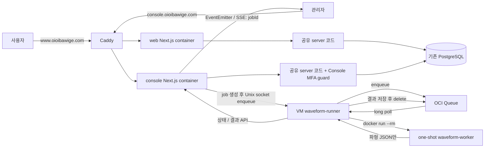

# Console·다중 응원법·파형 편집기 최소 설계

**사용자가 전체 방향을 승인한 구현 전 설계다.** 코드 근거는 [CURRENT-STATE](CURRENT-STATE.md), 파형 기술 근거는
[AUDIO-FEASIBILITY](AUDIO-FEASIBILITY.md), 구현 순서는 [ROADMAP](ROADMAP.md)이 소유한다.
이 개정은 `ef0ac77cd81cf7312df32139c44909fbf2166a09`의 runtime 실행·공용 설정·직렬 로드맵을 수정한다.
`8882b71c0bf6bfa71f3295d6b5f34de0b16d1dce` 이후 피드백으로 SSE 전달·Queue 인증 주체·active Job 중복 생성 규칙을 보완했다.
이번 추가 개정은 `dfcf9182c42efa9ee48899c55495746797c2cb4f`의 enqueue/socket 응답 불확실성 처리에만 한정한다.
애플리케이션·DB·배포 코드는 이번 문서 변경에 포함하지 않는다.

## 1. 목표

운영 화면을 별도 Console로 옮기고, 같은 곡의 OFFICIAL/FESTIVAL/CONCERT 응원법을 선택하고 편집한다.
기존 FAN은 FESTIVAL과 CONCERT로 나누며 기존 데이터는 운영자가 수동 분류한다.
Console에서 YouTube 링크를 입력하면 일회성 컨테이너가 파형 JSON을 생성하고, 편집기는 YouTube 재생과 JSON을 사용한다.
**서버의 음원 임시 처리는 허용하며 음원 영구 저장·공개·전달은 금지한다. 브라우저에서는 분석하지 않는다.**

기존 Service/Repository/CASL/Query/Ky/Zod, Auth.js/Argon2id, 가사 JSON, LRC·시간 캡처·Undo/Redo를 재사용한다.
세션 레지스트리·인증 grant·복구 UI·범용 Audit DB·미래 Event/variant 모델과 자동 정렬 연구는 이번 범위에서 뺀다.
필요한 도구의 기능을 직접 다시 구현하지 않는다.

## 2. 핵심 Architecture



공유 server는 두 Next 프로세스에서 실행하는 소스 패키지다. 별도 API 서버는 만들지 않는다.
RSC → Service와 Client → Query → Ky → Route → Service 흐름 및 기존 FSD 규칙을 유지한다.
각 앱은 자기 origin의 API를 호출하며 Console 세션을 web과 공유하지 않는다.
현재 배포의 digest·health·smoke·rollback 절차를 두 앱에 적용한다. release manifest framework는 추가하지 않는다.
GitHub Actions / OCI Run Command는 배포·운영 자동화에만 사용하고 runtime job을 실행하지 않는다.
DB runtime role 분리는 후속 hardening으로 남기고 기존 service 인가를 유지한다.

## 3. Monorepo 구조와 검증

```text
apps/
  web/                     기존 Next 앱을 먼저 그대로 이동, /admin 유지
  console/                 이후 관리 UI·API·인증 진입점 이관
packages/
  contracts/               함께 쓰는 Zod DTO·request/response·enum
  server/                  함께 쓰는 schema/DB·repository·service·인가·error
config/                    공유하는 정적 설정
  typescript/              base.json, next.json, node.json
  eslint/                  base.mjs, next.mjs, node.mjs
harness/
  architecture/            기존 공통 검사 primitive / workspace 간 경계 검사
workers/
  waveform/                VM-local runner + one-shot 분석 worker / Containerfile
drizzle/                   기존 migration 이력의 단일 소유자
pnpm-workspace.yaml        workspace/dependency 관리
turbo.json                 task graph·병렬 실행·로컬 cache
.husky/                    repository root 한 곳
```

`packages/ui`, `domain`, `api-client`는 초기 생성하지 않는다. server 추출도 기존 코드를 가능한 그대로 옮긴다.
Next/TS/ESLint 자동 탐색 진입점은 각 프로젝트 root의 얇은 wrapper로 두고 공유 설정을 extends/import한다.
web/console은 Next 설정, server는 Node 설정, contracts는 base 설정을 사용한다. 앱별 alias·include만 각 진입점에 둔다.
현재 React.cache/Auth.js를 사용하는 request-context 같은 framework adapter는 앱에 남기고 실제 공통 server 코드만 추출한다.

공용 harness는 기존 import/filesystem 검사와 assertion/helper를 재사용하는 기반이다.
**검사 경로·허용/금지 dependency·FSD·고유 제약은 각 workspace가 소유한다.**
필요한 정책은 workspace root의 얇은 `architecture.config.*` 또는 기존 ESLint/Steiger 설정으로 표현한다.
별도 configuration DSL을 만들거나 ESLint/Steiger가 처리하는 규칙을 다시 구현하지 않는다.

| workspace          | 자체 lint/architecture 정책                                                                |
| ------------------ | ------------------------------------------------------------------------------------------ |
| apps/web           | public/user route·Web FSD·feature/entity 경계, client → server 및 Console 직접 import 금지 |
| apps/console       | 관리/editor route·Console FSD/auth 경계, client → server 및 Web 직접 import 금지           |
| packages/server    | server-only·repository/service 방향·DB/delivery 경계, React/client·apps 의존 금지          |
| packages/contracts | serializable Zod 계약만, DB·Node-only·apps·server implementation 의존 금지                 |

두 앱은 `steiger apps/web/src`, `steiger apps/console/src`로 각각 독립된 FSD root를 검사한다.
공통 plugin/config는 공유할 수 있지만 실제 slice 구조와 정책이 같을 필요는 없다.

JS/TS workspace의 실제 작업에 `lint`, `type-check`, `test`, `build` 이름을 사용한다.
Next 앱만 `next build`를 실행하고, TS 소스 패키지는 앱의 `transpilePackages`로 소비해 불필요한 library build를 만들지 않는다.
Node 설정의 module resolution과 package exports가 앱 소비 방식에 맞는지는 두 앱 build로 검증한다.
worker는 JS workspace로 억지 포장하지 않고 CLI/container 검증을 별도로 연결한다.
같은 task 이름도 검사 내용은 위 workspace 정책에 따라 다르다. Turbo는 실행 순서와 cache를 소유한다.

```text
pnpm verify
├─ turbo run type-check lint test build --cache=local:rw
│  └─ lint: workspace별 ESLint / 앱별 Steiger / 자체 architecture 정책
├─ repo-level architecture harness + harness 자체 테스트
│  └─ 앱 간 직접 import / client → server / workspace dependency 방향
├─ 기존 운영 스크립트 테스트
└─ format:check
```

[Turbo](https://github.com/vercel/turborepo/blob/main/apps/docs/content/docs/crafting-your-repository/configuring-tasks.mdx)의
task graph를 쓰고 직접 변경 감지·cache 도구를 만들지 않는다. TS를 직접 소비하는 패키지도
상위 앱의 검사 hash에 dependency 변경이 반영되도록 transit task를 연결한다.
Next build outputs는 `.next/**`에서 `.next/cache/**`를 제외하고, config/·harness/·workspace 정책·테스트 설정·build 환경값을 hash 입력에 포함한다.
비결정적 작업과 DB/worker 실행 결과는 cache하지 않는다. Remote Cache는 초기 도입하지 않는다.

pre-commit은 root lint-staged의 ESLint/Prettier만 실행한다. 전체 type-check/build는 넣지 않는다.
pre-push는 필요하면 `turbo run lint type-check test --affected`를 사용한다.
[`--affected`](https://github.com/vercel/turborepo/blob/main/apps/docs/content/docs/reference/run.mdx)의 기준은
`migration_main` merge-base로 설정하고 필요한 Git 이력을 확보한다.
공유 config/harness 및 root 경계 규칙 변경은 affected 검사에서 빠지지 않게 하며, 초기 CI는 전체 `pnpm verify`를 실행한다.

## 4. Console / Auth

[Auth.js Credentials](https://authjs.dev/getting-started/authentication/credentials)를 유지한다.
UI는 ID/PW → TOTP 두 단계여도 최종 `authorize`에서 **비밀번호·ACTIVE·ADMIN·TOTP를 모두 검증한 뒤에만** identity를 반환한다.
첫 단계는 세션을 발급하지 않는다. 비밀번호는 현재 폼 메모리에서만 최종 요청까지 보유하고 URL/storage에 저장하지 않는다.
TOTP는 [otplib](https://github.com/yeojz/otplib), QR은 [qrcode](https://github.com/soldair/node-qrcode)를 사용하고 OTP 알고리즘이나 외부 QR 서비스를 만들지 않는다.

```text
admin_mfa
  accountId PK/FK
  encryptedSecret          Node crypto의 인증된 암호화, key는 Console 환경에만 보관
  enabledAt nullable       미등록/등록 진행 상태 구분
  lastUsedStep nullable    성공한 TOTP step의 원자 갱신으로 재사용 차단
  version                 reset/회수 시 증가, row를 지워 1로 재시작하지 않음

Console JWT application claims: { sub, mfaVerified: true, mfaVersion }
```

Auth.js의 표준 만료 claims는 유지하고 명시적 session maxAge를 둔다. 현재 sub만 남기는 callback은 위 MFA claims도 보존한다.
관리 RSC/Route/Server Action은 공통 Console guard에서 JWT 증명과 DB의 enabledAt/version을 확인한 뒤
기존 DB role/status·CASL·service `requireAdmin` 검사를 사용한다. MFA reset 및 관리자 인증 정보 변경에 필요한
Console 전체 회수는 version 증가로 처리한다. 세션별 관리·idle tracking·step-up은 도입하지 않는다.

최초 등록은 Console 외부 공개 전에 접근이 제한된 환경에서 끝낸다.
setup endpoint는 비밀번호로 확인한 ACTIVE ADMIN이면서 MFA 미등록일 때만 허용하고 관리 작업 권한은 주지 않는다.
pending secret도 같은 admin_mfa 행에 암호화 저장하며 TOTP 확인 후 활성화한다.
분실은 운영 CLI reset으로 처리한다. 다시 접근을 제한한 뒤 version 증가 → 기존 세션 거절 → 재등록 → 공개 순서를 따른다.
pre-auth DB, login/enrollment/recovery grant, recovery code UI, Gmail OTP fallback은 만들지 않는다.

Console 전용 AUTH_SECRET과 host-only Secure/HttpOnly/SameSite cookie를 사용한다.
관리 mutation은 허용된 Console Origin과 해당 요청 방식의 CSRF 방어를 검사한다.
현재 비밀번호 로그인에는 rate limit 호출이 없으므로, 단일 Console 프로세스에
[rate-limiter-flexible](https://github.com/animir/node-rate-limiter-flexible)의 메모리 limiter를 붙여 계정·신뢰한 IP별 실패를 제한한다.
분산 counter 테이블은 만들지 않는다. secret·OTP·비밀번호는 기록하지 않고 실패 이벤트는 기존 structured logging을 쓴다.

## 5. CheerGuide

```text
Song                       현재 곡·youtubeId·visibility 유지
CheerGuide
  id, songId, type          OFFICIAL | FESTIVAL | CONCERT
  label nullable, lyrics   기존 LyricsData JSON 구조
  version                  저장 요청과 비교하고 같은 UPDATE에서 증가
  UNIQUE(songId, type)
```

Song 하나에 타입별 최대 한 개만 둔다. Cue/Variant/Event 테이블을 미리 만들지 않는다.
가사 행·segments·isCheer/isEcho/isExtra·startTimeOffset을 보존하고 기존 초 단위 JSON을 그대로 소비한다.
편집기의 ms 계산만 저장 경계에서 초로 변환한다. 행의 안정 ID는 우선 편집 draft에만 두어 데이터 변환을 줄인다.
version은 동시 저장 방지용이며 과거 내용을 저장하는 revision 이력은 아니다.
모든 guide가 같은 Song.youtubeId를 쓰므로 BPM/beatOffset은 P10에서 Song의 작은 편집 설정 JSON으로 저장한다.
CheerGuide 구현 전에 기존 Song.lyrics로도 Grid 편집이 가능하다.

**Revision History는 기존 Domain 요구로 유지한다.** 이번 단계는 관리자만 편집하는 현재 콘텐츠 모델을 제안하며
이를 APPROVED revision이라고 부르지 않는다. 구현 PR에서 Domain에 이 초기 단계의 적용 범위를 명시하고
후속 이력·승인 단계와 구분해야 한다. 개정 없이 기존 승인본 불변성을 생략하는 구현은 진행하지 않는다.
Contribution/Discussion/범용 Audit과 승인 플랫폼을 타입 추가에 함께 구현하지 않는다.

운영자의 수동 매핑이 있는 곡만 guide로 이전한다. false/null flag를 FESTIVAL/CONCERT로 자동 변환하지 않는다.
Song.lyrics는 전환 기간 보존하고 미분류 곡만 legacy reader를 사용한다. 이전한 곡은 guide가 유일한 writer가 된다.
LRC create/update·lyrics 저장·삭제 경로를 함께 점검하고 shadow 비교로 내용 보존을 확인한다.
공개 조회는 기존 Song/Album visibility 조건을 유지한다. rollback은 새 guide 데이터를 읽는 호환 앱으로 한다.

사용자 기본 선택은 OFFICIAL → FESTIVAL → CONCERT다. 하나면 selector를 숨기고 2~3개면 segmented control을 쓴다.
`nuqs`의 `?guide=<id>`로 공유 가능한 선택을 보존하고 잘못된/다른 곡 ID는 기본 항목으로 정규화한다.
모두 같은 Song.youtubeId를 사용하므로 전환 시 player를 유지하고 가사만 바꾼다.
공개 DTO는 Query cache, Console 저장 성공은 관련 key invalidate를 사용한다. 다른 origin의 갱신은 refetch로 확인한다.
동일 타입의 다수 항목·bottom sheet·행사 연결은 실제 요구가 생길 때 확장한다.

## 6. Waveform Worker

```text
POST /api/admin/waveform-jobs
  → MFA/ADMIN + 입력 검증 → active Job 재사용 또는 PostgreSQL Job(QUEUED) 생성
  → 새 Job만 Unix socket → VM runner → OCI Queue enqueue
  → 202 Accepted { jobId }

OCI Queue → VM runner long poll → Job(RUNNING)
  → docker run --rm → yt-dlp → ffmpeg pipe → audiowaveform → JSON
  → JSON 검증 → 결과와 Job(SUCCEEDED) 저장 → message delete
```

| 요소              | 책임                                                                               |
| ----------------- | ---------------------------------------------------------------------------------- |
| PostgreSQL        | WaveformJob 상태와 Waveform JSON 결과의 SSOT                                       |
| OCI Queue         | 전달·재전달/retry·visibility timeout·delivery count·DLQ                            |
| waveform-runner   | 제한된 enqueue 호출·Queue consume → job 검증 → 고정 container → 결과 반영 → delete |
| waveform-worker   | audio → JSON만. HTTP 서버·DB 쓰기·job 관리 없음                                    |
| SSE               | 열린 Console에 상태 변경만 알림. 데이터 조회는 Query/API                           |
| OCI Notifications | 선택적 운영 장애 알림만. job 성공 여부와 결합하지 않음                             |

**동일 `(songId, videoId)`의 active Job(`QUEUED | RUNNING`)은 최대 한 개다.**
연속 클릭·응답 유실 후 재요청·동시 POST에 기존 active Job이 있으면 `202 { jobId }`로 그 Job을 반환하고
새 Job/message는 만들지 않는다. 새 Job 생성 경로만 enqueue 확인 뒤 202를 반환한다.
이는 active 작업 재사용 규칙이며 terminal(`SUCCEEDED | FAILED`) 이후의 새 요청은 재생성으로 처리한다.
UI의 버튼 비활성화에만 의존하지 않고 DB에서 조회/생성을 원자적으로 보장한다.
partial unique index 또는 기존 Song 행 잠금 등 구체적인 DB 수단은 P08에서 선택하고 동시 요청으로 검증한다.

**OCI Queue 호출은 VM-local Runner 하나가 push + pull을 모두 소유한다.**
Console은 Job을 저장한 뒤 제한된 Unix socket enqueue 호출만 한다. socket은 Console에만 연결하고
소유자/그룹 권한으로 접근을 제한하며 Caddy/public TCP endpoint로 공개하지 않는다.
Runner는 고정 Queue에 세 식별자만 enqueue하고 성공 확인을 내부 Job API에 기록한 뒤 socket 응답을 반환한다. 분석 완료를 기다리지 않는다.
SDK의 long poll 대기 중에도 enqueue 호출을 받을 수 있지만 분석 worker 동시 실행은 한 개를 유지한다.

Runner의 OCI SDK는 [Compute Instance Principal](https://docs.oracle.com/en-us/iaas/Content/Identity/Tasks/callingservicesfrominstances.htm)로 인증한다.
해당 VM을 dynamic group에 포함하고 [Queue IAM](https://docs.oracle.com/en-us/iaas/Content/queue/policy-reference.htm)의
`use queue-push`(PutMessages)와 `use queue-pull`(GetMessages/UpdateMessage/DeleteMessage)을 waveform Queue/DLQ 처리 범위로 제한한다.
Queue OCID/message endpoint는 배포 설정으로 고정하며 runtime에 Queue 생성·삭제·변경 권한을 주지 않는다.
Console은 OCI SDK/credential을 사용하지 않고 Runner가 내부 결과 API에 쓰는 service token과 OCI 인증은 별개다.
**IAM 주체는 container/process가 아니라 VM이며 이 VM을 OCI trust boundary로 본다.**
Runner로 호출을 모아도 IAM 차원의 process별 권한 분리가 생기지는 않는다. Console/Web/worker의
metadata 접근을 차단하고 host root 권한은 이 경계 안에 둔다. Console MFA secret의 VM 읽기
권한을 추가하는 **P06에서 Web/Console metadata 차단을 실제 VM에서 확인한다.** env 분리만으로
접근 격리를 주장하지 않는다. [P06 계획 §4.1~4.2](P06-PLAN.md#41-p06-b0-arm64-빌드-전-iam-준비실증)의
선행 차단·host 양성 대조·재시작/복구 검증을 따른다. P08은 Runner/worker·Queue IAM·Unix socket을
추가 검증하고 기존 Web/Console 차단도 재검증한다.

Queue payload는 `{ jobId, songId, videoId }`만 받는다. image/command/argument/volume/env를 받지 않는다.
Runner는 message의 songId/videoId를 DB job과 대조한 뒤 실행한다.
Runner는 기존 OCI SDK의 [long polling/visibility 연장](https://docs.oracle.com/en-us/iaas/Content/queue/consume-messages.htm)을 사용한다.
VM-local 프로세스 하나가 한 건씩 수신하고 worker 하나만 실행한다. 다음 요청은 Queue에 대기하며 scheduler/Redis/분산 잠금은 추가하지 않는다.
runner는 분석하지 않으며 image·argument·자원 한도는 배포된 고정 설정에서 결정한다.

```text
WaveformJob
  id, songId, videoId, status: QUEUED | RUNNING | SUCCEEDED | FAILED
  errorCode nullable, createdAt, startedAt nullable, finishedAt nullable
  enqueuedAt nullable        Runner의 PutMessages 성공 확인 시각, null은 성공 미확인
  attemptId nullable         재전달 시 오래된 실행 결과를 거절하는 식별자

Waveform                    job lifecycle과 분리한 song/source별 정상 JSON
```

Runner는 위 Queue push/pull 권한과 좁은 내부 job API의 service token만 사용한다. worker에는 videoId·자원 한도·outbound network만 제공한다.
worker에 DATABASE_URL/AUTH_SECRET/R2/OCI credential을 주지 않고 VM metadata·DB·내부 API 접근도 막는다.
Console의 내부 API → 기존 Service/Repository가 상태·결과를 저장하고 Runner/worker에 DB 연결을 주지 않는다.
token은 Runner의 보호된 환경에 보관하며 Queue·command·로그에 넣지 않는다.

jobId로 중복 반영을 막는다. 이미 SUCCEEDED인 message는 재분석하지 않고 delete하며 FAILED도 terminal로 취급한다.
실행 중에는 visibility를 연장하고, 만료/Runner 종료 후 재전달 시 기존 RUNNING 작업의 잔존 container를 정리한 뒤 다시 처리한다.
visibility 소유권을 잃으면 기존 실행을 중단한다. 현재 처리 시도·source에 맞는 결과만 조건부 반영한다.
**결과 저장과 SUCCEEDED 갱신을 같은 transaction으로 끝낸 뒤** delete한다. delete 실패는 DB 성공을 되돌리지 않는다.
일시 실패는 message를 지우지 않고 Queue 재전달에 맡긴다. 반복 실패는 [DLQ](https://docs.oracle.com/en-us/iaas/Content/queue/deadletterqueues.htm)로 보내지며
Runner가 DLQ의 미완료 job을 FAILED로 반영한 뒤 해당 message를 정리한다. DB에 retry queue를 구현하지 않는다.
DB Job 생성과 enqueue는 원자적이지 않으며 **socket error는 Queue enqueue 실패의 증거가 아니다.**
`QUEUED`는 전달 성공 또는 전달 결과 확인 중인 Job을 포함한다. 상태는 `QUEUED/RUNNING/SUCCEEDED/FAILED`를 유지한다.

| enqueue 결과 | 처리                                                                                                              |
| ------------ | ----------------------------------------------------------------------------------------------------------------- |
| 명확한 실패  | Runner의 호출 실패와 message 미생성이 확정된 경우만 FAILED로 전환할 수 있다. 이미 진행된 상태는 역전하지 않는다.  |
| 성공         | Runner가 PutMessages 성공 확인 → Console 내부 Job API로 enqueuedAt 기록 → socket 성공 응답 → 202 반환.            |
| 불확실       | socket/PutMessages 응답 유실 등으로 전달 여부를 확정할 수 없으면 QUEUED를 유지하고 즉시 FAILED로 전환하지 않는다. |

`enqueuedAt`은 Console의 socket 응답 수신 시각이 아니라 Runner의 PutMessages 성공 확인 기록이다.
PutMessages 성공 뒤 내부 API 기록 실패/응답 유실도 Queue 실패로 간주하지 않는다. `enqueuedAt = null`만으로 message가 없다고 판단하지 않는다.
Runner consume은 enqueuedAt이 null이어도 기존 Job을 RUNNING → SUCCEEDED로 처리할 수 있다.
결과 불확실로 Console이 즉시 재enqueue하지 않으며 재요청은 기존 active Job의 jobId를 반환한다.

Runner의 작은 stale-job 점검은 `status = QUEUED AND enqueuedAt IS NULL`인 Job에 대해 message가 더 이상
정상 전달될 수 없다고 간주할 수 있는 **충분히 보수적인 전달 종료 기한 이후에만** 조건부로 FAILED를 반영한다.
기한은 가장 늦은 enqueue 가능 시점부터 실제 [Queue 최대 message retention](https://docs.oracle.com/en-us/iaas/Content/queue/overview.htm)과
충분한 시계/관측 지연 여유를 포함해 P08에서 정한다. socket/visibility timeout이나 임의의 짧은 timeout을 기준으로 삼지 않는다.
그 이전에는 enqueue 여부 불확실성만으로 FAILED 처리하지 않는다. 이미 전달 확인/진행된 상태는 역전하지 않고 정상 Queue 대기 및 기존 retention 점검은 유지한다.
Console의 주기적 Queue 조회/재enqueue, DB retry queue, Outbox framework, 별도 retry scheduler·분산 transaction·범용 reconciliation은 만들지 않는다.
중복 전달·늦은 응답·timeout 경계는 P08에서 검증한다.

Worker는 `--rm --read-only --tmpfs /tmp`, CPU/memory/pids limit, cap-drop, no-new-privileges, restart 없음으로 실행한다.
pipe가 기본이고 필요 파일/cache만 tmpfs에 둔다. swap/core dump를 막고 성공·실패·timeout 모두 container와 하위 프로세스를 제거한다.
음원/PCM은 host filesystem/volume·Docker volume·PostgreSQL·R2/S3·로그·Sentry에 남기지 않는다.
재생성 실패는 직전 정상 JSON을 지우지 않으며 Waveform을 갱신해도 Cue 시각은 자동 변경하지 않는다.
JSON 형식·도구 선택·삭제 검증은 [파형 기술 검토](AUDIO-FEASIBILITY.md)를 따른다.

열린 Console은 `GET /api/admin/waveform-jobs/{jobId}/events`에 native EventSource로 연결한다(endpoint는 구현 시 고정).
`event: waveform-job-updated`, `data: {"jobId":"..."}`만 보내고 Waveform JSON 전체를 전송하지 않는다.
브라우저는 이벤트 수신 → 관련 Query invalidate → Job/Waveform refetch한다. 연결·재연결·focus 때도 현재 DB 상태를 확인한다.
초기 Console은 단일 container·단일 Node process로 운영한다. 상태/결과 Service가 DB commit을 끝낸 뒤 Console 서버 adapter에서
process-local [Node EventEmitter](https://nodejs.org/api/events.html#class-eventemitter)로 jobId를 emit하고 SSE에 전달한다.
결과 API와 SSE route가 같은 process의 EventEmitter 한 개를 공유한다. 범용 event bus나 별도 알림 저장소는 만들지 않는다.
EventEmitter/SSE는 영속 event log가 아니며 알림 실패로 commit된 성공을 되돌리거나 결과 API/Queue 처리를 실패시키지 않는다.
PostgreSQL LISTEN/NOTIFY는 지금 도입하지 않는다. Console process/container가 두 개 이상이 될 때 process 간 전달 수단으로 검토한다.
SSE는 MFA/ADMIN guard·job 검증을 거치고, 만료/회수·연결 종료 시 stream/listener를 정리한다. heartbeat와 Caddy 경유 전달을 확인한다.
FCM/Web Push는 닫힌 탭·서비스 전체 push 요구가 생길 때 후속으로 검토한다. OCI Notifications는 DLQ/Runner 장애 등 운영 알림 후보만 둔다.
Queue abstraction·Notification framework·Worker platform은 추가하지 않는다.

## 7. Audio Editor

```text
기존 YouTube / 가사 표 / LRC / 시간 캡처 / Undo·Redo
+ Peaks.js overview·zoom waveform·timeline·playhead·Cue point drag
+ BPM / 첫 박(beatOffset) / grid / Snap ON·OFF
+ Nudge / Fine Nudge / Cue 주변 Loop / A-B Loop
```

파형·zoom·point drag는 Peaks.js를 사용하고 현재 YouTubePlayer를 작은 custom player adapter로 연결한다.
별도 waveform Canvas 엔진이나 DAW를 만들지 않는다. 기존 가사 행은 point marker이며 UI 폭을 실제 종료 시각으로 저장하지 않는다.
Grid는 기존 point marker/시간축에 붙이는 기능이며 자동 BPM/onset은 필수가 아니다.
예를 들어 120 BPM에서 1/16 grid는 125ms다. 관리자가 첫 박을 지정하고 Snap을 켜야 이동에 적용된다.
Grid 변경은 기존 Cue를 움직이지 않는다. fine nudge는 Snap을 우회하며 Loop는 YouTube seek 지연을 허용한다.

server DTO는 Query, 편집 draft는 RHF, 선택/zoom/loop/drag preview는 local state/ref로 둔다.
기존 50개 Undo/Redo를 재사용하고 drag 종료 한 번을 변경 한 번으로 처리한다. Esc/취소는 원래 위치로 복원한다.
저장은 명시적으로 수행하며 충돌·만료·네트워크 실패에도 draft를 보존한다.
입력란·IME·dialog에서 전역 단축키를 막고 기존 Q/W/E/R·텍스트/강조 편집을 보존한다.
파형 실패 중에도 기존 가사 표와 시간 캡처를 사용할 수 있다. editor 라이브러리는 Console에서만 로드한다.

## 8. 주요 Trade-off

| 선택                                       | 남는 한계 / 확인 사항                                                                                             |
| ------------------------------------------ | ----------------------------------------------------------------------------------------------------------------- |
| OCI Queue + 작은 VM runner + 일회성 worker | Queue의 전달/재시도 기능을 사용하고 동시 분석은 하나로 제한한다. 같은 host의 자원 경쟁과 전달/DB 경계를 검증한다. |
| YouTube → 파형 JSON                        | iframe은 PCM을 제공하지 않는다. yt-dlp 성공·동일 영상의 시간축·이용 허용을 실제 입력으로 확인한다.                |
| 단일 프로세스 limiter와 MFA version        | 재시작 시 limiter 상태는 사라지고 세션별 회수는 없다. 복제 운영 시에만 분산 저장을 재검토한다.                    |
| 타입별 한 guide + 현재 JSON                | 공연별 다수 항목과 revision 이력은 초기 범위 밖이며 Domain의 단계 적용을 명시해야 한다.                           |
| 공유 DB·별도 앱                            | 같은 host/DB까지 격리되지는 않는다. pool 합계와 한쪽 rollback을 검증하고 DB role 세분화는 후속으로 둔다.          |

상위 기준은 [헌법](../../oioi-bwg-architecture-clean-v1/01-architecture-constitution.md),
[Auth](../../oioi-bwg-architecture-clean-v1/04-auth-authz-architecture.md), [Deployment](../../oioi-bwg-architecture-clean-v1/12-deployment-migration-runbook.md),
[Domain](../../DOMAIN_SPECIFICATION.md)이다. 앱 분리·MFA claims/회수·FAN 분류/Revision 단계·YouTube 임시 분석·실제 CD 경로의
변경은 해당 구현 PR에서 관련 active 문서와 같은 단위로 반영한다. Queue/runner/job/SSE의 lifecycle도 해당 문서에 반영하며 이 계획이 상위 문서를 자동 대체하지 않는다.
