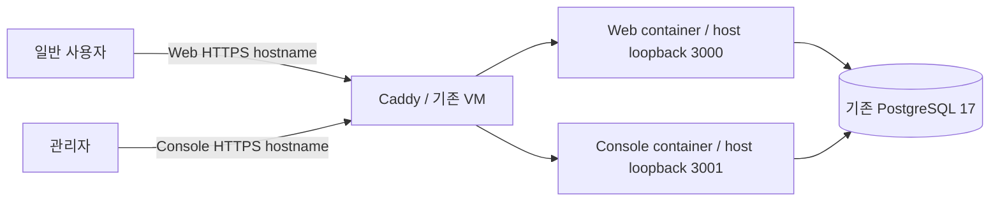

# P06 계획 초안

**기존 단일 VM·Promotion 파이프라인을 유지하고 Web·Console을 하나의 배포 단위로 확장한다.**
이 문서는 구현 순서와 검증 기준의 제안이다. 구현·Promotion 병합·OCI 변경·공개 배포 승인이 아니다.
P05 A~D의 통합과 공개 운영 준비를 구분한다. [P05-D 결과](P05-D-RESULT.md)의 운영 보류를 해소하는 단계다.

## 1. 기준과 확인 범위

- 저장소 `goldmayo/oioi-bwg`, fetch한 `origin/migration_main` 기준은 metadata의 P05-D 병합 커밋이다.
  작업 시작 시 tracked/untracked 변경은 없었고 `feature/p06-deployment-plan`을 이 head에서 만들었다.
  ignored 로컬 환경 파일은 읽거나 변경하지 않았다.
- 2026-10-10 fetch한 `origin/migration_develop`은
  `30592191f7bbf168a227a16a000085944c2191fa`(P01 승격)다. 두 ref의 migration 차이는
  `drizzle/0005_p05a_admin_mfa.sql`과 metadata다. 이것이 실제 VM의 적용 상태를 증명하지는 않는다.
- 초안 작성 시 열린 [#128](https://github.com/goldmayo/oioi-bwg/pull/128)(로컬 실행 안내),
  [#129](https://github.com/goldmayo/oioi-bwg/pull/129)(로그인 폼 정리)는 기준에 포함되지 않았다.
  두 PR은 이후 사용자 지시로 #129 → #128 순서로 병합됐다. revision 2의 코드 확인 기준은
  `5135f6eb1a53782b86a3120b1d8b0134410bf4d4`이며 작업 브랜치에도 merge로 반영했다.
  초안의 source_commit은 최초 조사 기준으로 보존하고 후속 구현은 최신 integration head에서 분기한다.
- 근거는 저장소 코드·설정의 정적 확인이다. 실제 host Caddyfile, DNS/CDN, VM 자원 사용량,
  Vault/IAM, DB migration 상태, current digest는 미확인이다. 운영 credential을 사용하지 않았다.

상위 기준은 [헌법](../../oioi-bwg-architecture-clean-v1/01-architecture-constitution.md),
[Auth §4.1](../../oioi-bwg-architecture-clean-v1/04-auth-authz-architecture.md#41-console의-단계적-전환),
[Server pool](../../oioi-bwg-architecture-clean-v1/06-server-data-access-architecture.md#33-connection-pool),
[Testing](../../oioi-bwg-architecture-clean-v1/10-testing-architecture.md),
[Runtime/env](../../oioi-bwg-architecture-clean-v1/11-content-i18n-assets-runtime-architecture.md),
[배포 runbook §19/21](../../oioi-bwg-architecture-clean-v1/12-deployment-migration-runbook.md#21-cicd),
[Domain AUTH-009](../../DOMAIN_SPECIFICATION.md#auth-009-console-mfa-등록과-회수)다.
[DESIGN](DESIGN.md)과 [ROADMAP](ROADMAP.md)의 전환 순서를 유지한다.

## 2. 현재 파이프라인에서 바꿀 경계

아래 경로는 저장소 루트 기준이다.

| 현재 근거 | 확인한 상태 | P06 변경 |
| --- | --- | --- |
| `Dockerfile` | builder는 두 앱 build, runtime/기본 runner는 Web만 복사. 검증 archive는 두 standalone 포함 | 같은 builder를 쓰는 Web·Console runtime target, 실제 두 이미지 검사 |
| `.github/workflows/verify.yml` | 일반 CI는 두 standalone 검증. Promotion은 ARM64 Web digest 하나를 게시/pull/smoke | 두 ARM64 digest를 같은 source/run에서 검증 후 기록 |
| `ops/oci/promotion.mjs`, `deploy-promotion.yml` | PR/head/tree/run/registry 대조, 단일 `imageRepository/imageDigest` | 기존 candidate의 고정 Web/Console 항목 확장, 둘 다 일치해야 배포 |
| `deploy-via-run-command.sh`, `deploy-release.sh` | digest 인자 하나, Vault→env 하나→Compose app→smoke→current/previous | 두 digest의 제한된 입력, 두 env·health·복구, 기존 lock/exit 0·20·21 유지 |
| `compose.oci-development.yml` | loopback app 하나, 기존 외부 PostgreSQL network | 같은 Compose project에 Web·Console, host loopback 3000/3001, DB network 유지 |
| `ops/oci/install-host-assets.sh` | Compose/script는 교체하지만 기존 protected config는 생성만 함 | 기존 설정의 명시적 upgrade/preflight, 설치만으로 env 전환 완료 처리 금지 |
| Console runtime/auth/limiter | HTTP loopback만 허용, Secure=false, `trustHost=true`, 공통 unknown IP bucket | 명시적 HTTPS origin·cookie·proxy trust 계약 및 IP 분리 |
| Console `/healthz`, Web `/readyz` | Console은 liveness만 있고 DB readiness 없음 | Console `/readyz`와 각 앱 인증 설정 검증, 두 앱 readiness 필수 |
| `packages/server/src/db/index.ts` | 프로세스별 max=10 pool | 두 앱 합계 최대 20 + 운영 여유를 실제 DB/메모리 baseline과 비교 |

Caddy 설정 파일은 저장소에서 찾지 못했다. host 소유 파일과 설치 경로를 확인한 뒤
review 가능한 routing 예시·검증·적용/복구 절차를 `ops/oci`에 추가한다. 실제 파일을 추측해 덮어쓰지 않는다.

## 3. 목표와 유지할 운영 계약

설계 hostname은 `www.oioibawige.com`·`console.oioibawige.com`이다. 첫 실행 대상은 기존 OCI
Development 환경을 제안하며 실제 staging hostname·프록시 경로는 실행 전 확인한다.
Development 승격을 production 활성화로 간주하지 않는다. 각 앱은 자기 origin의 API를 사용한다.

- `feature/* → migration_main → Promotion PR → migration_develop → OCI Run Command`를 유지한다.
  feature PR 병합으로 VM을 변경하지 않는다. source/test-merge/squash tree 동일성, 최신 성공 run,
  90일 artifact·registry 검증을 두 이미지에 적용한다. 배포 후 재build/tag 재해석을 하지 않는다.
- 하나의 source SHA/tree/run/attempt에 **정확히 Web·Console 두 repository/digest**를 기록한다.
  기존 `candidate.json`을 확장하며 release manifest framework나 독립 앱 승격 파이프라인을 만들지 않는다.
  OCIR Web repository는 유지하고 Console repository만 추가하는 안으로 IAM/변수를 검토한다.
- 기존 단일 VM, Caddy, PostgreSQL, 백업, Monitoring/Logging, Instance Principal, 제한된 sudoers를 유지한다.
  runtime secret은 host가 Vault에서 읽으며 GitHub/이미지/Run Command 본문에 전달하지 않는다.
  Waveform runner/Queue/P07~P10은 선행 조건으로 넣지 않는다.
- 짧은 maintenance downtime을 허용한다. Compose의 두 container 교체를 원자적 transaction이라고
  부르지 않는다. 배포 중 접근을 제한하고 **두 앱의 검증 완료**를 논리적 release 성공 기준으로 삼는다.

## 4. PR별 구현 순서와 완료 조건

각 행은 `migration_main` 대상 feature PR이다. 20파일/400줄 목표를 넘으면 해당 행을 독립 검증
가능한 준비/구현으로 더 나눈다. PR 병합과 환경 적용은 별개이며 RESULT에 실제 검증 ref를 남긴다.

| 단계 | 하나의 concern / 주요 파일 | 완료 조건 |
| --- | --- | --- |
| P06-A 이미지 | Dockerfile 두 runtime target, 일반 CI 두 container artifact/smoke, Console readiness | 같은 source의 두 amd64 실제 이미지에서 server/static/public·native dependency·DB readiness 확인. 런타임 secret 없이 build 성공 |
| P06-B1 후보 계약 | Promotion candidate JSON/검증, ARM64 publish/pull, summary/Slack | 두 ARM64 **게시 digest 자체**로 container smoke 통과 후 artifact 기록. 한쪽 누락·다른 head/run/registry·실패 시 promotion 거절 |
| P06-B2 host 배포 | Compose, Run Command, deploy/installer/preflight, env 예시 | 두 이미지/설정 모두 사전 검증, 두 앱 성공 후 상태 확정. 한쪽 실패 시 두 앱과 env 복구, lock·exit code·로그 비밀 미노출 검증 |
| P06-C HTTPS 경계 | Console runtime/cookies/Origin/auth ingress, 신뢰 IP limiter, Caddy routing 절차 | 제한된 HTTPS에서 host-only Secure 쿠키, 직접 callback/Action/등록의 같은 limiter, 위조 forwarded header·다른 Origin 거절 |
| P06-D 제한 운영 검증 | production용 CLI 실행 경계, migration/키 복구·최초 등록 절차, 기존 smoke 확장 | 비공개 Console에서 실물 인증기 등록·새 OTP 로그인·CLI reset/회수·관리 작업·복구 검증. 공개 endpoint로 등록 불가 |
| P06-E Web 관리 종료 | Web `/admin`, `/admin-login`, `/api/admin/*`, 관리 upload Action/연결 UI·테스트 정리 | Console 작업 검증 후 제거. Web의 직접 관리 호출/이전 Action ID 거절, 일반 로그인·signup·조회 유지. 안전한 rollback 기준 수립 |
| P06-F 활성화 기록 | 운영 runbook/RESULT, 별도 Promotion과 적용 증거 | 검증한 동일 두 digest로 두 앱 배포, 등록 닫힘/HTTPS/회수/rollback·자원 smoke 확인 후 Console 공개 |

B1과 B2는 계약 producer/consumer이므로 **둘 다 병합·host upgrade 확인 전에는 Promotion을 실행하지 않는다.**
B1의 후보 생성 성공을 기존 단일-digest host의 배포 호환성으로 오해하지 않는다.
각 단계 구현 시 해당 경계를 소유하는 active 문서를 함께 개정한다. 특히 B1/B2는 배포 §19/21,
C는 Auth/Runtime의 loopback·cookie 계약, E는 헌법/관련 문서의 임시 Web Admin 유지 규칙을 갱신한다.
이 계획 PR에서는 현재 실행 계약을 바꾼 것으로 문서화하지 않는다.

## 5. 배포·복구에서 먼저 해결할 사항

### 두 앱을 같은 정상 상태로 복구

기존 lock 아래 두 digest pull·두 temporary env validation·Compose validation을 **서비스 변경 전** 끝낸다.
보호된 두 env snapshot과 source/digest pair를 같은 release로 보관하고, 모든 smoke 성공 후에만
current/previous를 확정한다. 서로 다른 시점의 Web/Console digest와 env를 섞지 않는다.
앱 재배포가 DB를 migrate/rollback하거나 MFA version/secret을 되돌리지 않는다.

실패는 `20`(후보 실패·복구 성공), `21`(복구 실패)을 유지한다. Console만 실패해도 Web까지
직전 pair로 복구한다. 중단/VM 재시작 중 부분 교체 시 완료 상태를 기록하지 않고 접근 제한을
유지하며, 직전 검증 pair로 명시적으로 복구한 후 해제한다. 무중단/분산 배포 장치는 추가하지 않는다.

최초 host 전환에서는 단일 `current` digest를 가짜 Console digest로 채우지 않는다.
기존 Web digest/env·Compose/script/config와 서비스 이름 `app`을 보존하고,
첫 pair 실패 시 기존 Web을 복구하고 Console을 중지/차단하는 bootstrap 절차를 별도로 검증한다.
`app → web` 변경 뒤 old container가 남아 포트/관리 경로를 점유하지 않는지도 확인한다.
정상 pair 확정 후만 새로운 state 형식을 사용하며 installer가 이 변환을 암묵적으로 수행하지 않는다.

### Web 관리 종료 이후의 안전한 rollback

E 적용 전 proxy의 Web 관리 경로 차단을 준비하고, 코드 제거 후에도 과거 이미지 복구 시 유지한다.
이전 Action POST는 페이지 URL만 차단해서 막혔다고 간주하지 않고 action 진입 경로까지 확인한다.
E 이후 previous가 Web Admin을 포함한 pair라면 일반 자동 rollback 대상으로 쓰지 않는다.
관리 기능이 제거되거나 실제 경계에서 차단된 검증 pair만 안전한 복구 기준으로 삼는다.
안전한 pair가 없으면 접근 제한/maintenance를 유지하고 수동 복구한다. password-only 관리 경로를 열지 않는다.
등록 허용 flag·proxy 접근 제한 같은 보안 설정은 과거 env/config 복원으로 다시 열리지 않게 검증한다.

### Migration과 secret은 배포 전에 준비

실행 단계에서 실제 journal/schema·runtime role 권한을 먼저 확인하고 P05 migration SQL을 재검토한다.
검증은 guarded Docker Compose PostgreSQL과 기존 격리 runner에서 한다. 실제 DB 적용은 별도 승인된
migrator 작업으로 분리한다. deploy에 owner credential·자동 migration·운영 seed를 넣지 않는다.
`admin_mfa`의 권한도 migration 이후 확인한다. app role 직접 SQL의 DELETE/version 감소 우회는
[P05-A 결과](P05-A-RESULT.md)의 제한으로 남으며 이번 계획을 이유로 DB trigger/권한 체계를 추가하지 않는다.

Web/Console env는 별도 0600 파일로 최소 필요 항목만 주입한다.
Console에 `CONSOLE_AUTH_SECRET`과 canonical Base64 32-byte `CONSOLE_MFA_ENCRYPTION_KEY`를
별도 Vault secret으로 제공하고 Web에는 전달하지 않는다. R2 업로드 credential은 Console consumer를
확인하며 Web의 불필요한 credential을 정리한다. 동일 DB의 기존 non-owner app role 사용은 유지한다.
Sentry source map/release·공개 build 변수는 두 앱의 실제 consumer를 확인하고 Console에 Web 분석
설정을 일괄 전파하지 않는다. key는 배포마다 생성하지 않으며 임의 교체는 기존 암호문을 복구하지 못한다.
키의 접근 통제된 백업/동일 키 복구 proof가 없으면 공개하지 않는다. rotation framework는 보류한다.

## 6. HTTPS·등록·운영자 경계

- 로컬 HTTP loopback은 보존하고 배포는 명시적 Console HTTPS origin만 허용한다.
  세션/CSRF/callback cookie의 host-only·Secure·HttpOnly·SameSite 계약을 실제 브라우저에서 확인한다.
  Web cookie와 secret을 Console에 허용하지 않으며 cookie Domain 공유/자동 HTTPS 감지를 기본값으로 삼지 않는다.
- container 내부 `0.0.0.0`과 host publish `127.0.0.1`을 구분한다. 외부는 Caddy를 통해서만 접근한다.
  실제 proxy/CDN 체인을 확인해 Caddy가 신뢰할 client IP를 결정하고 앱에 전달하는 값을 덮어쓴다.
  임의 X-Forwarded-For/Host/Proto를 그대로 신뢰하지 않는다. Auth.js callback과 Action도 같은 경계를 검증한다.
- 기존 계정 5회/5분·IP 20회/5분 정책을 유지하되 `unknown` 공통 bucket은 신뢰한 IP로 나눈다.
  로그인/등록의 ingress adapter에서 같은 값을 제공한다. IP 식별 실패 시 우회 허용하지 않고 보수적으로 제한한다.
  Console 1 process/1 replica의 메모리 limiter를 유지하며 재시작 초기화 한계를 기록한다.
  다중 replica를 켜기 전 shared limiter 설계를 별도로 승인한다. 단일 VM이라는 이유로 두 Console replica를 허용하지 않는다.
- 최초 등록/재등록은 **proxy에서 운영자만 접근 가능한 상태 + enrollment flag 명시적 허용**을 함께 요구한다.
  구체적인 제한 수단은 실제 접근 환경 확인 후 D 실행 계획에서 확정한다. flag=true만으로 제한 완료라 하지 않는다.
  최초 confirm → 다음 OTP 로그인 → CRUD 후 flag=false로 전환하고 setup/confirm 거절을 확인한다.
  QR/secret/OTP/비밀번호를 로그·Sentry·artifact·브라우저 저장소에 남기지 않는다.
- 현재 B3 CLI는 local Compose 전용이므로 production URL을 넣어서 사용하지 않는다.
  production host의 승인된 개별 operator·보호 설정·대상 DB identity·credential 공급·네트워크 접근 통제를
  구현/검증한 후 연다. HTTP/일반 deploy principal/`ocarun`에 운영자 mutation 권한을 추가하지 않는다.
  local/production credential을 분리하고 SSH 포워딩까지 고려한다. 감사는 승인 티켓의 사유/승인자/UID/UTC/결과 연결을 유지한다.
- reset은 Console 제한 → version 증가 → 기존 JWT 401 → 재등록 → 등록 닫힘 → 제한 해제 순서다.
  강등/정지/복귀는 기존 transaction service를 사용한다. Console version을 Web 전체 Session 회수로 보고하지 않는다.

## 7. 검증 단계와 공개 gate

구현 변경마다 기본 여섯 검사와 ops 테스트, runtime/build 영향이 있으면 두 앱 build를 실행한다.
DB/인증 변경은 기존 `pnpm test:integration:postgres:local`, `pnpm test:integration:admin:local`을 재사용한다.
E에서는 두 앱 관리 CRUD 회귀를 **Console 관리 CRUD + Web 관리 거절/일반 기능 유지**로 전환한다.
fixture는 격리 DB에만 생성하고 잔여 연결/lock·DB/role 정리를 확인한다.

| 수준 | 필요한 증거 | 완료로 대체할 수 없는 것 |
| --- | --- | --- |
| Ops 자동 검사 | pair 누락/변조 거절, lock, secret 실패 시 무변경, 한쪽 실패/rollback 실패, state/env 복구 | mock Docker만으로 실제 배포 복구 완료 주장 |
| 로컬 실제 runtime | 두 Docker 이미지+Caddy+Compose PostgreSQL, HTTPS/쿠키/Origin, OTP/CRUD, 한쪽 장애와 pair 복구 | 두 standalone Node process 검증만으로 두 이미지 완료 주장 |
| Promotion | 같은 source/run의 두 ARM64 게시 digest pull/architecture/health/인증 smoke, artifact/tree 일치 | amd64·다른 tag·재build 이미지의 성공 |
| 제한된 환경 적용 | 실제 host preflight/HTTPS/DB migration·권한/Vault·CLI/키 복구, 실물 인증 앱 QR 등록·로그인 | 자동 QR decode만으로 실물 등록 완료 주장 |
| 공개 gate | Web 관리 직접 접근 거절, enrollment 닫힘, 두 hostname cookie 격리, reset/강등 후 옛 JWT 거절, rollback·자원 proof | feature PR/Promotion merge만으로 배포 완료 주장 |

Web+Console pool 최대 20에 migrator/operator/monitoring·PostgreSQL reserved connection 여유를 더해
실제 `max_connections`와 비교한다. 2 OCPU/12 GB 기준은 헌법의 목표이며 실측값이 아니다.
같은 VM에서 평상시/동시 CRUD/재시작의 RSS·CPU·DB connection·디스크를 측정하고 필요할 때
pool/container limit을 결정한다. 두 이미지/직전 이미지/로그 여유를 포함하며 자동 prune은 넣지 않는다.
각 앱 Docker log rotation과 기존 알람을 유지하고 Console health/401 증가의 운영 확인 경로를 보완한다.

## 8. 미확정 사항과 다음 작업

실행 전 확인할 값은 실제 Development hostname·Caddy 소유 경로·CDN/proxy 체인,
등록 시 운영자 접근 제한 수단, Console OCIR/Vault/IAM 설정, host 현재 state/DB journal,
operator 실행 경계와 key 복구 보관 방식, 실측 pool/메모리/디스크 여유다.
이 값들을 추측한 production 명령은 계획에 넣지 않았다.

다음 구현은 P06-A부터다. B1/B2 연결과 host upgrade, C/D의 제한 운영 proof를 건너뛰고
Web Admin을 제거하거나 Console을 공개하지 않는다. 외부 환경 적용은 구체적인 변경·대상·복구
절차를 review 가능하게 만든 후 별도 승인으로 진행한다. 현재 요청으로 production DB/credential을 사용하지 않는다.
VM 분리, 무중단 배포, 범용 release framework, shared limiter 저장소, DB role hardening,
Web 전체 Session 회수 미구현 해결, Waveform/Guide는 별도 관심사로 보류한다.

이 계획 작성에서는 Git ref/diff와 관련 코드·문서만 확인했다. 문서 format·링크·diff 검사는 PR에
실제 결과를 기록하며, push hook의 자동 검증은 직접 실행한 runtime 검사와 구분한다.

## 9. 외부 설정 사전 점검 (revision 2)

2026-10-10 공개 DNS/HTTPS HEAD, GitHub Environment·ruleset을 read-only로 확인했다.
Cloudflare dashboard·실제 VM·OCI IAM/Vault/DB에는 접근하지 않았다. 아래는 확인 결과와
준비 목록이며 자원을 생성/변경하거나 배포하지 않았다. GitHub secret은 이름만 조회했다.

### 확인한 사실과 아직 모르는 값

| 대상 | 관찰 결과 / 한계 |
| --- | --- |
| 공개 DNS | apex/www는 A/AAAA 응답, NS는 Cloudflare. console/dev와 임의 비교 hostname은 A/AAAA/CNAME NXDOMAIN |
| 공개 HTTPS | apex/www HEAD 200, `server: cloudflare`·`cf-ray` 있음. www `/healthz`·`/readyz` HEAD는 404 |
| origin | 위 결과로 www가 OCI Development VM인지 확인할 수 없음. DNS 응답의 Cloudflare edge IP를 VM 주소로 쓰지 않음 |
| GitHub 변수 | `oci-development-image`에 OCIR_REGISTRY/NAMESPACE/REPOSITORY, NEXT_PUBLIC_SENTRY_DSN, SENTRY_ORG/PROJECT 있음. 현재 repository 값은 `oioi-bwg` |
| GitHub secret 이름 | OCIR_USERNAME/AUTH_TOKEN, OCI_CLI_USER/TENANCY/FINGERPRINT/KEY_CONTENT, SENTRY_AUTH_TOKEN, SLACK_DEPLOY_WEBHOOK_URL 있음. 유효 권한/값 검증은 아님 |
| GitHub 보호 | Environment에 migration_develop·refs/pull/*/merge 허용. integration은 verify, deployment는 verify+promotion 및 strict 검사 활성 |
| IaC 권한 | `infra/oci/iam.tf`의 Compute pull은 기존 repository 이름 하나, Vault read는 runtime_secret_ocids의 개별 secret에 한정. 실제 적용 여부는 미확인 |

실제 OCI Development hostname과 Cloudflare DNS의 원본 대상/Proxied 여부를 먼저 확인한다.
www의 404를 Next 앱 장애나 VM 연결 실패로 단정하지 않는다. routing/다른 서비스 여부부터 구분한다.

### Cloudflare에서 준비할 항목

| 항목 | 준비 / 적용 조건 |
| --- | --- |
| DNS | 기존 oioibawige.com zone에 이름 console의 A를 **대상 VM의 실제 공인 IPv4**로 추가하는 안. 원본 hostname이 검증됐으면 CNAME도 가능. 새 도메인 구매/zone 등록/NS 교체는 불필요 |
| Proxy | 기존 CDN 경로를 유지하는 Proxied 안. AAAA는 origin IPv6가 실제 작동할 때만 구성. proxied 응답의 IPv6를 origin IPv6로 오해하지 않음 |
| TLS edge | Universal SSL의 active certificate가 console을 포함하는지 확인. 1단계 subdomain은 일반적으로 포함되지만 더 깊은 staging hostname은 별도 coverage 확인 |
| TLS origin | Caddy의 console 인증서/SNI/443과 Full (strict)를 함께 검증. 기존 자동 ACME 또는 Origin CA 방식을 확인해 확장. zone 전체 SSL mode 변경은 기존 www origin 영향부터 확인 |
| Cache | hostname console의 Cache eligibility를 Bypass cache로 두는 안. 기존 Cache Everything/Page Rule 우선순위도 확인하여 QR·인증·관리 응답 저장 방지. Web cache 설정은 유지 |
| Routing/WAF | apex/www redirect, Workers route, Origin/Transform Rule이 console까지 일치하는지 확인. Host/SNI를 www로 바꾸거나 callback/Action을 redirect/challenge하는 규칙은 Console 흐름으로 검증 |
| 최초 등록 제한 | DNS 노출 전 console virtual host를 운영자 제한/차단 상태로 준비. 운영자 IP 제한 등 기존 수단 우선. Access를 선택하면 origin 우회 차단과 JWT 서명/audience 검증까지 계획하며 헤더 존재만 신뢰하지 않음 |

DNS 추가 순서는 **실제 origin 확인 → 제한된 Caddy virtual host/TLS 준비 → DNS/proxy 연결 →
제한된 HTTPS 검증 → MFA 등록 → 등록 닫힘 확인 → 공개**다. console이 기존 Web fallback으로
연결되지 않아야 한다. 공개 단계에도 enrollment flag는 false다. 비공개·등록 제한을 DNS 부재만으로 보장하지 않는다.
Origin CA는 Cloudflare↔origin용이므로 DNS-only로 바꿀 때 브라우저가 신뢰하는 인증서인지 별도로 확인한다.
DNS challenge를 선택할 때만 필요한 Caddy DNS plugin/권한 제한 token을 준비하며 일반 DNS 수동 등록에 token을 요구하지 않는다.

근거: [subdomain DNS](https://developers.cloudflare.com/dns/manage-dns-records/how-to/create-subdomain/),
[Universal SSL 범위](https://developers.cloudflare.com/ssl/edge-certificates/universal-ssl/limitations/),
[Full strict](https://developers.cloudflare.com/ssl/origin-configuration/ssl-modes/full-strict/),
[Origin CA](https://developers.cloudflare.com/ssl/origin-configuration/origin-ca/),
[Cache rule](https://developers.cloudflare.com/cache/how-to/cache-rules/create-dashboard/),
[Origin rules](https://developers.cloudflare.com/rules/origin-rules/),
[Access origin 검증](https://developers.cloudflare.com/cloudflare-one/access-controls/applications/http-apps/authorization-cookie/application-token/).

### OCI·GitHub·VM에서 준비할 항목

| 항목 | 준비 / 검증 |
| --- | --- |
| OCIR | 기존 private oioi-bwg 유지, Console private repository 추가안의 이름/IaC 소유권 확정. 같은 Resource Manager Stack에서 Plan review → Apply, 기존 VM/registry/backup destroy·replace 금지 |
| Publish/pull IAM | 기존 CI OCIR publisher가 새 repository에 push 가능한지, Compute Instance Principal이 pull 가능한지 확인. Run Command 전용 principal에 registry/Vault 권한을 합치지 않음 |
| Vault | CONSOLE_AUTH_SECRET·CONSOLE_MFA_ENCRYPTION_KEY 두 secret 준비. Web/로컬과 별도 값, 암호화 키 canonical Base64 32 bytes. 실제 key 값을 Terraform/GitHub에 등록하지 않음 |
| Vault IAM | 새 두 secret OCID를 runtime_secret_ocids 및 host mapping에 반영, Instance Principal read 검증. 등록/배포마다 key 재생성 금지, 접근 통제된 동일 key 복구 준비 |
| GitHub | 기존 Environment/credential/branch policy 재사용. B1이 정한 Console repository 변수 추가, 앱별 Sentry/build 설정 확정. 변수명은 아직 구현 계약이 아니므로 임의로 선등록하지 않음 |
| Caddy/네트워크 | 설치 버전·host/container 위치·설정 경로 확인, 외부 443/선택한 ACME 경로와 IPv4/IPv6 확인. 앱 3000/3001·DB 5432는 외부 개방하지 않음. Caddy가 container면 localhost upstream 대신 실제 network 경로 확정 |
| 신뢰 IP | 실제 Cloudflare CIDR만 trusted proxy로 설정하고 정규화된 client IP를 앱에 전달. 임의 forwarded header·직접 origin 우회 검증. 현재 unknown bucket으로 공개하지 않음 |
| Host upgrade | 두 env 0600·Compose·deploy script·config/state 변환·sudoers/preflight 준비. 자동 installer는 기존 protected config를 업데이트하지 않으므로 명시적 검토/반영 필수 |
| DB | 실제 journal·admin_mfa·app 권한 확인 후 승인된 별도 migrator 적용. 앱 deploy에 migration/owner credential/seed 없음 |
| 운영 복구 | 대상 DB/host/credential guard가 갖춰진 CLI, 개인 operator·승인 티켓, TOTP용 host/인증기 시간 동기화, MFA key·DB 복구 조합, 안전한 rollback pair 준비 |
| 자원/관측 | pool 합계 20+운영 여유, CPU/RSS/디스크 실측. Console log 수집/알람·Sentry 이벤트·소스맵과 두 앱 health 확인 |
| R2 | 기존 bucket/assets hostname과 server-side S3 업로드 재사용, Console env에 필요한 credential 주입. 현재 서버 업로드 때문에 Console용 CORS PUT을 추가할 필요는 없음 |

Caddy의 CDN trust는 [공식 reverse_proxy 문서](https://caddyserver.com/docs/caddyfile/directives/reverse_proxy)를
설치 버전과 대조한다. R2 CORS는 [브라우저 cross-origin 요청](https://developers.cloudflare.com/r2/buckets/cors/)을
위한 설정이며 현재 `packages/server/src/storage/upload-public-asset.ts`의 서버 S3Client 호출과 구분한다.
Console은 Credentials+TOTP이므로 별도 Google/Kakao OAuth client/callback, 신규 DB/VM/bucket은 준비 항목이 아니다.

지금 먼저 확보할 정보는 **실제 VM origin/Development hostname, 현재 Caddy 배치·인증서 방식,
등록 접근 제한 수단, 새 Console repository 이름과 두 Vault secret 관리 위치**다.
이후 구현 PR의 계약과 일치하도록 설정하며 모든 외부 적용은 별도 실행 범위로 둔다.
