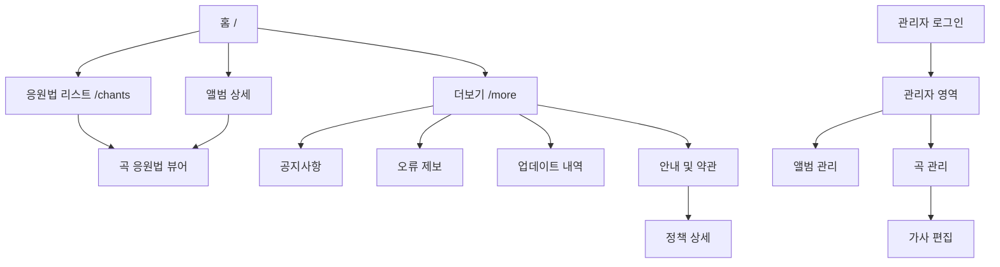

# As-Is IA / 메뉴 구조도

## 1. 분석 기준

본 문서는 현재 저장소의 실제 Route, Page, Component, Server Service, Route Handler, 인증·인가 코드와 화면 캡처를 기준으로 작성했다.

- 분석 대상: Web/Mobile Web 공개 영역 및 Admin Web
- 분석 범위: 현재 코드에서 화면 또는 사용자 진입점이 확인되는 항목
- 제외 기준: 코드 근거가 없는 미래 기능·도메인·권한

## 2. IA

| Screen ID | 1 Depth | 2 Depth | 3 Depth | Type | 접근 | 주요 설명 | 상태 |
|---|---|---|---|---|---|---|---|
| SCR-PUB-001 | 홈 | - | - | Page | Guest | 공개 앨범 및 수록곡 진입 화면 | 확인됨 |
| SCR-PUB-002 | 응원법 | - | - | Page | Guest | 전체 곡 응원법 목록과 검색/필터 | 확인됨 |
| SCR-PUB-003 | 앨범 | 앨범 상세 | - | Page/Modal UI | Guest | 앨범 정보와 수록곡 목록 | 확인됨 |
| SCR-PUB-004 | 곡 | 응원법 뷰어 | - | Page | Guest | YouTube 영상과 동기화된 가사·응원법 | 확인됨 |
| SCR-PUB-005 | 더보기 | - | - | Page | Guest | 공지·오류 제보·업데이트·정책 메뉴 | 확인됨 |
| SCR-PUB-006 | 더보기 | 공지사항 | - | Page | Guest | 공지 목록 및 접이식 상세 내용 | 확인됨 |
| SCR-PUB-007 | 더보기 | 안내 및 약관 | - | Page | Guest | 정책 문서 목록 | 확인됨 |
| SCR-PUB-008 | 더보기 | 안내 및 약관 | 정책 상세 | Page | Guest | privacy/terms/copyright/email/ga 문서 | 확인됨 |
| SCR-PUB-009 | 더보기 | 오류 제보 | - | Page | Guest | 외부 Google Form 오류 제보 안내 | 확인됨 |
| SCR-PUB-010 | 더보기 | 업데이트 내역 | - | Page | Guest | 업데이트 내역 정적 목록 | 확인됨 |
| SCR-AUTH-001 | 관리자 | 로그인 | - | Page | Guest | 관리자 계정 이메일·비밀번호 로그인 | 확인됨 |
| SCR-ADM-001 | 관리자 | 관리 홈 | - | Redirect | 인증 사용자 | `/admin/albums`로 이동하는 진입 경로 | 확인됨 |
| SCR-ADM-002 | 관리자 | 앨범 관리 | - | Page | Admin | 앨범 목록 조회 및 생성·수정·삭제 | 확인됨 |
| SCR-ADM-003 | 관리자 | 곡 관리 | - | Page | Admin | 곡 목록 조회 및 생성·수정·삭제 | 확인됨 |
| SCR-ADM-004 | 관리자 | 곡 관리 | 가사 편집 | Page | Admin | 특정 곡의 가사/LRC 타이밍 편집 및 저장 | 확인됨 |

## 3. 메뉴 흐름

## 4. 확인 필요

- 실제 운영 환경에서의 모바일/데스크톱별 메뉴 노출 차이는 코드와 캡처만으로 완전히 확정할 수 없다.
- `/more/notice`와 `/more/updates`의 콘텐츠가 운영 DB에서 관리되는지 여부는 확인되지 않았다. 현재 코드는 정적 데이터다.
- `/more/report`의 외부 Google Form 제출 이후 처리 흐름은 저장소에서 확인되지 않는다.

## Change Log

| Version | Date | Author | Changes |
|---|---|---|---|
| 0.1.0 | 2026-09-05 | - | 현재 Route와 화면 구현 기준 IA 초안 작성 |
