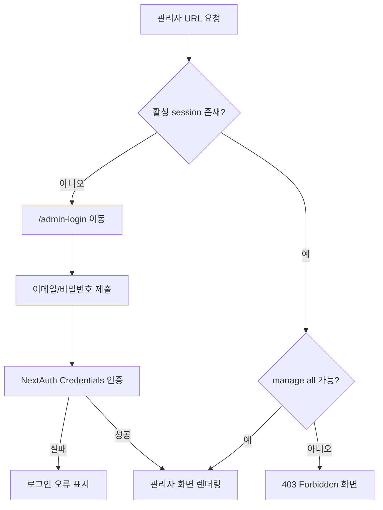

## Change Log

| Version | Date | Author | Changes |
|---|---|---|---|
| 0.1.1 | 2026-09-05 | - | 접근 주체 용어와 관리자 화면 Matrix 정합성 보정 및 Change Log 위치 수정 |
| 0.1.0 | 2026-09-05 | - | 현재 관리자 layout과 Credentials 인증 기준 접근 구조 작성 |

# As-Is 권한별 접근 구조

## 1. 현재 확인된 접근 주체

| 접근 주체 | 정의 | 근거 | 접근 범위 |
|---|---|---|---|
| Guest | 활성 session 없음 | `getRequestContext()`가 session이 없을 때 guest context 반환 | 공개 화면 및 관리자 로그인 화면 |
| Authenticated | 활성 session 존재; 관리자 권한 여부와 무관한 인증 상태 | 회원가입 시 `USER`/`ACTIVE` 계정 생성 및 Auth.js session 발급 | 공개 화면; 관리자 화면은 접근 불가 |
| Admin | 활성 session 존재 및 `manage all` ability 보유 | `src/app/(admin)/admin/layout.tsx`의 session·ability 검사 | 관리자 화면 전체 |

Authenticated 비관리자 상태는 시스템적으로 가능하다. 실제 운영 계정 존재 여부는 확인 필요하다.

## 2. 화면 접근 매트릭스

| Screen ID | Guest | Authenticated | Admin | 접근 제어 근거 |
|---|---:|---:|---:|---|
| SCR-PUB-001 ~ SCR-PUB-010 | O | O | O | 공개 route에 인증 guard 없음 |
| SCR-AUTH-001 | O | - | - | session이 있으면 `/admin`으로 redirect |
| SCR-ADM-001 | - | - | O | 관리자 layout의 권한 검사를 통과한 뒤 `/admin/albums`로 redirect |
| SCR-ADM-002 | - | - | O | 활성 session 및 `manage all` ability 필요 |
| SCR-ADM-003 | - | - | O | 활성 session 및 `manage all` ability 필요 |
| SCR-ADM-004 | - | - | O | 활성 session 및 `manage all` ability 필요 |

## 3. 관리자 접근 흐름

## 4. 인증 방식

- 현재 로그인 진입점은 `/admin-login`이다.
- 로그인은 NextAuth Credentials provider를 사용한다.
- session 전략은 JWT로 설정되어 있다.
- 인증 성공 후 session의 user id가 request context로 전달된다.
- 계정이 없거나 상태가 `ACTIVE`가 아니면 guest context로 처리된다.
- 클라이언트 UI 권한 정보는 `/api/auth/ability`에서 조회할 수 있다.

## 5. 확인 필요

- 운영 환경에서 관리자 계정이 어떻게 발급·승격되는지는 현재 저장소에서 확인되지 않는다.
- 로그인 실패 시 실제 운영 환경의 redirect/세션 만료 동작은 코드와 테스트 범위 외에는 확인되지 않는다.
- 공개 화면에서 로그인 사용자에게 별도 차등 UI를 제공하는지는 확인되지 않는다.
