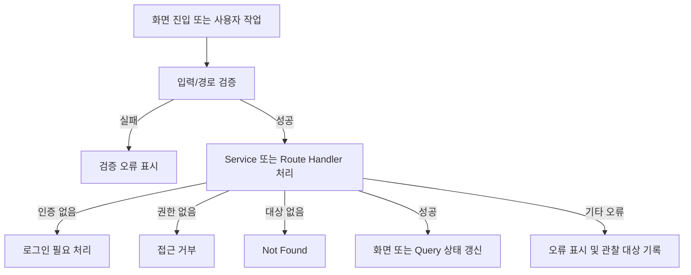

# As-Is 주요 사용자 프로세스 목록

이번 문서는 상세 화면 설계와 전체 상태 전이의 전 단계로서, 현재 구현이 확인되는 주요 사용자 프로세스의 목록과 범위만 정의한다.

## 1. 공개 콘텐츠 조회

| Process ID | 프로세스 | 선조건 | 정상 흐름 | 주요 예외 | 후조건 | 상태 |
|---|---|---|---|---|---|---|
| PROC-PUB-001 | 홈에서 앨범/곡 탐색 | 공개 앨범 또는 곡 데이터 조회 가능 | 홈 진입 → 공개 앨범 목록 조회 → 앨범/곡 선택 | 로딩, 조회 실패, 곡이 없는 앨범 제외 | 공개 앨범 목록 표시 | 확인됨 |
| PROC-PUB-002 | 응원법 목록 검색 | 공개 곡 데이터 조회 가능 | 응원법 리스트 진입 → 곡 목록 확인 → 클라이언트 필터 입력 → 결과 확인 | 검색 결과 없음, 초기 로딩/오류 | 필터 조건에 맞는 목록 표시 | 확인됨 |
| PROC-PUB-003 | 앨범에서 곡 선택 | 유효한 album slug 존재 | 앨범 URL 진입 → 앨범 상세 조회 → 수록곡 선택 → 곡 URL 이동 | slug 없음/앨범 없음 → not found | 선택한 곡 뷰어 진입 | 확인됨 |
| PROC-PUB-004 | 곡 응원법 시청 | 유효한 song slug 존재 | 곡 URL 진입 → 곡 상세 조회 → YouTube 재생 → 재생 시간에 맞춰 가사/응원 표시 | 곡 없음, YouTube 재생 상태 변화, 가사 데이터 없음 | 곡별 응원법 뷰어 사용 | 확인됨 |

## 2. 정보·정책 조회

| Process ID | 프로세스 | 선조건 | 정상 흐름 | 주요 예외 | 후조건 | 상태 |
|---|---|---|---|---|---|---|
| PROC-PUB-005 | 더보기 정보 탐색 | 없음 | 더보기 진입 → 하위 메뉴 선택 | 대상 route 없음 | 선택한 정보 화면 진입 | 확인됨 |
| PROC-PUB-006 | 공지 확인 | 공지 데이터 존재 | 공지사항 진입 → 공지 항목 선택/확장 → 내용 확인 | 공지 없음 | 공지 내용 확인 | 확인됨 |
| PROC-PUB-007 | 정책 확인 | 유효한 정책 slug 존재 | 정책 목록 진입 → 정책 선택 → 정책 본문 확인 | 잘못된 slug → not found | 정책 내용 표시 | 확인됨 |
| PROC-PUB-008 | 오류 제보 | 외부 Google Form 접근 가능 | 오류 제보 진입 → 외부 Form 링크 선택 | 외부 Form 접근 실패 | 제보는 외부 Form에서 진행 | 확인됨 |

## 3. 관리자 인증 및 콘텐츠 관리

| Process ID | 프로세스 | 선조건 | 정상 흐름 | 주요 예외 | 후조건 | 상태 |
|---|---|---|---|---|---|---|
| PROC-ADM-001 | 관리자 로그인 | 관리자 계정과 비밀번호 보유 | 로그인 화면 진입 → 이메일/비밀번호 입력 → Credentials 인증 → 관리자 진입 | 입력 검증 실패, 인증 실패, 서버 오류 | 관리자 영역 접근 또는 오류 표시 | 확인됨 |
| PROC-ADM-002 | 앨범 관리 | 활성 관리자 session과 관리 권한 | 앨범 관리 진입 → 목록 조회 → 생성/수정/삭제 작업 → 목록 갱신 | 권한 없음, 입력 오류, 대상 없음, 중복/서버 오류 | 앨범 목록에 변경 결과 반영 | 확인됨 |
| PROC-ADM-003 | 곡 관리 | 활성 관리자 session과 관리 권한 | 곡 관리 진입 → 목록 조회 → 생성/수정/삭제 작업 → 목록 갱신 | 권한 없음, 입력 오류, 대상 없음, 중복/서버 오류 | 곡 목록에 변경 결과 반영 | 확인됨 |
| PROC-ADM-004 | 가사 편집 및 저장 | 편집 가능한 곡과 활성 관리자 session | 곡 관리 → 가사 편집 진입 → 가사/LRC 편집 → 저장 → 결과 반영 | 곡 없음, 권한 없음, 계약 검증 실패, 저장 실패 | 곡의 lyrics 데이터 갱신 | 확인됨 |

## 4. 공통 예외 흐름

## 5. 다음 단계로 확장할 항목

- 각 화면의 UI Element별 표시/비활성/로딩/빈 상태/오류 상태
- 관리자 앨범·곡 CRUD의 입력 검증과 mutation별 상세 흐름
- 가사 편집기의 편집 상태와 저장 전후 동작
- 곡 뷰어의 YouTube 재생 상태와 가사 활성화 규칙

위 항목은 이번 1차 산출물에서 상세 명세로 확정하지 않는다.

## Change Log

| Version | Date | Author | Changes |
|---|---|---|---|
| 0.1.0 | 2026-09-05 | - | 현재 구현 기준 주요 사용자 프로세스 목록 작성 |
