## Change Log

| Version | Date | Author | Changes |
|---|---|---|---|
| 0.1.1 | 2026-09-05 | - | 더보기 예외 근거 보정, 곡 관리 CRUD 분리, 접근 범위 용어 통일 및 광고 감지 정합성 반영 |
| 0.1.0 | 2026-09-05 | - | 현재 구현 기준 상세 Process Flow 최초 작성 |

# As-Is 상세 Process Flow

## 1. 분석 기준

본 문서는 `RE-PROCESS-001`의 Process ID와 1·2차 As-Is 문서를 기준으로 실제 Route, Page, Component, Client/Form State, Mutation, Route Handler, Service, Repository, Schema 및 테스트 코드를 대조하여 작성했다.

- 분석 대상: `PROC-PUB-001` ~ `PROC-PUB-008`, `PROC-ADM-001` ~ `PROC-ADM-004`
- API의 path, request/response JSON, HTTP status 전체 명세는 작성하지 않는다.
- DB Table/Column/FK/Index 정의는 작성하지 않는다.
- 일반적인 UX나 구현되지 않은 자동 재시도·autosave·이탈 경고는 추가하지 않는다.

## 2. Public Process

## PROC-PUB-001 홈에서 앨범/곡 탐색

### 기본 정보

| 항목 | 내용 |
|---|---|
| Process ID | PROC-PUB-001 |
| 관련 Screen | SCR-PUB-001, SCR-PUB-003, SCR-PUB-004 |
| 접근 범위 | Public |
| 시작점 | `/` 진입 |
| 종료점 | 앨범 상세 또는 곡 뷰어 진입 |

### 선조건

- 공개 route에 접근할 수 있다.
- 서버에서 공개 앨범/곡 목록을 조회할 수 있다.

### 정상 흐름

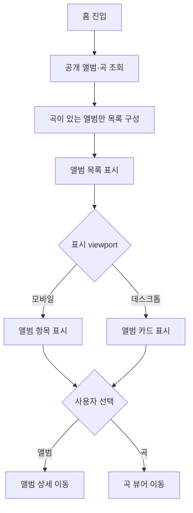

### 정상 흐름 설명

1. 홈 Page가 `listVisibleAlbumsWithSongs()`로 공개 앨범과 곡을 조회한다.
2. 곡이 없는 앨범은 화면 목록에서 제외한다.
3. 모바일에서는 앨범 항목을 펼쳐 수록곡을 표시할 수 있다.
4. 데스크톱에서는 앨범 카드가 표시된다.
5. 앨범 선택은 `/albums/{slug}`, 곡 선택은 `/songs/{slug}`로 이동한다.

### 예외 처리

| 조건 | 처리 | 사용자 결과 | 후속 상태 |
|---|---|---|---|
| 조회 중 | 화면 loading fallback | 앨범 목록 skeleton 표시 | 조회 완료 대기 |
| 곡이 없는 앨범 | 목록 구성 단계에서 제외 | 해당 앨범 미표시 | 나머지 목록 표시 |
| 공개 목록 조회 실패 | 화면 전용 오류 UI는 없음; 앱 전역 오류 경계 존재 | 전역 오류 처리 가능 | 화면 재시도 동작은 전역 경계 기준 |

### 후조건

- 공개 앨범 목록이 표시되거나, 선택한 상세 화면으로 이동한다.
- 별도 로그인 없이 탐색할 수 있다.

### 확인 필요

- 공개 목록 조회 오류가 실제 Next 실행 환경에서 `global-error.tsx`로 연결되는 세부 동작은 저장소만으로 확정하지 않는다.

## PROC-PUB-002 응원법 목록 검색

### 기본 정보

| 항목 | 내용 |
|---|---|
| Process ID | PROC-PUB-002 |
| 관련 Screen | SCR-PUB-002, SCR-PUB-004 |
| 접근 범위 | Public |
| 시작점 | `/chants` 진입 |
| 종료점 | 필터 결과 확인 또는 곡 뷰어 진입 |

### 선조건

- 공개 앨범/곡 조회가 성공한다.
- 검색어를 입력할 수 있다.

### 정상 흐름

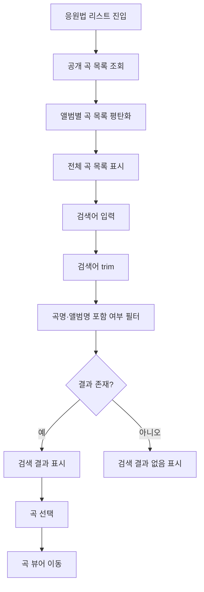

### 정상 흐름 설명

1. 서버에서 공개 곡을 조회하고 앨범명·앨범 커버를 포함한 목록으로 변환한다.
2. 검색어는 URL이 아닌 컴포넌트 form state로 관리된다.
3. 검색어가 공백이면 전체 목록을 표시한다.
4. 그 외에는 곡 제목 또는 앨범명에 검색어가 포함되는지 대소문자 무시 방식으로 필터링한다.
5. 결과 카드 선택 시 `/songs/{slug}`로 이동한다.

### 예외 처리

| 조건 | 처리 | 사용자 결과 | 후속 상태 |
|---|---|---|---|
| 초기 조회 중 | loading fallback | 목록 skeleton 표시 | 조회 완료 대기 |
| 검색 결과 0건 | 결과 배열 길이 확인 | `검색 결과가 없습니다.` 표시 | 검색어 유지 |
| 조회 실패 | 화면 전용 오류 UI는 없음 | 전역 오류 처리 가능 | 별도 화면 복구 동작 없음 |

### 후조건

- 검색 조건에 맞는 곡 목록 또는 Empty 상태가 표시된다.
- 곡을 선택하면 곡 응원법 뷰어로 이동한다.

## PROC-PUB-003 앨범에서 곡 선택

### 기본 정보

| 항목 | 내용 |
|---|---|
| Process ID | PROC-PUB-003 |
| 관련 Screen | SCR-PUB-001, SCR-PUB-003, SCR-PUB-004 |
| 접근 범위 | Public |
| 시작점 | 앨범 링크 또는 `/albums/{slug}` 진입 |
| 종료점 | 곡 뷰어, 홈 또는 404 |

### 선조건

- album slug가 dynamic route parameter로 전달된다.

### 정상 흐름

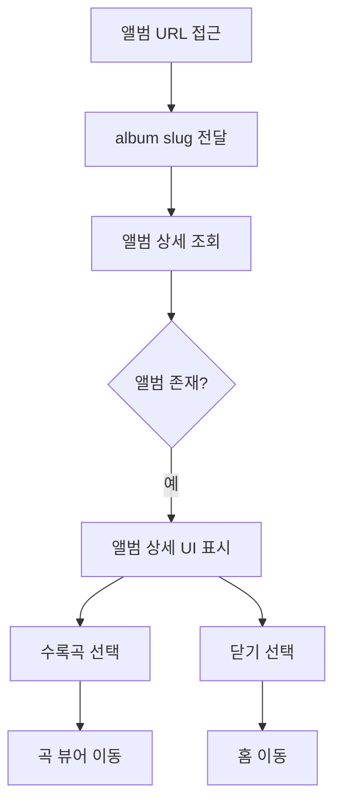

### 정상 흐름 설명

1. Page가 slug로 앨범 상세를 조회한다.
2. 조회 성공 시 앨범 이미지·이름·수록곡을 상세 UI에 표시한다.
3. 수록곡 링크를 선택하면 곡 slug로 곡 뷰어에 진입한다.
4. 닫기 버튼 또는 backdrop을 선택하면 닫기 animation 후 홈으로 이동한다.

### 예외 처리

| 조건 | 처리 | 사용자 결과 | 후속 상태 |
|---|---|---|---|
| slug 없음 | `notFound()` 호출 | 공통 404 화면 | 홈 이동 가능 |
| 앨범 조회 결과 없음 | `notFound()` 호출 | 공통 404 화면 | 홈 이동 가능 |
| 상세 조회 중 | route loading fallback | 앨범 상세 skeleton 표시 | 조회 완료 대기 |

### 후조건

- 유효한 앨범 상세가 표시되거나 공통 404 화면이 표시된다.
- 수록곡 선택 시 해당 곡 뷰어로 이동한다.

## PROC-PUB-004 곡 응원법 시청

### 기본 정보

| 항목 | 내용 |
|---|---|
| Process ID | PROC-PUB-004 |
| 관련 Screen | SCR-PUB-004, SCR-PUB-003 |
| 접근 범위 | Public |
| 시작점 | `/songs/{slug}` 진입 |
| 종료점 | 뷰어 사용, 앨범 이동 또는 공유 결과 확인 |

### 선조건

- song slug로 공개 곡 데이터를 조회할 수 있다.
- 곡 데이터에 YouTube ID와 가사 배열이 전달된다.

### 정상 흐름

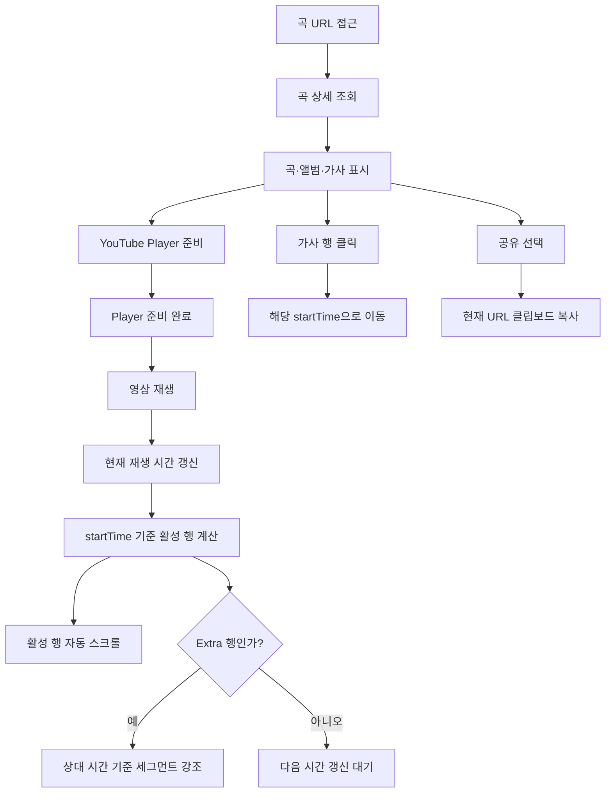

### 정상 흐름 설명

1. 곡 상세 조회 성공 시 곡명, 앨범, YouTube ID, 가사를 Client Component에 전달한다.
2. Player API가 준비되면 YouTube 영상을 재생할 수 있다.
3. 재생 중 현재 시간이 갱신되고, 가장 최근 `startTime`이 현재 시간 이하인 가사 행을 활성화한다.
4. 활성 행은 가사 스크롤 영역의 상단 15% 위치에 맞춰 자동 이동한다.
5. Extra 행은 행 시작 시간과 세그먼트 상대 offset을 비교해 세그먼트를 강조한다.
6. 일반 가사 행을 클릭하면 해당 행의 시작 시간으로 seek한다.
7. 공유 버튼은 현재 URL을 클립보드에 복사한다.

### 예외 처리

| 조건 | 처리 | 사용자 결과 | 후속 상태 |
|---|---|---|---|
| 곡 조회 중 | route loading fallback | 곡 상세 loading 표시 | 조회 완료 대기 |
| song slug 없음/곡 없음 | `notFound()` 호출 | 공통 404 화면 | 뷰어 미표시 |
| Player API 준비 전 | Player 내부 준비 상태 표시 | `Loading Player...` 표시 | 준비 완료 시 제거 |
| 가사 배열이 비어 있음 | 별도 Empty 분기 없음 | 가사 Empty 전용 UI는 확인되지 않음 | Player 영역은 별도 동작 |
| 광고 감지 | 가사 시간 갱신 중단 | 가사 활성화·스크롤 일시 정지 | 광고 상태 해제 후 갱신 재개 |
| 클립보드 복사 실패 | error toast 표시 | `링크 복사에 실패했습니다.` 표시 | 현재 화면 유지 |

### 후조건

- 사용자는 영상 재생 시간에 맞는 가사와 응원 구간을 확인한다.
- 가사 행 클릭 시 영상이 해당 시간으로 이동한다.
- 공유 성공 시 현재 URL이 클립보드에 복사된다.

### 확인 필요

- YouTube 외부 영상 오류 시 Player가 사용자에게 제공하는 최종 오류 UI는 외부 API 동작에 의존한다.

## PROC-PUB-005 더보기 정보 탐색

### 기본 정보

| 항목 | 내용 |
|---|---|
| Process ID | PROC-PUB-005 |
| 관련 Screen | SCR-PUB-005, SCR-PUB-006, SCR-PUB-007, SCR-PUB-009, SCR-PUB-010 |
| 접근 범위 | Public |
| 시작점 | `/more` 진입 |
| 종료점 | 선택한 정보 화면 진입 |

### 선조건

- 없음.

### 정상 흐름

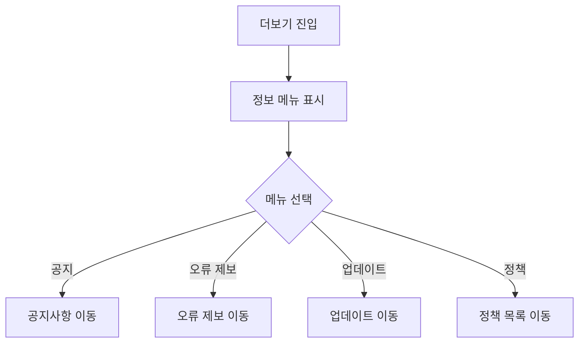

### 예외 처리

현재 정의된 메뉴 항목은 모두 구현된 Route를 가리키며, 별도 화면 내 예외 처리 로직은 확인되지 않는다.

### 후조건

- 선택한 정보 화면으로 이동한다.

## PROC-PUB-006 공지 확인

### 기본 정보

| 항목 | 내용 |
|---|---|
| Process ID | PROC-PUB-006 |
| 관련 Screen | SCR-PUB-006 |
| 접근 범위 | Public |
| 시작점 | `/more/notice` 진입 |
| 종료점 | 공지 내용 확인 |

### 선조건

- Page에 정의된 정적 공지 데이터가 로드된다.

### 정상 흐름

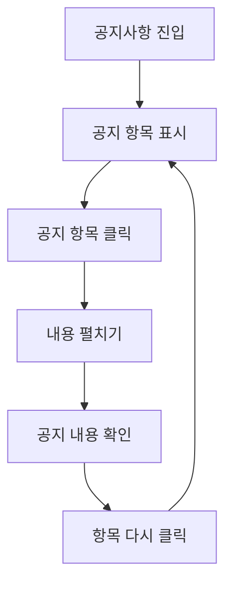

### 예외 처리

| 조건 | 처리 | 사용자 결과 | 후속 상태 |
|---|---|---|---|
| 공지 배열이 비어 있음 | 별도 Empty UI 없음 | 목록 영역에 공지 항목 미표시 | 상위 화면 유지 |

### 후조건

- 선택한 공지의 본문이 펼쳐지거나 다시 접힌다.

## PROC-PUB-007 정책 확인

### 기본 정보

| 항목 | 내용 |
|---|---|
| Process ID | PROC-PUB-007 |
| 관련 Screen | SCR-PUB-007, SCR-PUB-008 |
| 접근 범위 | Public |
| 시작점 | `/more/policy` 또는 정책 상세 링크 |
| 종료점 | 정책 본문 확인 |

### 선조건

- 정책 목록 또는 정책 상세 URL에 접근한다.

### 정상 흐름

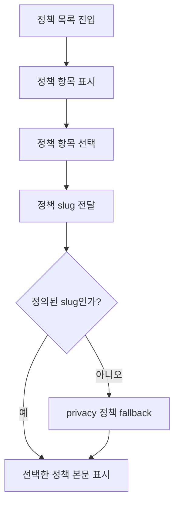

### 정상 흐름 설명

1. 정책 목록에는 5개의 정적 정책 링크가 표시된다.
2. 정책 링크 선택 시 slug가 상세 Page에 전달된다.
3. 정의된 slug면 해당 정책의 제목·적용일·본문을 표시한다.
4. 정의되지 않은 slug면 `privacy` 상세 데이터를 사용한다.

### 예외 처리

| 조건 | 처리 | 사용자 결과 | 후속 상태 |
|---|---|---|---|
| 정의되지 않은 정책 slug | `POLICY_DETAILS[slug] || POLICY_DETAILS.privacy` 적용 | 개인정보 처리방침 표시 | 정책 상세 화면 유지 |

### 후조건

- 정책 본문과 적용일이 표시된다.
- 잘못된 slug도 404가 아닌 `privacy` 상세로 처리된다.

## PROC-PUB-008 오류 제보

### 기본 정보

| 항목 | 내용 |
|---|---|
| Process ID | PROC-PUB-008 |
| 관련 Screen | SCR-PUB-009 |
| 접근 범위 | Public |
| 시작점 | `/more/report` 진입 |
| 종료점 | 외부 Form 사용 또는 새 창 이동 |

### 선조건

- 외부 Google Form을 로드할 수 있다.

### 정상 흐름

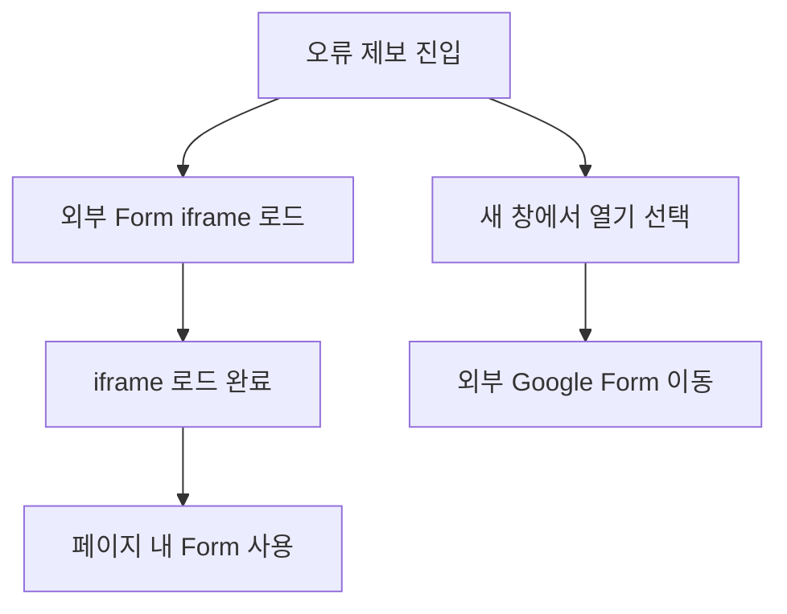

### 예외 처리

| 조건 | 처리 | 사용자 결과 | 후속 상태 |
|---|---|---|---|
| iframe 로딩 중 | loading overlay 유지 | spinner와 `Loading Form...` 표시 | 로드 완료 대기 |
| 외부 Form 오류 | 외부 iframe 동작에 맡김 | 저장소 내 별도 오류 UI 없음 | 현재 화면 유지 가능 |

### 후조건

- 사용자는 iframe 또는 새 창의 외부 Form에서 제보를 진행한다.
- 외부 Form 제출 결과는 저장소에서 확인되지 않는다.

## 3. Admin Process

## PROC-ADM-001 관리자 로그인

### 기본 정보

| 항목 | 내용 |
|---|---|
| Process ID | PROC-ADM-001 |
| 관련 Screen | SCR-AUTH-001, SCR-ADM-001, SCR-ADM-002 |
| 접근 범위 | Guest / Authenticated / Admin |
| 시작점 | `/admin-login` 또는 관리자 URL 접근 |
| 종료점 | 관리자 앨범 관리 진입 또는 로그인 오류 |

### 선조건

- 로그인 화면에 접근할 수 있다.
- 로그인하는 경우 이메일과 비밀번호를 입력할 수 있다.

### 정상 흐름

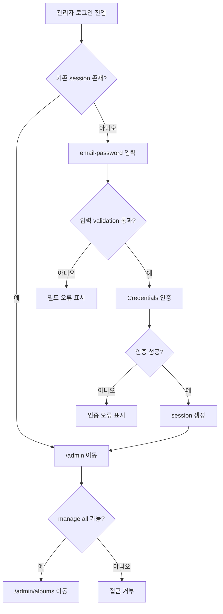

### 정상 흐름 설명

1. session이 없는 사용자는 이메일과 비밀번호를 입력한다.
2. 이메일 형식과 비밀번호 길이를 client form schema로 검증한다.
3. 검증 성공 시 Server Action을 통해 NextAuth Credentials 인증을 수행한다.
4. 인증 성공 시 session이 생성되고 `/admin`으로 이동한다.
5. 관리자 layout에서 활성 session과 `manage all` ability를 확인한다.
6. 권한 검사를 통과하면 `/admin/albums`로 redirect한다.

### 예외 처리

| 조건 | 처리 | 사용자 결과 | 후속 상태 |
|---|---|---|---|
| 이메일 형식 오류 | client validation | 이메일 필드 오류 표시 | 입력 화면 유지 |
| 비밀번호 6자 미만 | client validation | 비밀번호 필드 오류 표시 | 입력 화면 유지 |
| Credentials 인증 실패 | 인증 결과 오류 처리 | 로그인 오류 영역 표시 | session 없음 |
| 인증 처리 예외 | client 오류 처리 | `로그인 중 오류가 발생했습니다.` 표시 | 입력 화면 유지 |
| Authenticated이지만 Admin 아님 | 관리자 layout에서 ability 불충족 | forbidden 처리 | 관리자 화면 미표시 |

### 후조건

- Admin은 앨범 관리 화면에 진입한다.
- 인증 실패 사용자는 로그인 화면에 남는다.
- Authenticated 비관리자는 관리자 화면에 진입하지 못한다.

## PROC-ADM-002 앨범 관리

### 기본 정보

| 항목 | 내용 |
|---|---|
| Process ID | PROC-ADM-002 |
| 관련 Screen | SCR-ADM-002 |
| 접근 범위 | Admin |
| 시작점 | `/admin/albums` 진입 |
| 종료점 | 목록 확인 또는 생성·수정·삭제 결과 반영 |

### 선조건

- 관리자 layout의 session·ability 검사를 통과한다.
- 앨범 관리 데이터 조회 또는 mutation을 수행할 수 있다.

### 정상 흐름: 목록 조회·검색·페이지 이동

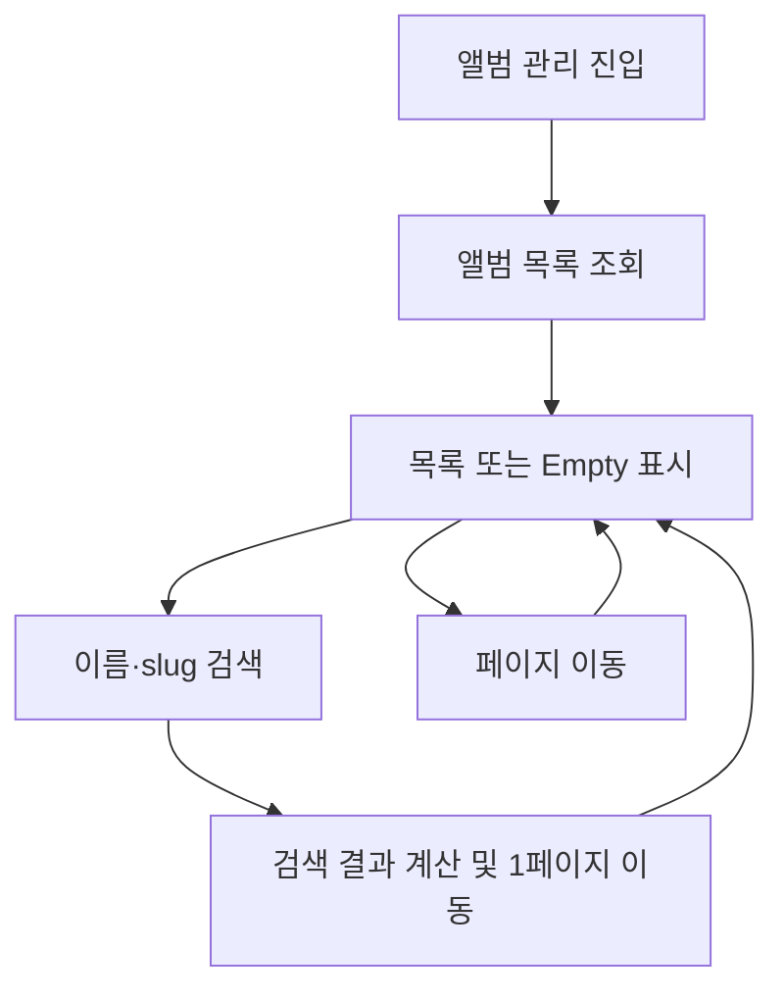

### 정상 흐름: 생성

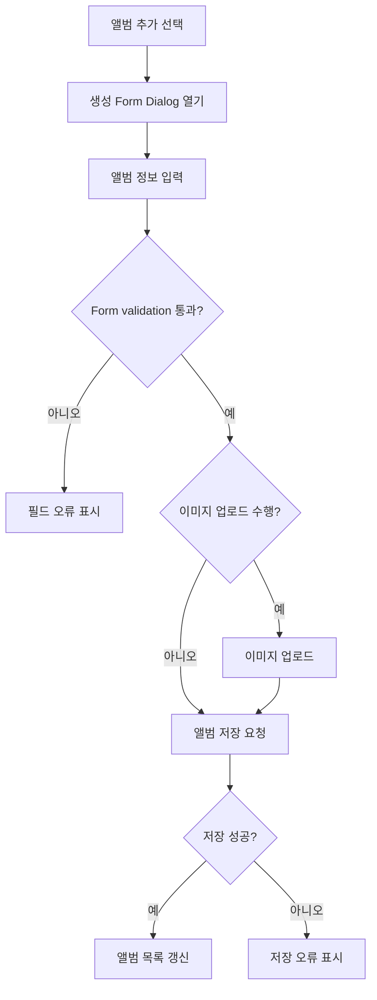

### 정상 흐름: 수정·삭제

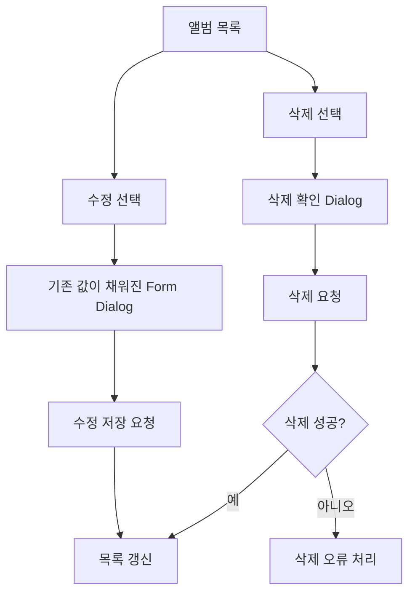

### 정상 흐름 설명

1. 목록은 최대 10개 단위로 페이지를 계산한다.
2. 이름 또는 slug 검색 시 현재 페이지를 첫 페이지로 초기화한다.
3. 생성/수정 Form은 이름, slug, 이미지, 색상, 발매일, 화면 표시를 입력받는다.
4. 이미지 파일을 선택하면 업로드 완료 후 이미지 URL을 Form에 반영한다.
5. 저장 성공 시 Dialog를 닫고 목록 데이터를 갱신한다.
6. 삭제 전 확인 Dialog를 표시하고, 확인 후 삭제 요청을 수행한다.

### 예외 처리

| 조건 | 처리 | 사용자 결과 | 후속 상태 |
|---|---|---|---|
| 목록 조회 중 | 앨범 목록 조회 중 | `앨범을 불러오는 중...` 표시 | 조회 완료 대기 |
| 앨범 0건 | 목록 Empty 분기 | `등록된 앨범이 없습니다.` 표시 | 추가 가능 |
| 검색 결과 0건 | 목록 Empty 분기 | `검색 결과가 없습니다.` 표시 | 검색어 유지 |
| Form validation 실패 | 필드별 오류 반영 | 각 입력 필드 오류 표시 | Dialog 유지 |
| slug 중복 | `ALBUM_SLUG_ALREADY_EXISTS` 처리 | slug 오류 표시 | Dialog 유지 |
| 이미지 업로드 실패 | 이미지 필드 오류 설정 | 이미지 오류 표시 | Dialog 유지 |
| 저장/삭제 실패 | 오류 처리 경로 | 오류 피드백 | 목록 또는 Dialog 유지 |
| 삭제 진행 중 | mutation pending | 삭제 버튼 disabled | 요청 완료 대기 |

### 후조건

- 생성·수정 성공 시 앨범 목록에 최신 결과가 반영된다.
- 삭제 성공 시 대상 앨범이 목록에서 제거된다.
- 앨범 삭제 시 소속 곡도 함께 삭제된다는 안내가 표시된다.

## PROC-ADM-003 곡 관리

### 기본 정보

| 항목 | 내용 |
|---|---|
| Process ID | PROC-ADM-003 |
| 관련 Screen | SCR-ADM-003, SCR-ADM-004 |
| 접근 범위 | Admin |
| 시작점 | `/admin/songs` 진입 |
| 종료점 | 곡 목록 결과 또는 가사 편집 진입 |

### 선조건

- 관리자 layout의 session·ability 검사를 통과한다.
- 곡 목록과 앨범 목록을 조회할 수 있다.

### 정상 흐름

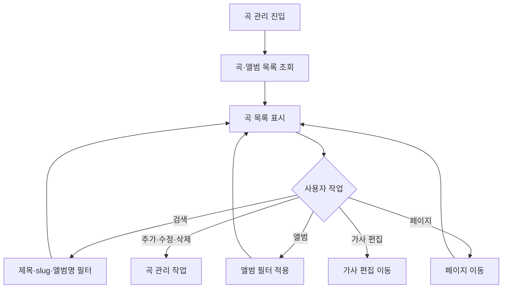

### 정상 흐름 설명

1. 곡과 앨범 목록을 병렬로 조회한다.
2. 검색은 곡 제목·slug·앨범명에 대해 수행한다.
3. 앨범 필터는 전체 앨범 또는 특정 앨범을 선택한다.
4. 목록은 최대 15개 단위로 페이지를 계산한다.
5. 곡 추가/수정은 Form Dialog를 사용하고, 삭제는 확인 Dialog를 거친다.
6. 곡 제목 링크 또는 편집 동작을 통해 `/admin/edit/{slug}`로 이동한다.

### 정상 흐름: 곡 생성·수정

~~~mermaid
flowchart TD
    LIST["곡 목록"] --> ACTION{"생성 또는 수정 선택"}
    ACTION -- "생성" --> CREATE["곡 추가 Form 열기"]
    ACTION -- "수정" --> EDIT["기존 값이 채워진 Form 열기"]
    CREATE --> INPUT["앨범·기본 정보·LRC 입력"]
    EDIT --> UPDATE_INPUT["곡 정보 수정"]
    INPUT --> VALIDATE{"Validation 통과?"}
    UPDATE_INPUT --> VALIDATE
    VALIDATE -- "아니오" --> ERROR["필드/LRC 오류 표시"]
    VALIDATE -- "예" --> SAVE["곡 저장 요청"]
    SAVE --> REFRESH["목록 데이터 갱신"]
~~~

### 정상 흐름: 곡 삭제·가사 편집 진입

~~~mermaid
flowchart TD
    LIST["곡 목록"] --> ACTION{"사용자 선택"}
    ACTION -- "삭제" --> CONFIRM["삭제 확인 Dialog"]
    CONFIRM --> DELETE["곡 삭제 요청"]
    DELETE --> REFRESH["목록 데이터 갱신"]
    ACTION -- "가사 편집" --> SLUG["대상 곡 slug 선택"]
    SLUG --> EDITOR["/admin/edit/{slug} 이동"]
~~~

### 예외 처리

| 조건 | 처리 | 사용자 결과 | 후속 상태 |
|---|---|---|---|
| 목록 조회 중 | 곡·앨범 목록 조회 중 | `로딩 중...` 표시 | 조회 완료 대기 |
| 필터 결과 0건 | `hasFilter` 기준 Empty 분기 | `검색 결과가 없습니다.` 표시 | 필터 유지 |
| 전체 곡 0건 | Empty 분기 | `등록된 곡이 없습니다.` 표시 | 추가 가능 |
| 생성 시 LRC 없음 | 생성 submit 단계에서 차단 | `LRC 파일을 업로드해주세요.` 표시 | Form 유지 |
| 입력/API 오류 | 필드·LRC·form 오류 반영 | 오류 메시지 표시 | Form 유지 |
| 삭제 진행 중 | mutation pending | 삭제 버튼 disabled | 요청 완료 대기 |
| 저장/삭제 성공 | 목록 데이터 갱신 | 최신 목록 표시 | 관리 화면 유지 |

### 후조건

- 곡 생성·수정·삭제 결과가 목록에 반영된다.
- 가사 편집 선택 시 대상 곡의 편집 화면으로 이동한다.

## PROC-ADM-004 가사 편집 및 저장

### 기본 정보

| 항목 | 내용 |
|---|---|
| Process ID | PROC-ADM-004 |
| 관련 Screen | SCR-ADM-003, SCR-ADM-004 |
| 접근 범위 | Admin |
| 시작점 | `/admin/edit/{slug}` 진입 |
| 종료점 | 편집 상태 저장 또는 편집 화면 유지 |

### 선조건

- 관리자 layout의 session·ability 검사를 통과한다.
- slug에 해당하는 곡 editor 데이터를 조회할 수 있다.

### 정상 흐름: 편집기 진입 및 시간 조정

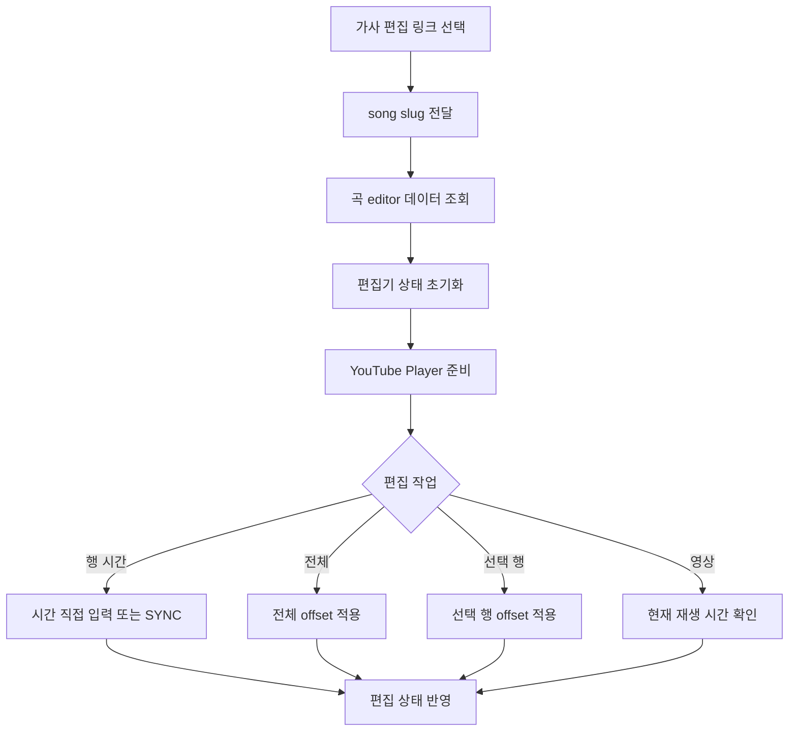

### 정상 흐름: 가사·세그먼트 편집

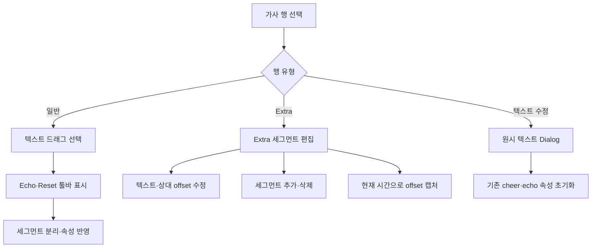

### 정상 흐름: LRC Import 및 저장

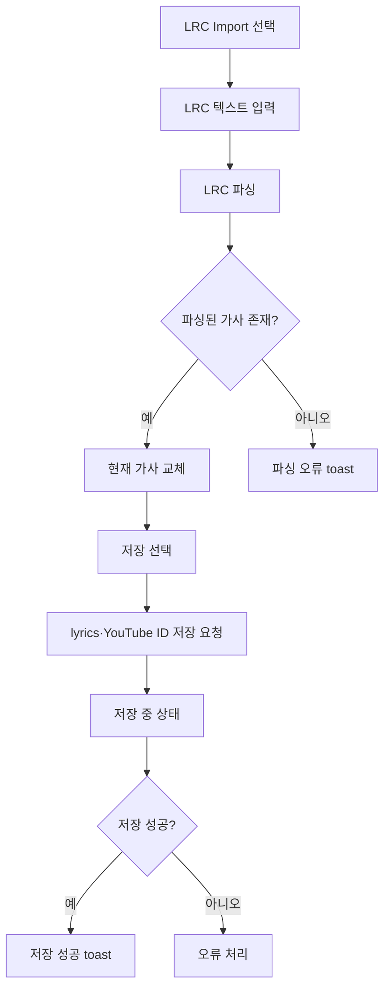

### 정상 흐름 설명

1. 편집 링크의 slug로 editor 데이터를 조회하고 편집기 상태를 초기화한다.
2. YouTube 재생 시간을 확인하면서 행 시작 시간 또는 Extra 세그먼트 offset을 조정한다.
3. 일반 행의 텍스트를 선택하면 Echo 또는 Reset으로 세그먼트를 분리한다.
4. Extra 행에서는 세그먼트 텍스트·상대 offset을 수정하거나 추가·삭제한다.
5. 모바일에서는 문자 단위 페인트 모드로 기본·응원법·에코 상태를 지정할 수 있다.
6. LRC 텍스트를 파싱하면 현재 가사를 교체한다.
7. 저장 시 현재 가사와 YouTube ID를 서버에 저장하고 성공 toast를 표시한다.
8. 저장 성공 후에도 현재 편집 화면을 유지한다.

### 예외 처리

| 조건 | 처리 | 사용자 결과 | 후속 상태 |
|---|---|---|---|
| editor 데이터 로딩 중 | route/lazy loading fallback | `에디터 로딩 중...` 표시 | 로딩 완료 대기 |
| slug 없음/곡 없음 | `notFound()` 호출 | 공통 404 화면 | editor 미표시 |
| 권한 없음 | 관리자 layout 또는 client ability 검사 | forbidden 또는 editor 미표시 | 저장 불가 |
| 잘못된 행 시간 | 유효한 0 이상 값만 반영 | 기존 시간 표시값으로 복원 | 편집 화면 유지 |
| LRC 파싱 결과 없음 | toast 오류 | `파싱된 가사가 없습니다. 형식을 확인해 주세요.` | Import Dialog 유지 |
| LRC 파싱 실패 | toast 오류 | `LRC 파싱 중 오류가 발생했습니다.` | Import Dialog 유지 |
| 저장 중 | saving state | 저장 버튼 disabled, `저장 중...` 표시 | 요청 완료 대기 |
| 저장 실패 | mutation 오류 처리 | 오류 피드백 | 현재 편집 상태 유지 |

### 후조건

- 편집 변경이 성공하면 곡의 가사와 YouTube ID가 저장된다.
- 저장 성공 후 현재 편집 화면이 유지된다.
- 별도 autosave, draft recovery, unsaved 이탈 경고는 확인되지 않는다.
- Undo/Redo는 history가 없을 때 각각 disabled다.

## 4. 기존 문서 정합성 이슈

- 확인된 추가 충돌 없음.
- `PROC-PUB-007`의 정책 잘못된 slug 처리와 2차 Screen Spec의 `privacy` fallback을 동일하게 반영했다.
- 모든 Process ID와 관련 Screen ID는 1차·2차 문서와 동일하게 유지했다.

## 5. 확인 필요

- 공개 목록 조회 오류가 실제 Next 실행 환경에서 전역 오류 경계로 연결되는 세부 동작은 저장소만으로 확정하지 않는다.
- YouTube 외부 영상 오류의 최종 사용자 표시 방식은 외부 Player API 동작에 의존한다.
- 외부 Google Form 제출 이후 결과 처리는 저장소 범위 밖이다.
