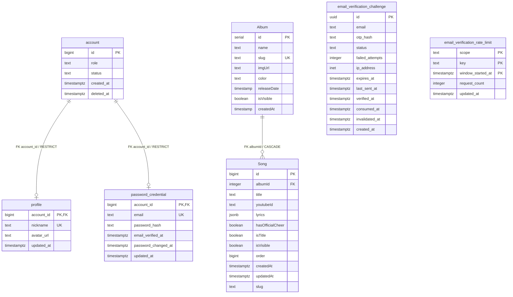

# Database Specification

## Change Log

| Version | Date | Author | Changes |
|---|---|---|---|
| 0.1.0 | 2026-09-05 | Codex | 현재 저장소의 Drizzle schema, migration, relation, repository, service를 기준으로 데이터베이스 구조를 정리 |

## 1. 문서 범위와 분석 기준

이 문서는 현재 저장소에서 실제 구현이 확인되는 PostgreSQL 데이터 구조만 정리한다. 분석 근거는 다음과 같다.

- `src/server/db/schema.ts`
- `drizzle/0000_long_matthew_murdock.sql` ~ `drizzle/0003_email_verification_rate_limit.sql`
- `drizzle/meta/`의 migration snapshot 및 journal
- `src/server/repositories/`
- `src/server/services/`
- `src/shared/contracts/song.ts`의 가사 JSON 계약

이번 문서에는 API endpoint, request/response 명세, 미래 도메인 테이블, 임의의 개선안을 포함하지 않는다.

길이 제한이 없는 `text` 계열은 별도 `Length` column을 두지 않는다. 길이 제약이 확인되는 경우에는 해당 column 설명 또는 제약조건에 기록한다.

### 1.1 확인 상태 표기

| 표기 | 의미 |
|---|---|
| 확인됨 | 현재 코드 또는 migration에서 직접 확인됨 |
| 추정 | 구조상 가능하지만 현재 코드만으로 확정할 수 없음 |
| 확인 필요 | 현재 저장소만으로는 운영 상태 또는 정책을 확정할 수 없음 |

## 2. 데이터베이스 개요

- DBMS: PostgreSQL — `drizzle.config.ts`의 dialect 및 migration SQL 기준 확인됨
- ORM: Drizzle ORM — 확인됨
- 현재 schema에 정의된 테이블: 7개 — 확인됨
- migration: `0000`부터 `0003`까지 4개 — 확인됨
- 데이터베이스 연결: `src/server/db/index.ts`에서 `postgres-js` 기반으로 생성 — 확인됨
- 실행기 추상화: `Database | Transaction`을 `DbExecutor`로 사용 — 확인됨
- 현재 저장소에서 production DB에 연결하거나 실제 운영 schema를 introspection한 근거: 확인 필요

Auth.js의 세션은 현재 코드에서 JWT 방식으로 구성되어 있으며, 현재 Drizzle schema에는 별도 session/account adapter 테이블이 없다. 따라서 세션 저장 테이블은 이 문서의 테이블 목록에 포함하지 않는다.

## 3. ERD

다이어그램의 식별자는 Mermaid 표시를 위한 이름이며, 실제 DB table name은 4장 표를 기준으로 한다.



`email_verification_challenge`와 `email_verification_rate_limit`은 현재 schema에 외래키가 없으므로 ERD에서 다른 테이블과 연결하지 않는다.

## 4. 테이블 인벤토리

| ID | TypeScript schema 변수 | 실제 DB table name | 역할 | 상태 |
|---|---|---|---|---|
| TB-001 | `account` | `account` | 계정의 역할·상태 및 삭제 시각 보관 | 확인됨 |
| TB-002 | `profile` | `profile` | 계정 프로필 보관 | 확인됨 |
| TB-003 | `passwordCredential` | `password_credential` | 이메일·비밀번호 인증 정보 보관 | 확인됨 |
| TB-004 | `emailVerificationChallenge` | `email_verification_challenge` | 이메일 OTP 검증 시도와 상태 보관 | 확인됨 |
| TB-005 | `emailVerificationRateLimit` | `email_verification_rate_limit` | 이메일/IP 단위 인증 요청 횟수와 윈도우 보관 | 확인됨 |
| TB-006 | `album` | `Album` | 공개 앨범 및 관리자 앨범 정보 보관 | 확인됨 |
| TB-007 | `song` | `Song` | 앨범 소속 곡, 공개 여부, 영상 및 가사 보관 | 확인됨 |

## 5. 테이블 정의

### TB-001. `account`

실제 table name은 소문자 `account`다.

| Column | Drizzle / DB type | Nullable | PK | FK | Unique | Default | 설명 |
|---|---|---:|---:|---|---|---|---|
| `id` | `bigint` / `BIGINT` | No | Yes | - | - | generated identity | 계정 식별자 |
| `role` | `text` / `TEXT` | No | No | - | - | - | `USER`, `REVIEWER`, `ADMIN` 중 하나 |
| `status` | `text` / `TEXT` | No | No | - | - | - | 계정 상태 |
| `createdAt` | `timestamp with timezone` / `TIMESTAMPTZ` | No | No | - | - | `now()` | 생성 시각 |
| `deletedAt` | `timestamp with timezone` / `TIMESTAMPTZ` | Yes | No | - | - | - | 삭제 상태와 연결되는 시각 |

`role`의 DB 허용값은 `USER`, `REVIEWER`, `ADMIN`이며, `status`의 DB 허용값은 `PENDING_VERIFICATION`, `ACTIVE`, `SUSPENDED`, `DELETED`다. `DELETED` 상태와 `deletedAt`의 null 여부는 서로 일치해야 한다.

현재 계정 생성 service는 `role: USER`, `status: ACTIVE`를 저장한다. `deletedAt`을 갱신하거나 계정 삭제를 수행하는 service/repository는 확인되지 않았다.

### TB-002. `profile`

실제 table name은 소문자 `profile`이다. `account`와 1:0..1 관계다.

| Column | Drizzle / DB type | Nullable | PK | FK | Unique | Default | 설명 |
|---|---|---:|---:|---|---|---|---|
| `accountId` (`account_id`) | `bigint` / `BIGINT` | No | Yes | `account.id`, `RESTRICT` | - | - | 계정 식별자이자 profile 식별자 |
| `nickname` | `text` / `TEXT` | No | No | - | Yes | - | 프로필 닉네임 |
| `avatarUrl` (`avatar_url`) | `text` / `TEXT` | Yes | No | - | - | - | 아바타 URL |
| `updatedAt` (`updated_at`) | `timestamp with timezone` / `TIMESTAMPTZ` | No | No | - | - | `now()` | 수정 시각 |

계정이 삭제될 때 profile을 자동 삭제하는 cascade는 없다. FK의 `ON DELETE RESTRICT`만 확인된다.

### TB-003. `password_credential`

TypeScript schema 변수는 `passwordCredential`이며 실제 table name은 `password_credential`이다.

| Column | Drizzle / DB type | Nullable | PK | FK | Unique | Default | 설명 |
|---|---|---:|---:|---|---|---|---|
| `accountId` (`account_id`) | `bigint` / `BIGINT` | No | Yes | `account.id`, `RESTRICT` | - | - | 계정 식별자 |
| `email` | `text` / `TEXT` | No | No | - | Yes | - | 인증 이메일 |
| `passwordHash` (`password_hash`) | `text` / `TEXT` | No | No | - | - | - | 해시된 비밀번호 |
| `emailVerifiedAt` (`email_verified_at`) | `timestamp with timezone` / `TIMESTAMPTZ` | No | No | - | - | - | 이메일 인증 완료 시각 |
| `passwordChangedAt` (`password_changed_at`) | `timestamp with timezone` / `TIMESTAMPTZ` | No | No | - | - | - | 비밀번호 변경 시각 |
| `updatedAt` (`updated_at`) | `timestamp with timezone` / `TIMESTAMPTZ` | No | No | - | - | `now()` | 수정 시각 |

DB check로 이메일은 빈 문자열이 아니고 trim 및 소문자 정규화 결과와 같아야 하며, `password_hash`도 빈 문자열이 아니어야 한다.

### TB-004. `email_verification_challenge`

| Column | Drizzle / DB type | Nullable | PK | FK | Unique | Default | 설명 |
|---|---|---:|---:|---|---|---|---|
| `id` | `uuid` / `UUID` | No | Yes | - | - | random UUID | 인증 challenge 식별자 |
| `email` | `text` / `TEXT` | No | No | - | - | - | 인증 대상 이메일 |
| `otpHash` (`otp_hash`) | `text` / `TEXT` | No | No | - | - | - | OTP 해시 |
| `status` | `text` / `TEXT` | No | No | - | - | - | challenge 상태 |
| `failedAttempts` (`failed_attempts`) | `integer` / `INTEGER` | No | No | - | - | `0` | 실패 횟수 |
| `ipAddress` (`ip_address`) | `inet` / `INET` | No | No | - | - | - | 요청 IP |
| `expiresAt` (`expires_at`) | `timestamp with timezone` / `TIMESTAMPTZ` | No | No | - | - | - | 만료 시각 |
| `lastSentAt` (`last_sent_at`) | `timestamp with timezone` / `TIMESTAMPTZ` | No | No | - | - | - | 마지막 발송 시각 |
| `verifiedAt` (`verified_at`) | `timestamp with timezone` / `TIMESTAMPTZ` | Yes | No | - | - | - | 검증 완료 시각 |
| `consumedAt` (`consumed_at`) | `timestamp with timezone` / `TIMESTAMPTZ` | Yes | No | - | - | - | 회원가입에서 소비된 시각 |
| `invalidatedAt` (`invalidated_at`) | `timestamp with timezone` / `TIMESTAMPTZ` | Yes | No | - | - | - | 무효화 시각 |
| `createdAt` (`created_at`) | `timestamp with timezone` / `TIMESTAMPTZ` | No | No | - | - | `now()` | 생성 시각 |

`status` 허용값은 `PENDING`, `VERIFIED`, `CONSUMED`, `INVALIDATED`다. `VERIFIED`, `CONSUMED`, `INVALIDATED` 각각의 상태는 대응하는 시각 column이 null이 아닌 조건으로 DB에서 강제된다. `failedAttempts`는 0 이상 5 이하이며 `otpHash`는 빈 문자열일 수 없다.

### TB-005. `email_verification_rate_limit`

| Column | Drizzle / DB type | Nullable | PK | FK | Unique | Default | 설명 |
|---|---|---:|---:|---|---|---|---|
| `scope` | `text` / `TEXT` | No | Yes* | - | - | - | 제한 기준: `EMAIL` 또는 `IP` |
| `key` | `text` / `TEXT` | No | Yes* | - | - | - | 이메일 또는 IP 값 |
| `windowStartedAt` (`window_started_at`) | `timestamp with timezone` / `TIMESTAMPTZ` | No | Yes* | - | - | - | 제한 윈도우 시작 시각 |
| `requestCount` (`request_count`) | `integer` / `INTEGER` | No | No | - | - | `0` | 윈도우 내 요청 횟수 |
| `updatedAt` (`updated_at`) | `timestamp with timezone` / `TIMESTAMPTZ` | No | No | - | - | `now()` | 수정 시각 |

`*` `scope`, `key`, `window_started_at`의 복합 primary key다. `scope`는 `EMAIL` 또는 `IP`여야 하고, `key`는 빈 문자열일 수 없으며, `requestCount`는 0 이상이어야 한다.

### TB-006. `Album`

TypeScript schema 변수는 `album`이지만 실제 table name은 대문자 `Album`이다.

| Column | Drizzle / DB type | Nullable | PK | FK | Unique | Default | 설명 |
|---|---|---:|---:|---|---|---|---|
| `id` | `serial` / `SERIAL` | No | Yes | - | - | sequence | 앨범 식별자 |
| `name` | `text` / `TEXT` | No | No | - | - | - | 앨범명 |
| `slug` | `text` / `TEXT` | No | No | - | Yes | - | 앨범 URL 식별자 |
| `imgUrl` | `text` / `TEXT` | No | No | - | - | - | 앨범 이미지 URL |
| `color` | `text` / `TEXT` | No | No | - | - | - | 앨범 표시 색상 값 |
| `releaseDate` | `timestamp(3)` / `TIMESTAMP(3)` | Yes | No | - | - | - | 발매일 |
| `isVisible` | `boolean` / `BOOLEAN` | No | No | - | - | `true` | 공개 여부 |
| `createdAt` | `timestamp(3)` / `TIMESTAMP(3)` | No | No | - | - | `CURRENT_TIMESTAMP` | 생성 시각 |

앨범 `slug`에는 `Album_slug_key` unique constraint가 있다. `releaseDate`와 `createdAt`은 timezone 없는 timestamp로 정의되어 있으며, `updatedAt` 또는 `deletedAt` column은 없다.

### TB-007. `Song`

TypeScript schema 변수는 `song`이지만 실제 table name은 대문자 `Song`이다.

| Column | Drizzle / DB type | Nullable | PK | FK | Unique | Default | 설명 |
|---|---|---:|---:|---|---|---|---|
| `id` | `bigserial` / `BIGSERIAL` | No | Yes | - | - | sequence | 곡 식별자 |
| `albumId` | `integer` / `INTEGER` | No | No | `Album.id`, `CASCADE` | - | - | 소속 앨범 |
| `title` | `text` / `TEXT` | Yes | No | - | - | - | 곡 제목 |
| `youtubeId` | `text` / `TEXT` | Yes | No | - | - | - | YouTube 영상 식별자 |
| `lyrics` | `jsonb` / `JSONB` | Yes | No | - | - | - | 동기화 가사 데이터 |
| `hasOfficialCheer` | `boolean` / `BOOLEAN` | Yes | No | - | - | - | 공식 응원법 존재 여부 |
| `isTitle` | `boolean` / `BOOLEAN` | No | No | - | - | `false` | 타이틀곡 여부 |
| `isVisible` | `boolean` / `BOOLEAN` | No | No | - | - | `true` | 공개 여부 |
| `order` | `bigint` / `BIGINT` | Yes | No | - | - | - | 앨범 내 정렬 순서 |
| `createdAt` | `timestamp(3) with timezone` / `TIMESTAMPTZ(3)` | Yes | No | - | - | - | 생성 시각 |
| `updatedAt` | `timestamp(3) with timezone` / `TIMESTAMPTZ(3)` | Yes | No | - | - | - | 최종 수정 시각 |
| `slug` | `text` / `TEXT` | Yes | No | - | - | - | 곡 URL 식별자 |

`Song.albumId`는 `Album.id`를 참조하며 앨범 삭제 시 cascade로 곡이 삭제된다. 현재 migration에는 `Song.slug` unique constraint 또는 unique index가 확인되지 않는다. 앱 입력 계약에서는 slug를 요구하지만 DB column 자체는 nullable·비고유다.

#### `Song.lyrics` JSONB 구조

현재 shared contract 기준으로 `lyrics`는 배열이며, 각 element는 다음 구조다.

```json
[
  {
    "startTime": 12.34,
    "segments": [
      {
        "text": "가사 한 구간",
        "isCheer": false,
        "isEcho": false,
        "startTimeOffset": 0.25
      }
    ],
    "isExtra": false
  }
]
```

| JSON 경로 | Type | 필수 | 제약 |
|---|---|---:|---|
| `[]` | array | Yes | `LyricLine` 배열 |
| `[].startTime` | number | Yes | 0 이상 |
| `[].segments` | array | Yes | `LyricSegment` 배열 |
| `[].segments[].text` | string | Yes | 1자 이상 |
| `[].segments[].isCheer` | boolean | No | 기본값 false |
| `[].segments[].isEcho` | boolean | No | 기본값 false |
| `[].segments[].startTimeOffset` | number | No | 선택 값 |
| `[].isExtra` | boolean | No | 기본값 false |

DB는 JSONB column으로 저장하고, 구조 검증 및 기본값 부여는 현재 shared Zod contract/application path에서 수행한다. 현재 DB migration에는 JSONB 내부 구조를 검사하는 check constraint가 없다.

## 6. 관계 정의

### 6.1 실제 DB 외래키

| 부모 | 자식 | 자식 column | 삭제 동작 | 상태 |
|---|---|---|---|---|
| `account` | `profile` | `profile.account_id` | `ON DELETE RESTRICT` | 확인됨 |
| `account` | `password_credential` | `password_credential.account_id` | `ON DELETE RESTRICT` | 확인됨 |
| `Album` | `Song` | `Song.albumId` | `ON DELETE CASCADE` | 확인됨 |

모든 외래키는 migration SQL에 `ON UPDATE NO ACTION`이 명시되어 있다.

### 6.2 Drizzle relations

`src/server/db/schema.ts`에서 다음 ORM relation이 정의되어 repository 조회의 `with`에 사용된다.

| Relation | 방향 | 사용 예 |
|---|---|---|
| `albumRelations.songs` | `album` 1 : N `song` | 공개 앨범 조회 시 공개 곡 포함 |
| `songRelations.album` | `song` N : 1 `album` | 곡 상세·관리 목록에 앨범 포함 |
| `accountRelations.profile` | `account` 1 : 0..1 `profile` | 계정과 프로필 연결 |
| `accountRelations.passwordCredential` | `account` 1 : 0..1 `passwordCredential` | 계정과 인증 정보 연결 |
| `profileRelations.account` | `profile` N : 1 `account` | 프로필의 계정 연결 |
| `passwordCredentialRelations.account` | `passwordCredential` N : 1 `account` | 인증 정보의 계정 연결 |

`drizzle/relations.ts`에는 별도의 relation 선언이 없고 schema의 relation 정의를 재정의하지 않는다. DB foreign key와 ORM relation은 각각 독립된 정의이므로, ORM `with` 조회 가능 여부와 DB 삭제 cascade를 동일한 개념으로 취급하지 않는다.

## 7. 인덱스·키·제약조건

### 7.1 확인된 명시적 인덱스와 unique

| 이름 | 대상 | 유형 | 목적/상태 |
|---|---|---|---|
| `profile_nickname_key` | `profile.nickname` | unique | 닉네임 중복 방지 |
| `password_credential_email_key` | `password_credential.email` | unique | 이메일 중복 방지 |
| `Album_slug_key` | `Album.slug` | unique | 앨범 slug 중복 방지 |
| `email_verification_challenge_email_created_at_idx` | challenge `(email, created_at)` | index | 이메일 기준 최신 challenge 조회 |
| `email_verification_challenge_ip_created_at_idx` | challenge `(ip_address, created_at)` | index | IP 기준 요청 제한 조회 |
| `email_verification_rate_limit_updated_at_idx` | rate limit `updated_at` | index | 갱신 시각 기준 조회 |
| `Song_albumId_idx` | `Song.albumId` | index | 앨범별 곡 조회 |

`email_verification_rate_limit`의 `(scope, key, window_started_at)`은 복합 primary key다. 각 테이블의 primary key도 migration에서 확인된다.

### 7.2 Check constraint 및 application validation

| 대상 | DB constraint | application 보완 |
|---|---|---|
| `account.role` | 허용 role 목록 | 계정 생성 시 `USER` 저장 |
| `account.status` | 허용 status 목록 | 인증 완료 계정 생성 시 `ACTIVE` 저장 |
| `account.deleted_at` | `DELETED` 상태와 null 여부 일치 | 삭제 service는 확인 필요 |
| `password_credential.email` | 빈 문자열 금지, trim/lower 정규형 | 입력 정규화는 인증 흐름에서 수행 |
| `password_credential.password_hash` | 빈 문자열 금지 | 해시 생성은 인증 service 경로에서 수행 |
| challenge 상태 시각 | 상태별 완료 시각 null 여부 일치 | 검증·소비·무효화 흐름에서 상태 갱신 |
| challenge 실패 횟수 | 0 이상 5 이하 | OTP 실패 시 증가 |
| rate limit scope/key/count | scope 목록, key 비어 있지 않음, count 0 이상 | 이메일/IP 요청 제한 흐름에서 증가 |
| `Song.lyrics` | JSONB column만 보장 | Zod contract가 내부 구조 검증 |

앨범·곡의 일반 입력 규칙(예: 필수 문자열, slug 형식, LRC 형식)은 현재 application contract/service에 있고 DB check constraint로는 확인되지 않는다.

## 8. 주요 조회 패턴

현재 repository에서 확인된 데이터 접근 패턴은 다음과 같다.

| 대상 | 조회/변경 패턴 | 확인된 조건 및 정렬 |
|---|---|---|
| 공개 앨범 | `Album` 조회 후 `Song` relation 포함 | album·song 모두 `isVisible = true`; 앨범 `releaseDate` 내림차순, 곡 `order` 오름차순 |
| 공개 앨범 상세 | `Album.slug` 조회 후 공개 곡 포함 | slug 및 album 공개 여부 확인; 곡은 `isVisible = true` |
| 관리자 앨범 | `Album` 전체 조회 | `releaseDate` 오름차순 |
| 공개 곡 | `Song` 목록 조회 | `isVisible = true`; `order` 오름차순 |
| 관리자 곡 | `Song` 목록 + `Album.name` relation | `albumId`, `order` 오름차순 |
| 공개 곡 상세 | `Song.slug` 조회 + album/songs relation | 곡 `isVisible = true`; slug는 DB에서 unique로 강제되지 않음 |
| 관리자 곡 상세 | `Song.slug` 단건 조회 | 공개 여부 조건 없음 |
| 앨범/곡 mutation | insert/update/delete | 반환 row의 존재 여부로 not found 및 저장 성공 판단 |
| 최신 challenge | 이메일 기준 생성 시각 내림차순 1건, 필요 시 row lock | OTP 재발송·검증 흐름에서 사용 |

공개 조회 결과는 service mapper를 통해 화면용 DTO로 변환된다. 예를 들어 필수 공개 정보가 없는 곡은 `mapRenderableSong`에서 공개 앨범 결과에서 제외될 수 있다.

## 9. 트랜잭션 및 상태 변경

### 9.1 확인된 transaction 경계

| 흐름 | transaction 내 작업 | 목적 |
|---|---|---|
| 이메일 OTP 요청 | 기존 challenge lock, rate limit 증가, 기존 pending 무효화, 새 challenge insert | 동일 요청에 대한 challenge·제한 상태의 원자적 변경 |
| 회원가입 완료 | 검증된 challenge 소비, account/profile/password credential insert | 인증 소비와 계정 생성의 원자성 |

`verifyOtp`는 `findChallengeById`로 조회한 뒤 `incrementFailedAttempts` 또는 `markChallengeVerified`를 database executor에 직접 수행한다. 해당 service에는 명시적인 transaction 경계가 없다. 따라서 OTP 검증 자체는 위의 transaction 흐름과 별도로 동작하는 것으로 확인된다.

앨범·곡 단일 insert/update/delete는 repository에 전달된 executor로 직접 수행된다. 앨범 삭제 시 DB FK cascade가 곡 삭제를 담당한다.

### 9.2 시간 column 갱신 방식

- `account.createdAt`, `profile.updatedAt`, `passwordCredential.updatedAt`, challenge/rate-limit 생성·수정 시각은 schema default 또는 service 흐름에서 설정된다.
- `Album.createdAt`은 DB `CURRENT_TIMESTAMP` default다.
- `Song.createdAt`, `Song.updatedAt`은 DB default가 없고, 현재 song service가 생성·수정 시각을 직접 전달한다.
- DB trigger 또는 자동 updated-at trigger는 현재 migration에서 확인되지 않는다.

## 10. 삭제 및 보존 정책

| 대상 | 실제 확인된 동작 | 정책 판단 |
|---|---|---|
| `Album` | repository가 row를 hard delete; `Song.albumId` FK cascade로 소속 곡 삭제 | 확인됨 |
| `Song` | repository가 row를 hard delete | 확인됨 |
| `account` | status/deletedAt column과 일관성 check 존재; 삭제 service/repository는 확인되지 않음 | 운영 삭제 방식 확인 필요 |
| `profile` | account FK `RESTRICT`; 별도 삭제 operation 확인되지 않음 | 삭제 정책 확인 필요 |
| `password_credential` | account FK `RESTRICT`; 별도 삭제 operation 확인되지 않음 | 삭제 정책 확인 필요 |
| `email_verification_challenge` | 상태 무효화·소비 update는 확인됨; delete operation은 확인되지 않음 | 보존/정리 정책 확인 필요 |
| `email_verification_rate_limit` | count/update는 확인됨; delete operation은 확인되지 않음 | 보존/정리 정책 확인 필요 |

## 11. Migration·초기 데이터 검증

### 11.1 Migration 확인 결과

`0000`에서 `Album`, `Song`이 생성되고, `0001`에서 account/profile/password credential, `0002`에서 email verification challenge, `0003`에서 rate limit이 추가된다. 현재 확인한 `src/server/db/schema.ts`와 migration SQL의 column, key, FK, index, check 정의 사이에 저장소 수준의 명백한 불일치는 확인되지 않았다.

다만 실제 운영 DB에 migration이 모두 적용되어 있는지는 production DB에 접속하지 않고는 확인할 수 없다.

### 11.2 Seed

현재 저장소에서 별도 seed 파일 또는 자동 초기 데이터 입력 코드는 확인되지 않았다. 실제 운영 데이터의 초기 구성과 local DB 데이터는 이 문서의 근거만으로 확정하지 않는다.

## 12. 확인 필요 항목

- 현재 운영 DB에 실제 적용된 schema가 `0000`~`0003` migration과 일치하는지
- 계정 `DELETED` 상태와 `deletedAt`을 사용하는 실제 운영 흐름 및 삭제/복구 정책
- profile, password credential의 삭제·갱신 lifecycle
- challenge와 rate limit 데이터의 보존 기간 및 정리 작업
- `Song.slug`의 운영 데이터 중복 여부와 실제 URL 식별자 운영 규칙
- DB timezone/session 설정과 `Album`의 timezone 없는 timestamp를 운영에서 해석하는 기준
- seed 또는 초기 데이터가 배포 환경에서 별도 운영되는지

위 항목은 현재 구현되지 않은 미래 기능을 추가하는 내용이 아니라, 저장소 밖의 운영 상태 또는 코드에서 직접 확인되지 않은 정책이다.

## 13. 기존 역기획 문서와의 정합성

| 기존 문서 | 확인 내용 | 상태 |
|---|---|---|
| `01-ia-menu-structure.md` | 앨범·곡 공개 구조 및 관리자 메뉴가 현재 Album/Song 데이터 구조와 연결됨 | 정합 |
| `02-screen-id-list.md` | 공개 앨범/곡 및 관리자 앨범/곡 화면의 식별 대상이 확인됨 | 정합 |
| `03-access-control-structure.md` | 관리자 layout의 session/ability 접근 제어와 정합함. 일부 server service에서도 `manage all` 권한 검사가 확인됨 | 정합 |
| `04-user-process-inventory.md` | 앨범 삭제, 곡 가사 편집·저장 흐름과 DB 구조가 정합함. 회원가입/OTP 관련 DB 구조는 존재하지만 현재 Process Inventory의 문서화 대상에는 포함되지 않음 | 정합 |
| `05-screen-spec.md` | 가사 editor의 저장 대상이 `Song.lyrics` JSONB이고, 앨범 삭제 시 곡 동반 삭제가 확인됨 | 정합 |
| `06-process-flow.md` | 앨범·곡 CRUD와 가사 저장의 상태·transaction 근거가 현재 repository/service와 연결됨 | 정합 |

## 14. 산출물 범위 외 항목

다음 문서는 이번 4차 산출물 범위에 포함하지 않는다.

- API Specification
- API request/response schema 및 endpoint 목록
- Database migration 변경안
- 성능 개선용 인덱스 제안
- 미래 도메인 또는 신규 테이블 설계
