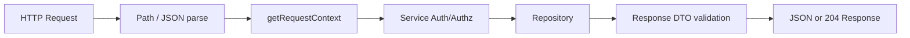

# API Specification

## Change Log

| Version | Date | Author | Changes |
|---|---|---|---|
| 0.1.0 | 2026-09-05 | Codex | 현재 Route Handler, contract, service, error mapper 및 client 호출부 기준 As-Is HTTP API 정리 |

## 1. 문서 범위와 분석 기준

이 문서는 현재 저장소에서 실제 export된 HTTP Route Handler와 Auth.js managed handler만 기록한다. API가 없는 RSC의 service 직접 호출, Server Action, 외부 R2 API는 HTTP API와 구분한다.

분석 근거:

- `src/app/api/**/route.ts`
- `src/auth.ts`
- `src/shared/contracts/`
- `src/server/http/api-response.ts`
- 관련 service, repository, client API adapter 및 route test

`DOMAIN_SPECIFICATION.md` 및 미래 기능은 분석 근거에서 제외한다.

## 2. HTTP API Inventory

| API ID | Method | Path | 영역 | Auth | 주요 목적 | 상태 |
|---|---|---|---|---|---|---|
| API-PUB-001 | GET | `/api/albums/{slug}` | Public | None | 공개 앨범 상세 조회 | 확인됨 |
| API-PUB-002 | GET | `/api/songs/{slug}` | Public | None | 공개 곡 상세 조회 | 확인됨 |
| API-ADM-001 | GET | `/api/admin/albums` | Admin | Auth.js session | 관리자 앨범 목록 조회 | 확인됨 |
| API-ADM-002 | POST | `/api/admin/albums` | Admin | Auth.js session | 앨범 생성 | 확인됨 |
| API-ADM-003 | PATCH | `/api/admin/albums/{id}` | Admin | Auth.js session | 앨범 수정 | 확인됨 |
| API-ADM-004 | DELETE | `/api/admin/albums/{id}` | Admin | Auth.js session | 앨범 삭제 | 확인됨 |
| API-ADM-005 | GET | `/api/admin/songs` | Admin | Auth.js session | 관리자 곡 목록 조회 | 확인됨 |
| API-ADM-006 | POST | `/api/admin/songs` | Admin | Auth.js session | 곡 생성 | 확인됨 |
| API-ADM-007 | PATCH | `/api/admin/songs/{id}` | Admin | Auth.js session | 곡 수정 | 확인됨 |
| API-ADM-008 | DELETE | `/api/admin/songs/{id}` | Admin | Auth.js session | 곡 삭제 | 확인됨 |
| API-ADM-009 | PATCH | `/api/admin/songs/{id}/lyrics` | Admin | Auth.js session | 곡 가사·YouTube ID 저장 | 확인됨 |
| API-AUTH-001 | GET | `/api/auth/ability` | Auth | Auth.js session 선택 | 현재 ability 조회 | 확인됨 |
| API-AUTH-002 | POST | `/api/auth/signup/otp` | Auth | None | 회원가입 이메일 OTP 발급 | 확인됨 |
| API-AUTH-003 | POST | `/api/auth/signup/otp/verify` | Auth | None | OTP 검증 | 확인됨 |
| API-AUTH-004 | POST | `/api/auth/signup/complete` | Auth | None | OTP 인증 회원가입 완료 | 확인됨 |
| API-AUTH-005 | GET/POST | `/api/auth/{...nextauth}` | Auth.js managed | Auth.js | Auth.js 내부 인증 처리 | 확인됨 |

현재 inventory에서 query parameter 기반 pagination, search, filter, sort API는 확인되지 않는다. 관리자 화면의 검색·페이지네이션은 전체 목록을 받은 뒤 client에서 처리한다.

## 3. 공통 HTTP 계약

### 3.1 인증·인가

- Auth.js는 `session: { strategy: "jwt" }`로 구성된다.
- 브라우저 요청의 인증 경계는 Auth.js session cookie이며, JWT를 `Authorization: Bearer`로 보내는 API 계약은 확인되지 않는다.
- `getRequestContext()`는 session의 user ID로 활성 `account`를 조회한다. account가 없거나 `ACTIVE`가 아니면 guest context가 된다.
- 관리자 service는 `requireUser()` 후 `ctx.ability.cannot("manage", "all")`를 검사한다.
- Route Handler에는 별도 관리자 검사 코드가 없으며 `getRequestContext()`를 service에 전달한다. 따라서 Admin 인가는 service 경계에서 확인된다.

### 3.2 성공 응답

성공 응답은 endpoint별 DTO를 JSON으로 직접 반환한다. 공통 `{ success: true }` envelope는 사용하지 않는다.

| 응답 형태 | 사용 endpoint |
|---|---|
| 단일 DTO | 공개 상세, 앨범 생성·수정 |
| DTO 배열 | 관리자 앨범·곡 목록 |
| `{ id: number }` | 곡 생성·수정·가사 저장 |
| 빈 body | 앨범·곡 삭제 (`204`) |
| `{ challengeId }` | OTP 발급 |
| `{ challengeId, verified: true }` | OTP 검증 |
| `{ accountId: string }` | 회원가입 완료 |
| `{ rules: [...] }` | ability 조회 |

모든 JSON 성공 payload는 Route Handler에서 Zod response schema로 검증한 뒤 반환한다.

### 3.3 공통 오류 응답

모든 business Route Handler는 `toErrorResponse()`를 통해 다음 형태를 반환한다.

```json
{
  "code": "SONG_NOT_FOUND",
  "message": "곡을 찾을 수 없습니다."
}
```

요청 JSON 문법 오류 또는 Zod validation 오류는 다음 형태다.

```json
{
  "code": "VALIDATION_ERROR",
  "message": "입력값이 올바르지 않습니다.",
  "details": {
    "fieldErrors": {
      "slug": ["Invalid string"]
    }
  }
}
```

| 상황 | HTTP Status | Error Code |
|---|---:|---|
| JSON body 파싱 실패 | 400 | `VALIDATION_ERROR` |
| Path/body Zod validation 실패 | 400 | `VALIDATION_ERROR` |
| 인증 session 없음 | 401 | `UNAUTHENTICATED` |
| `manage all` 권한 없음 | 403 | `FORBIDDEN` |
| 앨범/곡 조회 결과 없음 | 404 | `ALBUM_NOT_FOUND`, `SONG_NOT_FOUND` |
| 앨범 slug 중복 | 409 | `ALBUM_SLUG_ALREADY_EXISTS` |
| OTP cooldown/limit | 429 | `OTP_COOLDOWN`, `OTP_RATE_LIMITED` |
| 그 외 처리되지 않은 오류 | 500 | `INTERNAL_SERVER_ERROR` |

### 3.4 Error Code Inventory

| Code | Status | 영역 | 의미 |
|---|---:|---|---|
| `ALBUM_NOT_FOUND` | 404 | Album | 앨범 조회·수정·삭제 대상 없음 |
| `ALBUM_SLUG_ALREADY_EXISTS` | 409 | Album | 앨범 slug unique 충돌 |
| `SONG_NOT_FOUND` | 404 | Song | 곡 조회·수정·삭제 대상 없음 |
| `SONG_LYRICS_INVALID` | 400 | Song | LRC에서 유효 가사를 만들 수 없음 |
| `UNAUTHENTICATED` | 401 | Auth/Admin | 활성 session 없음 |
| `FORBIDDEN` | 403 | Admin | `manage all` ability 없음 |
| `OTP_COOLDOWN` | 429 | Signup | 재발송 cooldown 중 |
| `OTP_RATE_LIMITED` | 429 | Signup | 이메일/IP 요청 한도 초과 |
| `OTP_EXPIRED` | 400 | Signup | OTP 만료 |
| `OTP_INVALID` | 400 | Signup | OTP 또는 challenge가 유효하지 않음 |
| `OTP_ATTEMPTS_EXCEEDED` | 400 | Signup | OTP 실패 횟수 초과 |
| `OTP_NOT_VERIFIED` | 400 | Signup | 검증되지 않은 challenge로 가입 완료 시도 |
| `EMAIL_ALREADY_REGISTERED` | 409 | Signup | 이메일 중복 |
| `NICKNAME_ALREADY_REGISTERED` | 409 | Signup | 닉네임 중복 |
| `VALIDATION_ERROR` | 400 | Common | JSON 또는 입력 contract 오류 |
| `INTERNAL_SERVER_ERROR` | 500 | Common | 예상하지 못한 서버 오류 |

## 4. Public API

### API-PUB-001 공개 앨범 상세 조회

#### 기본 정보

| 항목 | 내용 |
|---|---|
| API ID | API-PUB-001 |
| Method | GET |
| Path | `/api/albums/{slug}` |
| 영역 | Public |
| Authentication | None |
| Authorization | 없음 |
| 구현 위치 | `src/app/api/albums/[slug]/route.ts` |
| 관련 Service | `requireAlbumDetailBySlug` |
| 관련 Screen | `SCR-PUB-003` |
| 관련 Process | `PROC-PUB-003` |
| 관련 Table | `Album`, `Song` |

#### Path Parameters

| Parameter | Type | Required | Validation | 설명 |
|---|---|---:|---|---|
| `slug` | string | Yes | trim 후 1자 이상 | 앨범 slug |

#### Success Response — 200 OK

`albumDetailSchema` DTO를 반환한다. 앨범 기본 정보와 공개 가능한 곡 배열을 포함한다. `releaseDate`는 `string | null`이다.

#### Error Response

| HTTP Status | Code | 조건 |
|---:|---|---|
| 400 | `VALIDATION_ERROR` | slug가 없거나 빈 값 |
| 404 | `ALBUM_NOT_FOUND` | slug의 공개 앨범 조회 결과 없음 |
| 500 | `INTERNAL_SERVER_ERROR` | 기타 오류 |

앨범은 `isVisible = true`인 경우에만 조회되며 포함 곡도 `isVisible = true` 조건을 사용한다. 이 API는 pagination/query/search/filter/sort parameter를 사용하지 않는다.

### API-PUB-002 공개 곡 상세 조회

#### 기본 정보

| 항목 | 내용 |
|---|---|
| API ID | API-PUB-002 |
| Method | GET |
| Path | `/api/songs/{slug}` |
| 영역 | Public |
| Authentication | None |
| Authorization | 없음 |
| 구현 위치 | `src/app/api/songs/[slug]/route.ts` |
| 관련 Service | `requireSongDetailBySlug` |
| 관련 Screen | `SCR-PUB-004` |
| 관련 Process | `PROC-PUB-004` |
| 관련 Table | `Song`, `Album` |

#### Path Parameters

| Parameter | Type | Required | Validation | 설명 |
|---|---|---:|---|---|
| `slug` | string | Yes | trim 후 1자 이상 | 곡 slug |

#### Success Response — 200 OK

`songDetailSchema` DTO를 반환한다. 곡 정보, `lyrics` 배열, 소속 앨범과 앨범의 공개 곡 배열을 포함한다.

#### Error Response

| HTTP Status | Code | 조건 |
|---:|---|---|
| 400 | `VALIDATION_ERROR` | slug가 없거나 빈 값 |
| 404 | `SONG_NOT_FOUND` | 공개 곡 또는 필요한 상세 데이터 조회 결과 없음 |
| 500 | `INTERNAL_SERVER_ERROR` | 저장된 lyrics contract 위반 등 기타 오류 |

## 5. Admin Album API

Admin API는 모든 요청에서 `getRequestContext()`를 만들고, service가 활성 session과 `manage all` ability를 확인한다. 따라서 인증 실패는 401, 권한 부족은 403으로 공통 변환된다.

### API-ADM-001 앨범 목록 조회

| 항목 | 내용 |
|---|---|
| Method / Path | `GET /api/admin/albums` |
| 구현 위치 | `src/app/api/admin/albums/route.ts` |
| Service | `listAdminAlbums` |
| 관련 Screen / Process | `SCR-ADM-002` / `PROC-ADM-002` |
| 관련 Table | `Album` |
| Success | `200 OK`, `albumSummarySchema[]` |

Query parameter가 없으며 전체 앨범을 반환한다. 정렬은 repository에서 `releaseDate` 오름차순이다. client 화면에서 검색·페이지네이션을 수행한다.

### API-ADM-002 앨범 생성

| 항목 | 내용 |
|---|---|
| Method / Path | `POST /api/admin/albums` |
| 구현 위치 | `src/app/api/admin/albums/route.ts` |
| Service | `createAlbum` |
| 관련 Screen / Process | `SCR-ADM-002` / `PROC-ADM-002` |
| 관련 Table | `Album` |
| Success | `201 Created`, `albumSummarySchema` |

#### Request Body

```json
{
  "name": "Example Album",
  "slug": "example-album",
  "imgUrl": "https://assets.example.com/album.webp",
  "color": "#123456",
  "releaseDate": "2026-01-01T00:00:00.000Z",
  "isVisible": true
}
```

| Field | Type | Required | Rule |
|---|---|---:|---|
| `name` | string | Yes | trim 후 1자 이상 |
| `slug` | string | Yes | trim 후 lowercase 영문·숫자·하이픈 패턴 |
| `imgUrl` | string | Yes | URL |
| `color` | string | Yes | `#RGB` 또는 `#RRGGBB` |
| `releaseDate` | string | null | Yes | nullable; 별도 date 형식 검증은 schema에서 확인되지 않음 |
| `isVisible` | boolean | Yes | boolean |

#### Error Response

| Status | Code | 조건 |
|---:|---|---|
| 400 | `VALIDATION_ERROR` | JSON 또는 body contract 오류 |
| 401 | `UNAUTHENTICATED` | 활성 session 없음 |
| 403 | `FORBIDDEN` | `manage all` 없음 |
| 409 | `ALBUM_SLUG_ALREADY_EXISTS` | DB unique 충돌 |
| 500 | `INTERNAL_SERVER_ERROR` | 기타 오류 |

### API-ADM-003 앨범 수정

| 항목 | 내용 |
|---|---|
| Method / Path | `PATCH /api/admin/albums/{id}` |
| 구현 위치 | `src/app/api/admin/albums/[id]/route.ts` |
| Service | `editAlbum` |
| 관련 Screen / Process | `SCR-ADM-002` / `PROC-ADM-002` |
| 관련 Table | `Album` |
| Success | `200 OK`, `albumSummarySchema` |

`id`는 path parameter이며 `coerce number → integer → positive` 검증을 통과해야 한다. Request body는 API-ADM-002와 동일한 `saveAdminAlbumSchema` 전체 입력이다.

| Status | Code | 조건 |
|---:|---|---|
| 400 | `VALIDATION_ERROR` | id 또는 body contract 오류 |
| 401 | `UNAUTHENTICATED` | 활성 session 없음 |
| 403 | `FORBIDDEN` | `manage all` 없음 |
| 404 | `ALBUM_NOT_FOUND` | 수정 대상 없음 |
| 409 | `ALBUM_SLUG_ALREADY_EXISTS` | DB unique 충돌 |
| 500 | `INTERNAL_SERVER_ERROR` | 기타 오류 |

### API-ADM-004 앨범 삭제

| 항목 | 내용 |
|---|---|
| Method / Path | `DELETE /api/admin/albums/{id}` |
| 구현 위치 | `src/app/api/admin/albums/[id]/route.ts` |
| Service | `deleteAlbum` |
| 관련 Screen / Process | `SCR-ADM-002` / `PROC-ADM-002` |
| 관련 Table | `Album`, `Song` |
| Success | `204 No Content`, body 없음 |

`id`는 양의 정수다. 삭제는 repository의 hard delete를 호출하며, DB FK `Song.albumId ON DELETE CASCADE`에 따라 소속 곡도 삭제된다.

| Status | Code | 조건 |
|---:|---|---|
| 400 | `VALIDATION_ERROR` | id 오류 |
| 401 | `UNAUTHENTICATED` | 활성 session 없음 |
| 403 | `FORBIDDEN` | `manage all` 없음 |
| 404 | `ALBUM_NOT_FOUND` | 삭제 대상 없음 |
| 500 | `INTERNAL_SERVER_ERROR` | 기타 오류 |

## 6. Admin Song API

### API-ADM-005 곡 목록 조회

| 항목 | 내용 |
|---|---|
| Method / Path | `GET /api/admin/songs` |
| 구현 위치 | `src/app/api/admin/songs/route.ts` |
| Service | `listAdminSongs` |
| 관련 Screen / Process | `SCR-ADM-003` / `PROC-ADM-003` |
| 관련 Table | `Song`, `Album` |
| Success | `200 OK`, `adminSongSummarySchema[]` |

Query parameter 없이 전체 곡과 앨범명을 반환한다. 정렬은 `albumId`, `order` 오름차순이며 검색·필터·페이지네이션은 client 처리다.

### API-ADM-006 곡 생성

| 항목 | 내용 |
|---|---|
| Method / Path | `POST /api/admin/songs` |
| 구현 위치 | `src/app/api/admin/songs/route.ts` |
| Service | `createSong` |
| 관련 Screen / Process | `SCR-ADM-003` / `PROC-ADM-003` |
| 관련 Table | `Song` |
| Success | `201 Created`, `{ "id": number }` |

Request body는 `createAdminSongSchema`이며 `albumId`, `title`, `slug`, `youtubeId`, `hasOfficialCheer`, `isTitle`, `isVisible`, `order`, `lrcText`가 모두 required다. 문자열은 title/slug/youtubeId/lrcText에 trim이 적용되며, slug는 lowercase 영문·숫자·하이픈, albumId는 양의 정수, order는 정수다. `lrcText`는 trim 후 1자 이상이고 service가 유효 가사를 parse하지 못하면 `SONG_LYRICS_INVALID`다.

| Status | Code | 조건 |
|---:|---|---|
| 400 | `VALIDATION_ERROR` | path/body contract 오류 |
| 400 | `SONG_LYRICS_INVALID` | 유효한 LRC line 없음 |
| 401 | `UNAUTHENTICATED` | 활성 session 없음 |
| 403 | `FORBIDDEN` | `manage all` 없음 |
| 500 | `INTERNAL_SERVER_ERROR` | 기타 오류 |

### API-ADM-007 곡 수정

| 항목 | 내용 |
|---|---|
| Method / Path | `PATCH /api/admin/songs/{id}` |
| 구현 위치 | `src/app/api/admin/songs/[id]/route.ts` |
| Service | `editSong` |
| 관련 Screen / Process | `SCR-ADM-003` / `PROC-ADM-003` |
| 관련 Table | `Song` |
| Success | `200 OK`, `{ "id": number }` |

`id`는 양의 정수다. body는 `updateAdminSongSchema`이며 곡 기본 필드는 API-ADM-006과 같고 `lrcText`만 optional이다. `lrcText`가 전달되면 parse 후 lyrics를 갱신하며, 전달되지 않으면 기존 lyrics를 유지한다.

| Status | Code | 조건 |
|---:|---|---|
| 400 | `VALIDATION_ERROR` | id/body 오류 |
| 400 | `SONG_LYRICS_INVALID` | 전달된 LRC가 유효하지 않음 |
| 401 | `UNAUTHENTICATED` | 활성 session 없음 |
| 403 | `FORBIDDEN` | `manage all` 없음 |
| 404 | `SONG_NOT_FOUND` | 수정 대상 없음 |
| 500 | `INTERNAL_SERVER_ERROR` | 기타 오류 |

### API-ADM-008 곡 삭제

| 항목 | 내용 |
|---|---|
| Method / Path | `DELETE /api/admin/songs/{id}` |
| 구현 위치 | `src/app/api/admin/songs/[id]/route.ts` |
| Service | `deleteSong` |
| 관련 Screen / Process | `SCR-ADM-003` / `PROC-ADM-003` |
| 관련 Table | `Song` |
| Success | `204 No Content`, body 없음 |

`id`는 양의 정수이며 대상 곡을 hard delete한다. 오류 status는 API-ADM-004와 동일하고 resource code만 `SONG_NOT_FOUND`다.

### API-ADM-009 가사·YouTube ID 저장

| 항목 | 내용 |
|---|---|
| Method / Path | `PATCH /api/admin/songs/{id}/lyrics` |
| 구현 위치 | `src/app/api/admin/songs/[id]/lyrics/route.ts` |
| Service | `saveSongLyrics` |
| 관련 Screen / Process | `SCR-ADM-004` / `PROC-ADM-004` |
| 관련 Table | `Song.lyrics`, `Song.youtubeId` |
| Success | `200 OK`, `{ "id": number }` |

`id`는 양의 정수다. body는 다음 두 필드를 required로 갖는다.

```json
{
  "lyrics": [
    {
      "startTime": 12.34,
      "segments": [{ "text": "가사", "isCheer": false, "isEcho": false }],
      "isExtra": false
    }
  ],
  "youtubeId": "youtube-video-id"
}
```

`lyrics`는 07 문서의 JSONB 구조와 동일한 `lyricsDataSchema`로 검증한다. `youtubeId`는 trim string이며 빈 문자열도 schema 상 허용된다. validation 후 service가 `Song.lyrics`, `Song.youtubeId`, `updatedAt`을 갱신한다.

| Status | Code | 조건 |
|---:|---|---|
| 400 | `VALIDATION_ERROR` | id/body 또는 lyrics 구조 오류 |
| 401 | `UNAUTHENTICATED` | 활성 session 없음 |
| 403 | `FORBIDDEN` | `manage all` 없음 |
| 404 | `SONG_NOT_FOUND` | 수정 대상 없음 |
| 500 | `INTERNAL_SERVER_ERROR` | 기타 오류 |

## 7. Auth Business API

### API-AUTH-001 현재 ability 조회

| 항목 | 내용 |
|---|---|
| Method / Path | `GET /api/auth/ability` |
| 영역 | Auth |
| Authentication | Auth.js session 선택 |
| Authorization | 없음 |
| 구현 위치 | `src/app/api/auth/ability/route.ts` |
| 관련 Service | `getRequestContext` |
| 관련 Screen / Process | `SCR-AUTH-001` / `PROC-ADM-001` |
| 관련 Table | `account` |
| Success | `200 OK`, `{ rules: SerializedAbilityRule[] }` |

session이 없거나 active account를 찾지 못해도 guest ability를 만들고 정상 JSON을 반환한다. 따라서 이 endpoint 자체는 인증 부재를 401로 처리하지 않는다.

### API-AUTH-002 회원가입 OTP 발급

| 항목 | 내용 |
|---|---|
| Method / Path | `POST /api/auth/signup/otp` |
| Authentication | None |
| Authorization | 없음 |
| 구현 위치 | `src/app/api/auth/signup/otp/route.ts` |
| 관련 Service | `requestOtp` |
| 관련 Table | `email_verification_challenge`, `email_verification_rate_limit` |
| Success | `201 Created`, `{ "challengeId": "uuid" }` |

Request body는 `{ "email": "user@example.com" }`이며 trim 후 유효한 email이어야 한다. 요청 IP는 `x-forwarded-for` 첫 값, 다음으로 `x-real-ip`, 모두 없으면 `0.0.0.0`을 사용한다. service transaction에서 cooldown과 이메일/IP rate limit을 확인하고 challenge를 생성한 뒤 외부 이메일 provider로 OTP를 발송한다.

| Status | Code | 조건 |
|---:|---|---|
| 400 | `VALIDATION_ERROR` | JSON 또는 email 오류 |
| 429 | `OTP_COOLDOWN` | 재발송 cooldown |
| 429 | `OTP_RATE_LIMITED` | 이메일/IP limit 초과 |
| 500 | `INTERNAL_SERVER_ERROR` | 기타 오류 또는 이메일 발송 실패 |

### API-AUTH-003 OTP 검증

| 항목 | 내용 |
|---|---|
| Method / Path | `POST /api/auth/signup/otp/verify` |
| Authentication | None |
| Authorization | 없음 |
| 구현 위치 | `src/app/api/auth/signup/otp/verify/route.ts` |
| 관련 Service | `verifyOtp` |
| 관련 Table | `email_verification_challenge` |
| Success | `200 OK`, `{ "challengeId": "uuid", "verified": true }` |

Request body는 `challengeId` UUID와 6자리 숫자 `otp`가 required다. challenge 상태, 만료 시각, 실패 횟수를 확인하고 성공 시 VERIFIED로 변경한다. 이 service에는 명시적 transaction 경계가 확인되지 않는다.

| Status | Code | 조건 |
|---:|---|---|
| 400 | `VALIDATION_ERROR` | challengeId/otp 형식 오류 |
| 400 | `OTP_INVALID` | challenge 또는 OTP 불일치 |
| 400 | `OTP_EXPIRED` | 만료 시각 경과 |
| 400 | `OTP_ATTEMPTS_EXCEEDED` | 실패 횟수 초과 |
| 500 | `INTERNAL_SERVER_ERROR` | 기타 오류 |

### API-AUTH-004 회원가입 완료

| 항목 | 내용 |
|---|---|
| Method / Path | `POST /api/auth/signup/complete` |
| Authentication | None |
| Authorization | 없음 |
| 구현 위치 | `src/app/api/auth/signup/complete/route.ts` |
| 관련 Service | `completeSignup` |
| 관련 Table | `email_verification_challenge`, `account`, `profile`, `password_credential` |
| Success | `201 Created`, `{ "accountId": "string" }` |

Request body는 `challengeId` UUID, `password`, `nickname`이 required다. password는 10~32자이며 영문·숫자·특수문자를 각각 포함해야 한다. nickname은 trim 후 1~32자다. service transaction에서 VERIFIED challenge를 소비하고 USER/ACTIVE account, profile, password credential을 원자적으로 생성한다. password hash는 response에 노출되지 않는다.

| Status | Code | 조건 |
|---:|---|---|
| 400 | `VALIDATION_ERROR` | body contract 오류 |
| 400 | `OTP_NOT_VERIFIED` | 인증되지 않은 challenge |
| 409 | `EMAIL_ALREADY_REGISTERED` | 이메일 unique 충돌 |
| 409 | `NICKNAME_ALREADY_REGISTERED` | 닉네임 unique 충돌 |
| 500 | `INTERNAL_SERVER_ERROR` | 기타 오류 |

## 8. Auth.js Managed Endpoint

### API-AUTH-005 Auth.js handler

| 항목 | 내용 |
|---|---|
| Path | `/api/auth/{...nextauth}` |
| Method | `GET`, `POST` |
| 영역 | Auth.js managed |
| 구현 위치 | `src/app/api/auth/[...nextauth]/route.ts` |
| Handler | `handlers` from `src/auth.ts` |
| Provider | Credentials |
| Session | JWT |

`src/auth.ts`에서 Credentials provider의 `authorize`가 입력을 검증하고 `authenticateCredentials`를 호출한다. 관리자 로그인 화면의 Server Action은 `signIn("credentials", formData)`를 호출하며, 이 Server Action은 별도 business REST API로 inventory에 넣지 않는다. Credentials 실패는 Auth.js `CredentialsSignin`으로 처리되어 화면용 메시지로 변환된다.

Auth.js가 내부적으로 제공하는 세부 action path와 response는 framework managed 계약이므로, 현재 애플리케이션이 직접 정의한 business API처럼 재작성하지 않는다.

## 9. HTTP API 외 서버 진입점 및 외부 연동

### 9.1 앨범 이미지 업로드 Server Action

`uploadAlbumImageAction`은 `src/features/manage-album/api/upload-album-image-action.ts`의 Server Action이며 Route Handler가 아니다. 따라서 HTTP API Inventory에는 포함하지 않는다.

- 입력: `FormData`의 `file`
- 제한: 최대 5MB, `image/avif`, `image/jpeg`, `image/png`, `image/webp`
- 처리: random UUID 기반 `images/albums/{uuid}.{ext}` object key 생성
- 외부 연동: R2 `PutObjectCommand`
- 반환: 성공 `{ success: true, url }`, 실패 `{ success: false, error }`
- 인증/인가: action 자체에서 request context 검사는 확인되지 않음

R2 endpoint, bucket, credential, public base URL은 환경변수로 구성되며 외부 storage API 전체 계약은 이 문서 범위에 포함하지 않는다.

### 9.2 Public RSC의 service 직접 호출

Public 페이지 일부는 HTTP API를 거치지 않고 Server Component에서 service를 직접 호출한다. 이런 경우 해당 화면에 대응하는 HTTP endpoint가 반드시 존재한다고 해석하지 않는다. 현재 `/api/albums/{slug}`, `/api/songs/{slug}`는 client API adapter에서 실제 호출되는 별도 HTTP 경계다.

## 10. 처리 흐름

### 10.1 Admin mutation 공통 흐름



validation 또는 service 오류는 `toErrorResponse()`가 공통 error JSON과 status로 변환한다.

### 10.2 Signup OTP 흐름

```text
POST /api/auth/signup/otp
→ body validation
→ IP header 추출
→ requestOtp transaction
→ challenge/rate-limit 변경
→ 이메일 provider 발송
→ challengeId 반환
```

## 11. Pagination·Search·Filter·Sort

현재 확인 결과는 다음과 같다.

| 영역 | API 동작 |
|---|---|
| Public 앨범/곡 상세 | path slug 단건 조회; query parameter 없음 |
| Admin 앨범 목록 | 전체 목록 반환; `releaseDate` 정렬은 repository; 화면 검색·페이지네이션은 client |
| Admin 곡 목록 | 전체 목록 반환; `albumId`, `order` 정렬은 repository; 화면 검색·필터·페이지네이션은 client |
| Auth | pagination 없음 |

`page`, `limit`, `cursor`, `q`, `sort` 등의 HTTP query parameter는 현재 Route Handler에서 확인되지 않는다.

## 12. 07 Database Specification과의 정합성

| 항목 | API 문서 반영 | 상태 |
|---|---|---|
| Album → Song cascade | 앨범 DELETE 성공 시 DB cascade로 곡도 삭제 | 정합 |
| `Song.slug` | API path와 contract에서는 사용하지만 DB nullable·non-unique 사실 유지 | 정합 |
| `Song.lyrics` | 가사 저장 body를 `lyricsDataSchema`로 검증하고 JSONB에 저장 | 정합 |
| timestamps | Song mutation에서 `updatedAt`을 service가 전달 | 정합 |
| account/auth 보조 테이블 | signup API의 실제 challenge·account/profile/credential 저장과 연결 | 정합 |

## 13. 기존 역기획 문서 정합성 및 이슈

### 13.1 기존 문서와 정합한 항목

- `01-ia-menu-structure.md`의 공개 앨범·곡 및 관리자 앨범·곡 구조는 실제 API route와 연결된다.
- `02-screen-id-list.md`, `05-screen-spec.md`의 Public 상세 및 Admin CRUD 화면은 실제 client API adapter와 연결된다.
- `03-access-control-structure.md`의 관리자 session/ability 경계는 `getRequestContext` 및 service `manage all` 검사와 연결된다.
- `04-user-process-inventory.md`, `06-process-flow.md`의 앨범·곡 CRUD와 가사 저장 흐름은 실제 API와 연결된다.
- `07-database-spec.md`의 slug nullable/non-unique, lyrics JSONB, Album-Song cascade가 API 동작과 충돌하지 않는다.

### 13.2 ISSUE-001 — 기존 Process의 Public 조회 경계 표현

- 관련 문서: `04-user-process-inventory.md`, `06-process-flow.md`
- 기존 기술: Public 앨범·곡 조회 흐름을 서버 데이터 조회로 설명
- 실제 API 구현: `/api/albums/{slug}`, `/api/songs/{slug}` GET route가 존재하지만, Public RSC 페이지는 service 직접 호출 경로도 사용한다.
- 영향: 문서의 “서버 조회”만으로는 HTTP API 사용 여부를 판단할 수 없다.
- 수정 필요 문서: 현재 문서에서 HTTP API 경계를 분리해 기록했으며, 기존 문서의 기능 흐름 자체를 변경할 근거는 확인되지 않음

## 14. 확인 필요

- Auth.js managed endpoint의 framework 내부 세부 응답은 현재 애플리케이션 코드가 직접 정의하지 않는다.
- `uploadAlbumImageAction`에 대한 별도 service-level authentication/authorization은 현재 action 코드에서 확인되지 않는다. 실제 호출 경계와 배포 runtime 정책은 확인 필요다.
- 운영 환경에서 API route가 실제로 모두 배포·노출되는지와 production DB/schema 적용 상태는 저장소만으로 확인할 수 없다.
- API client가 아닌 다른 외부 consumer가 존재하는지, 존재한다면 호환 요구사항은 저장소만으로 확인할 수 없다.

## 15. 산출물 범위 외 항목

- 신규 endpoint 설계
- OpenAPI/Swagger 전체 문서
- API versioning 또는 REST path 개선안
- 미래 도메인 API
- 외부 R2·이메일 provider의 전체 API 계약
