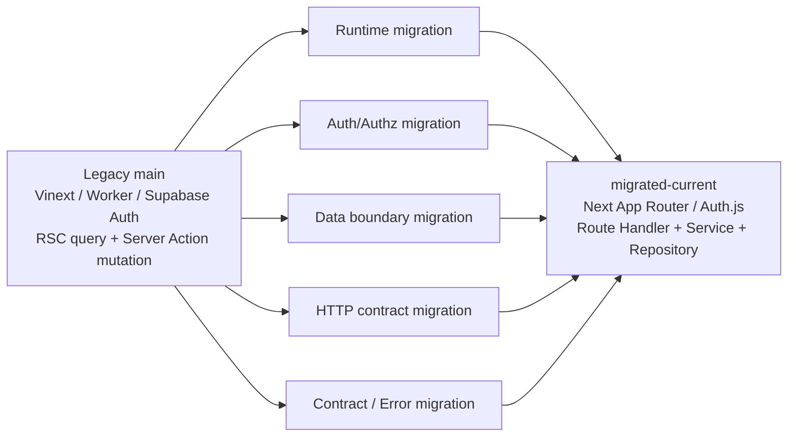

## Change Log

| Version | Date | Author | Changes |
|---|---|---|---|
| 0.1.1 | 2026-09-05 | Codex | 선택 precision pass: 변화 유형·상태 표현, Observability 문구 및 보존 동작 Summary 정리 |
| 0.1.0 | 2026-09-05 | Codex | Legacy main과 migrated-current AS-IS snapshot의 구조 차이와 migration 상태를 정리 |

# Main to Migrated Gap Map

## 1. 목적

이 문서는 다음 두 AS-IS snapshot 사이에서 실제 확인되는 구조·기능·경계 변화를 추적한다.

```text
Legacy main AS-IS
→ migration change
→ migrated-current AS-IS
```

이 문서는 To-Be 설계나 품질 평가표가 아니다. migrated-current가 Legacy와 달라진 사실, 아직 확인되지 않은 차이, Legacy anomaly의 현재 상태만 기록한다.

## 2. 비교 baseline

### Legacy main

```yaml
repository: goldmayo/oioi-bwg
branch: main
commit: 4b299934846f4a0eed7132f58c5b1c2a481a3739
source_documents: docs/reverse-engineering/legacy-main/00~09
```

### migrated-current

```yaml
repository: goldmayo/oioi-bwg
branch: unknown
commit: unknown
source_documents: docs/reverse-engineering/migrated-current/01~08
```

`migrated-current` 문서의 front matter에 source branch와 commit이 명시되어 있지 않으므로 둘 다 확정하지 않는다. 이 문서는 현재 문서화된 migration state를 비교 대상으로 사용한다.

## 3. 변화 유형 및 상태

### 3.1 Change Type

`removed`, `added`, `replaced`, `restructured`, `moved`, `split`, `merged`, `normalized`, `isolated`, `hardened`, `not-yet-migrated`, `behavior-preserved`, `behavior-changed`, `unknown`을 사용한다.

### 3.2 Migration Status

| 상태 | 의미 |
|---|---|
| `complete` | 이 gap map이 비교하는 코드/문서 snapshot 범위에서 해당 구조 변화가 완료된 것으로 확인됨. production 적용 완료를 의미하지 않음 |
| `partial` | 일부 구조 또는 일부 경로에서만 변화가 확인됨 |
| `not-started` | Legacy 차이를 migrated-current 문서에서 확인하지 못함 |
| `not-applicable` | 이 비교 범위의 migration 대상이 아님 |
| `unknown` | source 또는 운영 evidence 부족으로 확정할 수 없음 |

상태는 우열이 아니라 migration evidence의 확인 정도다.

### 3.3 Change Origin

| Origin | 의미 |
|---|---|
| `migration-normalization` | 기존 capability 또는 구조를 migration 과정에서 다른 경계로 정리한 변화 |
| `migration-enabler` | migration된 인증·데이터·경계가 동작하도록 추가된 기반 구조 |
| `new-capability` | Legacy 문서/코드에서 확인되지 않고 migrated-current에서 새로 확인되는 capability |
| `behavior-preservation` | 사용자 관찰 동작 또는 데이터 의미가 유지된 변화 |
| `unknown` | snapshot evidence만으로 변화의 기원을 확정할 수 없음 |

Origin은 변화가 좋거나 나쁘다는 평가가 아니라, 기존 capability의 이동인지 새 capability의 추가인지 구분하기 위한 분류다.

### 3.4 주요 변화의 Origin 분류

| 변화 | Origin |
|---|---|
| Supabase Auth → Auth.js | `migration-normalization` |
| Server Action/direct DB → Route Handler/Service/Repository | `migration-normalization` |
| `account`/`profile`/`password_credential` persistence | `migration-enabler` |
| Signup OTP API | `new-capability` |
| Album/Song/lyrics 핵심 capability 유지 | `behavior-preservation` |
| 최종 runtime/deployment 교체 여부 | `unknown` |

## 4. Executive Summary

- Legacy의 Vinext + Cloudflare Workers runtime integration은 migrated-current에서 더 이상 동일한 형태로 문서화되지 않으며, Next.js App Router 기반 application 구조로 정리된 것은 확인된다. migrated deployment runtime target은 현재 evidence만으로 확정하지 않는다.
- 인증은 Supabase Auth의 `signInWithPassword`/cookie session에서 Auth.js Credentials/JWT 및 request context 구조로 `replaced`되었다.
- 관리자 인가는 Legacy의 AdminLayout `app_metadata.role` 확인과 Server Action 자체 검사 부재에서, migrated-current의 RequestContext·CASL·service `manage all` 검사로 `restructured`되었다.
- Server Action 직접 DB mutation은 migrated-current의 Route Handler → Service → Repository 경계로 `restructured`되었다.
- HTTP application API가 없던 Legacy에 Public/Admin/Auth business API와 Auth.js managed endpoint가 추가되었다.
- DB 접근은 `shared/api/db/drizzle`의 query/command 직접 호출에서 `src/server`의 repository/service 경계로 이동했다.
- Legacy의 runtime/tooling schema 불일치와 seed path 불일치는 migrated-current 문서상 별도 schema/migration 구조로 정리된 것으로 확인되며, runtime schema의 실제 운영 일치 여부는 `unknown`이다.
- Album/Song 콘텐츠와 `Song.lyrics` JSONB는 migrated-current에서도 유지되어 `behavior-preserved`로 분류한다.
- Error handling은 plain Server Action result에서 공통 `AppError`·HTTP error mapper·Zod response contract로 `restructured`되었다.
- Legacy의 Cloudflare/R2/Storage 및 배포 세부는 migrated-current 문서만으로 전체 전환 완료 여부를 확정할 수 없다.

## 5. 전체 migration 방향



다이어그램은 비교 방향을 보여주는 보조 자료이며, 각 변화의 확정 근거는 아래 비교표와 snapshot 문서다.

## 6. Runtime / Deployment

| Area | Legacy main | migrated-current | Change Type | Migration Meaning | Status | Evidence |
|---|---|---|---|---|---|---|
| Runtime target | Vinext + Vite + Cloudflare Worker | Next.js App Router 및 현재 migration 문서 구조; exact runtime target 미기록 | replaced | application runtime 경계 변화는 확인되나 최종 배포 target은 미확정 | partial | legacy 09, migrated-current 01~08 |
| Worker / Wrangler | Worker entry, Wrangler bindings, Hyperdrive, Assets, Images | migrated-current 문서에서 직접 확인되지 않음 | unknown | Cloudflare 의존성의 유지·제거를 확정할 수 없음 | unknown | legacy 09; migrated source 없음 |
| Database connection path | `env.DB.connectionString` → Hyperdrive, `DATABASE_URL` fallback | `src/server/db/index.ts`의 `postgres-js` database boundary | restructured | DB 호출 경계는 이동했으나 production connection target은 미확정 | partial | legacy 07/09, migrated 07 |
| Container / standalone | main에 Docker/standalone evidence 없음 | migrated-current 문서에서 Docker/standalone evidence 없음 | unknown | deployment replacement 여부를 문서만으로 계산하지 않음 | unknown | legacy 09, migrated-current 07/08 |
| Build/deploy workflow | Vinext build/deploy 및 Wrangler workflow | migrated-current 문서에서 상세 workflow 미기록 | unknown | CI/CD 전환 상태 미확정 | unknown | legacy 09 |

Runtime의 “migrated 완료”를 architecture 문서나 branch 이름만으로 확정하지 않는다.

## 7. Routing / Rendering

| Area | Legacy main | migrated-current | Change Type | Migration Meaning | Status | Evidence |
|---|---|---|---|---|---|---|
| Public route | App Router route group과 RSC direct query | App Router route와 동일한 Public IA가 문서화됨 | behavior-preserved / restructured | 화면 route와 사용자 capability는 대부분 유지 | complete | legacy 01/02/05, migrated 01/02/05 |
| Admin login route | 별도 login page 없음; `/admin` layout 내부에서 login form 렌더링 | 별도 `/admin-login` page | added / moved / behavior-changed | 로그인 UI 진입점이 layout 내부에서 독립 route로 이동 | complete | legacy 01~03, migrated 01~03 |
| Admin route | `/admin` redirect, albums/songs/edit sibling | `/admin` redirect 및 동일 관리 route | behavior-preserved | 관리 화면 URL 구조 유지 | complete | legacy 01/02, migrated 01/02 |
| Policy unknown slug | `privacy` fallback | `privacy` fallback | behavior-preserved | 정책 fallback 동작 유지 | complete | legacy 01/05/06, migrated 04/05/06 |
| Rendering data path | RSC → shared query helper | RSC direct service 또는 client HTTP adapter 경로 | restructured | 화면별 data acquisition path 분리 | partial | legacy 06/08, migrated 05/06/08 |

## 8. Authentication

| Area | Legacy main | migrated-current | Change Type | Migration Meaning | Status | Evidence |
|---|---|---|---|---|---|---|
| Identity provider | Supabase Auth | Auth.js Credentials provider | replaced | 인증 provider 및 application integration 교체 | complete | legacy 03/06/08, migrated 03/06/08 |
| Login | `supabase.auth.signInWithPassword` | Credentials `signIn` → `authenticateCredentials` | replaced / restructured | 로그인 처리 adapter 변경 | complete | legacy 03/08, migrated 06/08 |
| Session | Supabase cookie/server client | Auth.js JWT session cookie | replaced | session 발급·해석 경계 변경 | complete | legacy 03/09, migrated 03/08 |
| Signup/OTP | Legacy main에서 확인되지 않음 | OTP 발급·검증·회원가입 API 및 account credential 구조 | added | migration snapshot에서 인증 capability 추가 | complete | legacy 03/07/08, migrated 07/08 |
| Auth persistence | Supabase Auth 외 별도 application auth table 없음 | `account`, `profile`, `password_credential`, challenge/rate-limit | added / restructured | application-side auth persistence 추가 | complete | legacy 07, migrated 07 |

Signup/OTP의 추가는 현재 migrated capability로는 확인되지만, Legacy 화면 문서에 해당 화면이 있었다고 역추정하지 않는다.

## 9. Authorization

| Area | Legacy main | migrated-current | Change Type | Migration Meaning | Status | Evidence |
|---|---|---|---|---|---|---|
| UI access check | AdminLayout에서 `app_metadata.role === "admin"` | 활성 session 및 ability 검사 | restructured | role check에서 session/ability 기반 경계로 이동 | complete | legacy 03, migrated 03 |
| Server Action authz | content/lyrics action 자체 role 검사 확인되지 않음 | service `requireUser` + `manage all` 검사 | hardened / restructured | UI/layout 중심에서 service boundary 중심으로 이동 | complete | legacy 03/04, migrated 03/08 |
| Account state | Supabase user/app metadata | DB account `ACTIVE` 및 role 조회 | restructured | 권한 판단에 application DB facts 포함 | complete | legacy 03, migrated 03/07 |
| Ability transport | 별도 ability API 확인 없음 | `/api/auth/ability` 및 serialized CASL rules | added | client가 현재 ability를 조회하는 경계 추가 | complete | legacy 08, migrated 08 |

## 10. Server Boundary

| Area | Legacy main | migrated-current | Change Type | Migration Meaning | Status | Evidence |
|---|---|---|---|---|---|---|
| Public read | RSC → `shared/api/db/drizzle/queries` → `getDb` → Drizzle | RSC → Service → Repository → DbExecutor → Drizzle | moved / restructured | DB 접근 책임이 shared query helper에서 server boundary로 이동 | complete | legacy 06/07, migrated 06/07 |
| Admin mutation | Client form → Server Action → direct `getDb`/command | Client → ky → Route Handler → Service → Repository | restructured | implicit action boundary에서 explicit HTTP/application boundary로 이동 | complete | legacy 06/08, migrated 06/08 |
| Lyrics mutation | `saveSongData` → command | `/api/admin/songs/{id}/lyrics` → service → repository | restructured | editor mutation의 HTTP contract 분리 | complete | legacy 06/08, migrated 06/08 |
| DB exposure | shared DB schema/types imported by UI/action | Drizzle row를 service mapper/DTO로 projection | isolated / normalized | persistence type와 external DTO 경계 분리 | complete | legacy 07/08, migrated 07/08 |
| Transaction ownership | 명시적 transaction 확인 없음 | OTP/signup service transaction 확인 | added / restructured | multi-step auth use case에 transaction 경계 추가 | partial | legacy 06/07, migrated 07/08 |

## 11. API Boundary

| Area | Legacy main | migrated-current | Change Type | Migration Meaning | Status | Evidence |
|---|---|---|---|---|---|---|
| Application HTTP API | Route Handler 없음 | Public 2개, Admin 9개, Auth business 4개, Auth.js managed route | added | 화면·mutation과 독립된 HTTP contract 추가 | complete | legacy 08, migrated 08 |
| Request validation | Server Action form schema 및 action parse | Route boundary Zod path/body parse | restructured / normalized | 입력 검증 위치를 HTTP boundary로 이동 | complete | legacy 08, migrated 08 |
| Response contract | `{ success, error? }` plain action result | DTO schema 및 공통 error response | restructured | status와 structured error contract 도입 | complete | legacy 08, migrated 08 |
| Error status | HTTP mapper 없음 | 400/401/403/404/409/429/500 mapper | added / normalized | business error를 HTTP status로 명시 | complete | legacy 08, migrated 08 |
| Pagination/search | client-side 목록 filtering/pagination | Admin API 전체 목록 + client filtering/pagination | behavior-preserved | API pagination으로 확장되지 않음 | complete | legacy 05/08, migrated 06/08 |

## 12. Data Access

| Area | Legacy main | migrated-current | Change Type | Migration Meaning | Status | Evidence |
|---|---|---|---|---|---|---|
| Query ownership | `src/shared/api/db/drizzle/queries.ts` | `src/server/repositories` 및 service | moved / restructured | query ownership을 server layer로 이동 | complete | legacy 07, migrated 07 |
| Mutation ownership | `src/shared/api/db/drizzle/commands.ts` 및 feature action | service가 use case/authorization/DTO를 소유 | moved / isolated | mutation policy와 persistence 호출 분리 | complete | legacy 07/08, migrated 07/08 |
| DB executor | `getDb()` 직접 호출 | `Database | Transaction` executor 전달 | normalized / restructured | transaction-aware repository 경계 추가 | complete | legacy 07, migrated 07 |
| Server-only boundary | shared DB module에서 action/RSC가 직접 import | `server-only` service/repository boundary | isolated | client에 persistence 접근이 새지 않도록 경계화 | complete | legacy 07, migrated 07 |
| DTO mapping | UI가 Drizzle inferred type을 직접 사용 | service mapper 및 contract DTO | normalized | persistence model과 화면/API model 분리 | complete | legacy 07, migrated 07/08 |

## 13. Database / Schema

| Area | Legacy main | migrated-current | Change Type | Migration Meaning | Status | Evidence |
|---|---|---|---|---|---|---|
| Content tables | `Album`, `Song` | `Album`, `Song` 유지 | behavior-preserved | 핵심 콘텐츠 persistence 유지 | complete | legacy 07, migrated 07 |
| Song lyrics | `Song.lyrics` JSONB + `LyricsDataSchema` | `Song.lyrics` JSONB + shared contract | behavior-preserved | 가사 저장 모델 유지 | complete | legacy 07, migrated 07/08 |
| Song slug | unique index 존재하는 root schema와 runtime schema 차이 | migrated-current schema/migration에는 unique constraint가 없는 것으로 문서화됨 | normalized | snapshot 문서의 실제 migration schema 기준 정리 | partial | legacy 07, migrated 07 |
| Auth tables | 없음 | account/profile/password credential/challenge/rate-limit | added | Auth.js/application auth persistence 추가 | complete | legacy 07, migrated 07 |
| Schema SSOT | runtime/shared, root drizzle, config path 불일치 | `src/server/db/schema.ts`와 migration 기준 구조 | normalized | repository 내 runtime schema ownership은 정리됨. production schema/tooling 전체 정합성은 별도 확인 필요 | partial | legacy 07, migrated 07 |
| FK/cascade | Album→Song cascade | Album→Song cascade | behavior-preserved | 앨범 삭제 시 곡 cascade 유지 | complete | legacy 06/07, migrated 06/07 |
| Migration transaction | 명시적 transaction 확인 없음 | OTP 요청·signup 완료 transaction | added | auth multi-step atomicity 추가 | partial | legacy 07, migrated 07 |

`Song.slug`의 Legacy schema discrepancy는 source snapshot의 정의가 서로 달라 완전한 resolution으로 판정하지 않는다. migrated-current 문서가 기준으로 삼은 migration/schema 내부 정합성은 확인되지만 production schema 적용 여부는 별도 unknown이다.

## 14. Contract / Validation

| Area | Legacy main | migrated-current | Change Type | Migration Meaning | Status | Evidence |
|---|---|---|---|---|---|---|
| Form input | feature form Zod schema | shared contract Zod schema + Route Handler parse | moved / normalized | validation을 boundary별 contract로 분리 | complete | legacy 04/08, migrated 05/08 |
| Lyrics validation | `LyricsDataSchema` action parse | `lyricsDataSchema` request/response 및 persistence mapper | normalized | 가사 구조 검증 재사용 | complete | legacy 07/08, migrated 07/08 |
| Response validation | action result shape만 존재 | `jsonResponse` DTO safe parse | added / hardened | outbound response contract 검증 추가 | complete | legacy 08, migrated 08 |
| Persistence exposure | inferred Drizzle type가 UI/action에 노출 | DTO projection | isolated | DB row와 API/UI contract 구분 | complete | legacy 07, migrated 07/08 |

## 15. Cache / State

| Area | Legacy main | migrated-current | Change Type | Migration Meaning | Status | Evidence |
|---|---|---|---|---|---|---|
| Framework cache | `use cache`, `updateTag`, `revalidatePath` | API/query 중심 문서; Next Data Cache 용도는 별도 확인 필요 | restructured | cache 책임이 RSC mutation invalidation에서 client server-state로 이동 | partial | legacy 06/09, migrated 06/08 |
| Mutation invalidation | action/command에서 `updateTag`, root `revalidatePath` | mutation 성공 후 Query invalidation 명시 | restructured | mutation 이후 client cache 갱신 경계 추가 | complete | legacy 06, migrated 06/08 |
| Client reload | `window.location.reload()` | API mutation + query invalidation | replaced | 전체 reload 의존에서 query cache 갱신으로 이동 | complete | legacy 05/06, migrated 05/06/08 |
| Server state | RSC initial data + local client state | TanStack Query API/client state | added / restructured | client server-state ownership 추가 | complete | legacy 05/08, migrated 05/08 |
| Form state | React Hook Form 및 local UI state | React Hook Form 유지 | behavior-preserved | form state 경계 유지 | partial | legacy 05, migrated 05 |

Migrated-current 문서만으로 Next Data Cache의 완전한 제거를 확정하지 않는다. API/query cache와 framework cache의 관계는 `unknown` 또는 `partial`로 남긴다.

## 16. Error Handling / Observability

| Area | Legacy main | migrated-current | Change Type | Migration Meaning | Status | Evidence |
|---|---|---|---|---|---|---|
| Action error | try/catch, console/error plain result | `AppError`와 공통 `toErrorResponse` | restructured / normalized | error code/status contract 도입 | complete | legacy 06/08, migrated 08 |
| Validation error | action schema parse 후 generic failure object | `VALIDATION_ERROR` + fieldErrors | hardened / normalized | boundary validation 오류의 구조화 | complete | legacy 08, migrated 08 |
| Resource not found | RSC `notFound()` | RSC `notFound()` + API 404 | behavior-preserved / added | 화면 404와 API 404를 분리 | complete | legacy 05/08, migrated 05/08 |
| Observability | console/error, global error/Sentry 설정 | logger/Sentry integration documented 및 route error mapping | restructured | 공통 server error 관찰 경계 추가 | partial | legacy 05/09, migrated 05/08 |

## 17. Testing

| Area | Legacy main | migrated-current | Change Type | Migration Meaning | Status | Evidence |
|---|---|---|---|---|---|---|
| Unit tests | Vitest, hook/parser/utils 중심 | route tests, service tests, unit harness 등 | added / restructured | server/API contract test 범위 추가 | partial | legacy 09, migrated 07/08 문서 |
| Browser/E2E | Playwright 설정 확인되지 않음 | migrated-current API/route test는 확인되나 browser E2E 범위는 문서상 제한 | added | 검증 범위가 확장됐지만 전체 E2E는 미확정 | partial | legacy 09, migrated 08 |
| Load tests | k6 load/stress/spike | migrated-current 유지 여부 문서상 미확인 | unknown | load test continuity 미확정 | unknown | legacy 09 |
| Test DB | 확인되지 않음 | local PostgreSQL 관련 migration 구조는 있으나 운영 test DB는 미확정 | unknown | 실제 integration DB 상태 미확정 | unknown | legacy 09, migrated 07 |

## 18. Assets / Storage

| Area | Legacy main | migrated-current | Change Type | Migration Meaning | Status | Evidence |
|---|---|---|---|---|---|---|
| Album image upload | Server Action → Supabase Storage `images` bucket | Server Action → R2 `PutObjectCommand` | replaced / restructured | storage provider와 upload path 교체 | complete | legacy 04/08, migrated 05/08 |
| Public image URL | Supabase Storage public URL | `ASSETS_PUBLIC_BASE_URL` 기반 R2 URL | replaced | asset URL 생성 방식 교체 | complete | legacy 08, migrated 07/08 |
| Image optimization | Cloudflare Images Worker binding + unoptimized Next config | migrated-current 문서에서 exact runtime image path 미기록 | unknown | 이미지 최적화 이행 여부 미확정 | unknown | legacy 09, migrated 05/08 |
| YouTube | viewer external player | viewer external player | behavior-preserved | 사용자 콘텐츠 시청 경계 유지 | partial | legacy 05/08, migrated 05/06 |

R2 storage adoption은 확인되지만, 이는 migrated runtime이 Cloudflare Workers임을 의미하지 않는다.

## 19. User-facing Capability

| Capability | Legacy main | migrated-current | Change Type | Status | Evidence |
|---|---|---|---|---|---|
| Public home/album/song | 존재, RSC direct query | 존재, RSC/API 경계 문서화 | behavior-preserved / restructured | complete | legacy/migrated 01~06 |
| Public chants search/filter | client filtering | client filtering | behavior-preserved | complete | legacy 05/08, migrated 05/08 |
| Policy unknown slug | privacy fallback | privacy fallback | behavior-preserved | complete | legacy/migrated 05/06 |
| Admin login | AdminLayout 내부 login form | `/admin-login` 별도 page + Auth.js | behavior-changed / moved | complete | legacy 02/03, migrated 02/03 |
| Album CRUD | Server Action direct DB | Admin HTTP API + service/repository | restructured | complete | legacy/migrated 04/06/08 |
| Song CRUD | Server Action direct DB | Admin HTTP API + service/repository | restructured | complete | legacy/migrated 04/06/08 |
| Lyrics editor | Server Action `saveSongData` | lyrics PATCH API | restructured | complete | legacy/migrated 05/06/08 |
| Report | Google Forms external link | Google Forms external link | behavior-preserved | complete | legacy 01/02/05, migrated 01/02/05 |
| Signup/OTP | 문서상 capability 확인 없음 | 실제 Auth API capability 존재 | added | complete | legacy 03/07/08, migrated 07/08 |

## 20. Legacy Anomaly Resolution Map

| Legacy Anomaly | Legacy Evidence | migrated-current State | Resolution Status | Notes |
|---|---|---|---|---|
| Runtime/tooling schema mismatch | shared runtime schema, root schema, config path 불일치 | `src/server/db/schema.ts` 및 migration 문서로 경계 정리 | partially-resolved | 실제 production schema 적용은 unknown |
| Missing Drizzle config schema path | `src/libs/db/drizzle/schema.ts` 경로 없음 | migrated-current schema path가 문서화됨 | resolved | production DB introspection은 별도 |
| Missing seed path | `db:seed` script와 target 파일 불일치 | migrated-current 문서에서 seed operation 미확인 | unknown | 실제 seed pipeline 미확정 |
| Server Action authorization gap | content/lyrics action 내부 role check 없음 | service `requireUser`/`manage all` 검사 | resolved | migrated code evidence 기준 |
| Cloudflare/Vinext coupling | Worker/Vinext/Hyperdrive/Images | migrated runtime exact target 미기록 | unknown | 문서상 runtime source 부족 |
| Supabase Auth + DB ownership ambiguity | Supabase Auth/Storage와 Drizzle/Hyperdrive 병존 | Auth.js + application account DB로 분리 | partially-resolved | production provider mapping은 unknown |
| HTTP contract absence | HTTP application API 없음 | Public/Admin/Auth Route Handler 추가 | resolved | Auth.js managed route는 별도 분류 |
| Direct DB access from framework boundary | RSC/action이 shared DB helper 직접 호출 | server service/repository boundary | resolved | client persistence 노출 감소 확인 |
| Cache invalidation inconsistency | action별 `updateTag`/`revalidatePath` 차이 | API mutation/query invalidation 구조 | partially-resolved | Next Data Cache와 Query 관계는 unknown |

## 21. Remaining Gaps

다음은 미래 domain 기능이 아니라 두 snapshot 간 migration evidence가 아직 부족하거나 부분적으로 남은 항목이다.

| Gap | 상태 | 근거 |
|---|---|---|
| migrated runtime target 및 Cloudflare 제거/유지 여부 | unknown | migrated-current 01~08에 runtime source 없음 |
| migrated exact commit | unknown | 문서 front matter에 source commit 없음 |
| production DB/schema 적용 상태 | unknown | 두 snapshot 모두 production introspection 없음 |
| RLS 및 storage policy | unknown | 저장소 문서에서 실제 정책 확인 없음 |
| k6/load test continuity | unknown | migrated-current 문서에서 확인되지 않음 |
| Next Data Cache와 TanStack Query의 최종 관계 | partial | API/query boundary는 확인되나 runtime cache 전체는 미확정 |
| image optimization path | unknown | Legacy Cloudflare Images 이후 경계 미확정 |

다음 항목은 migration gap으로 계산하지 않는다.

- `CheerGuide`
- `Revision`
- `Contribution`
- `Discussion`
- `Cue`
- `PerformanceSchedule`
- 기타 미래 domain/product 기능

## 22. Architecture Decision Traceability

아래 architecture 문서는 변화의 구현 근거가 아니라, migration 방향의 설계 rationale를 연결하는 참고 지점이다.

| Observed Change | 관련 architecture rationale |
|---|---|
| Server Action/direct DB → Route Handler/Service/Repository | `03-api-error-architecture.md`, `06-server-data-access-architecture.md` |
| Supabase Auth → Auth.js + RequestContext/CASL | `04-auth-authz-architecture.md` |
| input/output contract 및 error mapper | `03-api-error-architecture.md`, `05-contract-validation-architecture.md` |
| RSC/client query/cache 경계 | `07-rendering-query-cache-architecture.md`, `08-form-state-architecture.md` |
| error UX/observability | `09-error-ux-observability.md` |
| runtime/deployment 변화 | `11-content-i18n-assets-runtime-architecture.md`, `12-deployment-migration-runbook.md` |

architecture 문서에만 정의되고 migrated-current evidence에서 확인되지 않는 항목은 이 gap map에서 migration 완료로 표시하지 않았다.

## 23. Cross-document consistency check

- Legacy `00~09`의 핵심 사실과 비교표가 충돌하지 않는다.
- migrated-current `01~08`에서 확인되는 Auth.js, API, service/repository, DB, contract 변화만 complete 또는 partial로 기록했다.
- migrated-current의 exact commit과 runtime/deployment 세부는 임의로 추정하지 않고 `unknown`으로 남겼다.
- `privacy` fallback, Album→Song cascade, `Song.lyrics` JSONB, Public/Admin capability는 두 snapshot 간 behavior-preserved로 정리했다.
- 미래 domain 구조는 migration 해결 항목이나 remaining gap으로 포함하지 않았다.
- Architecture 문서는 rationale traceability로만 사용하고 implementation evidence로 사용하지 않았다.

## 24. Summary

### Resolved by migration

- Supabase Auth 중심 인증에서 Auth.js Credentials/JWT 및 application account/request context 구조로 이동
- UI/layout 중심 관리자 접근에서 service boundary authorization으로 이동
- Server Action/direct DB 구조에서 Route Handler → Service → Repository 구조로 이동
- HTTP error/status/DTO contract 도입
- shared DB access에서 server repository/service ownership으로 이동
- Legacy의 직접 Supabase Storage upload에서 R2 upload 경계로 이동

### Preserved behavior

- Album/Song/lyrics 핵심 사용자 capability 유지
- Public home/album/song, chants 검색·필터, 정책 `privacy` fallback 유지
- Album→Song cascade, `Song.lyrics` JSONB 저장 의미 유지

### Still incomplete or unknown in migration evidence

- migrated-current exact source commit
- 최종 runtime/deployment target
- production DB/RLS/storage policy
- Cloudflare/Hyperdrive/Image binding의 현재 상태
- load test 및 browser E2E continuity
- Next Data Cache와 TanStack Query의 최종 effective behavior

### Out of scope / future domain work

- `CheerGuide`, `Revision`, `Contribution`, `Discussion`, `Cue`, `PerformanceSchedule`
- 코드에 없는 신규 product capability
- To-Be architecture 또는 보안 개선안
