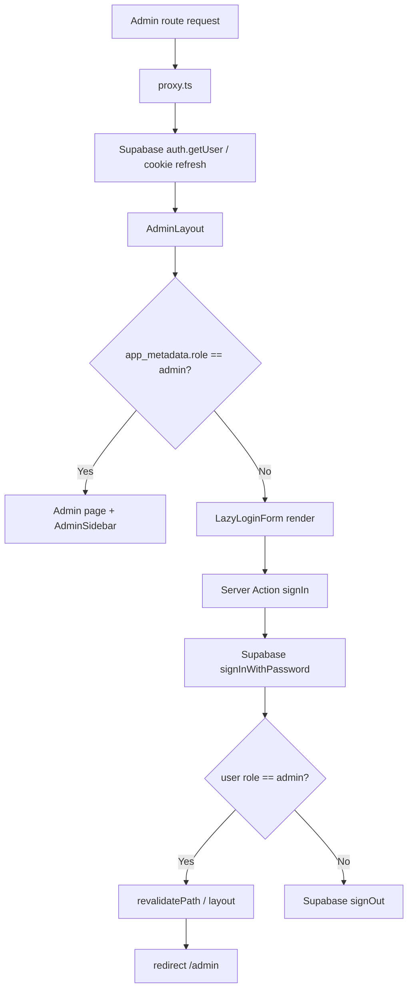

## Change Log

| Version | Date | Author | Changes |
|---|---|---|---|
| 0.1.0 | 2026-09-05 | Codex | main Supabase session과 관리자 접근 구조 작성 |

# Legacy Main Access Control Structure

## 1. 확인된 인증 구조

| 항목 | 구현 | 상태 |
|---|---|---|
| Browser client | `createBrowserClient(NEXT_PUBLIC_SUPABASE_URL, NEXT_PUBLIC_SUPABASE_ANON_KEY)` | `confirmed` |
| Server client | `createServerClient` + Next `cookies()` | `confirmed` |
| Session 갱신 | `proxy.ts` → `updateSession()` → `supabase.auth.getUser()` | `confirmed` |
| Auth provider | Supabase Auth `signInWithPassword`, `signOut` | `confirmed` |
| Auth.js | main tree에 Auth.js 구현 없음 | `confirmed` |
| Bearer API | application code에 Bearer 인증 구현 없음 | `confirmed` |

Cloudflare 또는 외부 인프라에서 별도 Bearer/access rule을 적용하는지는 저장소만으로 확인할 수 없어 `unknown`이다.

## 2. Actor / capability

main 코드에서 명시적으로 확인되는 구분은 다음과 같다.

| 상태 | 판별 | 접근 결과 |
|---|---|---|
| 인증 사용자 없음 | `supabase.auth.getUser()`가 user 없음 | AdminLayout에서 로그인 폼 렌더링 |
| 인증 사용자이나 admin 아님 | `user.app_metadata.role !== "admin"` | AdminLayout에서 로그인 폼 렌더링 |
| 관리자 | `user.app_metadata.role === "admin"` | Admin layout children 및 sidebar 렌더링 |

Public layout과 public page에는 인증 검사가 없다. `Authenticated` 일반 사용자의 별도 화면 권한은 main code에서 확인되지 않는다.

## 3. 관리자 접근 흐름

`/admin` 자체는 page에서 `/admin/albums`로 redirect하지만, AdminLayout의 role 검사가 먼저 적용되는 route hierarchy다.

## 4. Server Action 인가 관찰

`manage-content/actions.ts`의 album/song CRUD action과 `manage-lyrics/actions.ts`의 가사 저장 action에는 별도의 `supabase.auth.getUser()` 또는 role 검사 호출이 확인되지 않는다. 따라서 다음 두 주체를 분리해 기록한다.

- UI 진입 주체: `AdminLayout` role 검사를 통과한 사용자
- Server Action 자체 인가: 별도 검사 확인되지 않음

action이 `getDb()`와 DB command를 직접 호출하는 것은 `confirmed`다. 이를 안전하다고 해석하거나 보정하지 않는다.

로그인 action 내부에는 admin role 검사가 있다. `app_metadata.role`이 admin이 아니면 Supabase signOut 후 오류 객체를 반환한다.

## 5. 접근 거부 방식

- Admin 접근 거부: 401/403 response가 아니라 로그인 폼을 다시 렌더링한다.
- 로그인 실패: Supabase error message를 action 반환값으로 전달한다.
- Admin 아닌 인증 사용자: signIn 성공 직후 signOut하고 `관리자 권한이 없습니다.`를 반환한다.
- Public route: 별도 접근 거부 흐름 없음.

## 6. 확인 필요

- 실제 Supabase project의 Auth 설정과 `app_metadata` 발급/관리 방식
- production에서 RLS가 활성화되어 있는지와 각 table policy
- Worker/Cloudflare 계층에서 별도 인증 또는 access rule이 있는지
